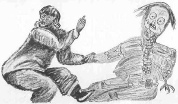

  
[Intangible Textual Heritage](../../../index)  [Native
American](../../index)  [Inuit](../index) 

------------------------------------------------------------------------

[Buy this Book at
Amazon.com](https://www.amazon.com/exec/obidos/ASIN/0548624798/internetsacredte)

------------------------------------------------------------------------

<table width="75%">
<colgroup>
<col style="width: 50%" />
<col style="width: 50%" />
</colgroup>
<tbody>
<tr class="odd">
<td width="50%" data-valign="TOP"> 
Making a tupilak. (Public Domain Image)</td>
<td width="50%" data-valign="CENTER"><h1 id="eskimo-folk-tales" data-align="center">Eskimo Folk-Tales</h1>
<h3 id="by-knud-rasmussen" data-align="center">by Knud Rasmussen</h3>
<h4 id="section" data-align="center">[1921]</h4></td>
</tr>
</tbody>
</table>

------------------------------------------------------------------------

[Start Reading](eft00)    [Text \[Zipped\]](efttxt.zip)

------------------------------------------------------------------------

|                                                                                                                           |
|---------------------------------------------------------------------------------------------------------------------------|
|  |

[Frontispiece](eft00)  
[Title Page](eft01)  
[INTRODUCTION](eft02)  
[CONTENTS](eft03)  
[ILLUSTRATIONS](eft04)  
[THE TWO FRIENDS WHO SET OFF TO TRAVEL ROUND THE WORLD](eft05)  
[THE COMING OF MEN, A LONG, LONG WHILE AGO](eft06)  
[NUKÚNGUASIK, WHO ESCAPED FROM THE TUPILAK](eft07)  
[QUJÂVÂRSSUK](eft08)  
[KÚNIGSEQ](eft09)  
[THE WOMAN WHO HAD A BEAR AS A FOSTER-SON](eft10)  
[ÍMARASUGSSUAQ, WHO ATE HIS WIVES](eft11)  
[QALAGÁNGUASÊ, WHO PASSED TO THE LAND OF GHOSTS](eft12)  
[ISIGÂLIGÂRSSIK](eft13)  
[THE INSECTS THAT WOOED A WIFELESS MAN](eft14)  
[THE VERY OBSTINATE MAN](eft15)  
[THE DWARFS](eft16)  
[THE BOY FROM THE BOTTOM OF THE SEA, WHO FRIGHTENED THE PEOPLE OF THE
HOUSE TO DEATH](eft17)  
[THE RAVEN AND THE GOOSE](eft18)  
[WHEN THE RAVENS COULD SPEAK](eft19)  
[MAKÍTE](eft20)  
[ASALÔQ](eft21)  
[UKALEQ](eft22)  
[ÍKARDLÍTUARSSUK](eft23)  
[THE RAVEN WHO WANTED A WIFE](eft24)  
[THE MAN WHO TOOK A VIXEN TO WIFE](eft25)  
[THE GREAT BEAR](eft26)  
[THE MAN WHO BECAME A STAR](eft27)  
[THE WOMAN WITH THE IRON TAIL](eft28)  
[HOW THE FOG CAME](eft29)  
[THE MAN WHO AVENGED THE WIDOWS](eft30)  
[THE MAN WHO WENT OUT TO SEARCH FOR HIS SON](eft31)  
[ATUNGAIT, WHO WENT A-WANDERING](eft32)  
[KUMAGDLAK AND THE LIVING ARROWS](eft33)  
[THE GIANT DOG](eft34)  
[THE INLAND-DWELLERS OF ETAH](eft35)  
[THE MAN WHO STABBED HIS WIFE IN THE LEG](eft36)  
[THE SOUL THAT LIVED IN THE BODIES OF ALL BEASTS](eft37)  
[PAPIK, WHO KILLED HIS WIFE'S BROTHER](eft38)  
[PÂTUSSORSSUAQ, WHO KILLED HIS UNCLE](eft39)  
[THE MEN WHO CHANGED WIVES](eft40)  
[ARTUK, WHO DID ALL FORBIDDEN THINGS](eft41)  
[THE THUNDER SPIRITS](eft42)  
[NERRIVIK](eft43)  
[THE WIFE WHO LIED](eft44)  
[KÂGSSAGSSUK, THE HOMELESS BOY WHO BECAME A STRONG MAN](eft45)  
[QASIAGSSAQ, THE GREAT LIAR](eft46)  
[THE EAGLE AND THE WHALE](eft47)  
[THE TWO LITTLE OUTCASTS](eft48)  
[ATDLARNEQ, THE GREAT GLUTTON](eft49)  
[ÁNGÁNGŬJUK](eft50)  
[ÂTÂRSSUAQ](eft51)  
[PUAGSSUAQ](eft52)  
[TUNGUJULUK AND SAUNIKOQ](eft53)  
[ANARTEQ](eft54)  
[THE GUILLEMOT THAT COULD TALK](eft55)  
[KÁNAGSSUAQ](eft56)  
[Sources of Legends](eft57)  
