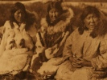

  
[Intangible Textual Heritage](../../../index.md)  [Native
American](../../index)  [Inuit](../index.md) 
[Siberian](../../../asia/index.htm#siberia)  [Index](index.md) 
[Previous](eos17)  [Next](eos19.md) 

------------------------------------------------------------------------

[Buy this Book at
Amazon.com](https://www.amazon.com/exec/obidos/ASIN/B002EQAB3E/internetsacredte.md)

------------------------------------------------------------------------

  
*The Eskimo of Siberia*, by Waldemar Bogoras, \[1913\], at Intangible
Textual Heritage

------------------------------------------------------------------------

p. 437

## II. — SONGS. [1](#fn_12.md)

### 1 (*a*).

"Who is this man? [3](#fn_14.md) Whence does he
come?" — "Alaka´li, I do not know him." — "Do you not know Alaka´li? He
and his companions, they have the shape of gulls. They screech just like
gulls." [2](#fn_13.md)

### 1 (*b*).

My heart longs only for that place, for that aunt of mine, who is always
singing.

### 1 (*c*).

O women! run here with your vessels (for taking water)!

p. 438

### 1 (*d*).

Ra´wtačhaw exerted himself more than all other men, more than you. In
these exertions he vanquished you, he will vanquish them also. Eskimo
women were saying, "We will cut up for him this crab-meat."

1 (*a-d*) sung by Ri´rmi, an Asiatic Eskimo man, at Mariinsky Post,
April 1901.

### 2 (*a*).

At the cape of Uñi´sak, at the pretty one, O girls! I learned a song,
good for singing, a pretty one. The steamboats were already coming.

At the cape of Uñi´sak, at the pretty one, O boys! I learned a song,
good for singing, a pretty one. O boys! You are my assistants (in
singing), you never refuse. My heart yearns for King Island, for the
woman Ača´ka.

p. 439

### 2 (*b*).

Where is it, this song? I was not able to use it. But I will begin it
again. Well, now I shall sing it. Enough, I cease to sing. My singing
has spoiled itself. [1](#fn_15.md) So I became poor
of song.

O man! I sing shaman songs which are destined to give protection from
evil spirits to your living-place. Enough, I cease to sing.

### 2 (*c*).

Oh, it is strange! This man all the time induces us to be his teachers
in singing, so that we grew poor in songs. I have no more new songs.

My heart yearns only there to the village of Kakma´lik, [1](#fn_15.md) to the woman who sings well, who dances
well. My cousin showed me, he informed me of this woman of his. My
cousin showed me, informed me, told me of it: These women ask much; they
speak too much. And when one turns away, they say to another man, "Come
here, come here!"

Why, Ka´lmik here sang quite well, and she was not married. Oh, we two
shall have a singing-match! But I cannot surpass you. Oh, there, I
cease! I lost my voice. [3](#fn_16.md) Oh, it is
strange! This idle man! [4](#fn_17.md) God damn!
Son of a bitch!

p. 440

2 (*a-c*) Sung by Če´lhat, an Asiatic Eskimo man, in the village of
Uñi´sak [1](#fn_18.md), at Indian Point, May, 1901.

### 3.

Where is this song of the village of Uñi´sak? I could not find it. So I
will sing the song of the village Nịbu´kak, What are its words? Oh,
there repeat them to me! [3](#fn_19.md)

How is it, my own ears heard the report of that rifle. I should like to
eat of that reindeer-buck (i. e., killed with a shot). I have consumed
the whole of it. Now where shall I eat some seaweed? I came too late,
and missed seaweed at the cape of Uki´ṛalwak, though I hurried there,

p. 441

Sung by Tal‘i´mak, an Asiatic Eskimo man, in the village of Uñi´sak, at
Indian Point, May, 1901.

### 4.

My heart within me yearns strongly (there) for my cousin Hai´tị, who
sits at the boat's prow, [1](#fn_20.md) and who can
write.

Sung by Tal‘i´mak, an Asiatic Eskimo man, in the village of Uñi´sak, at
Indian Point, May, 1901.

### 5 (*a*).

Oh, you who belong to my master and sit in the sleeping-room, come out!
You have a crooked back, you are a hump-back. I look at this whiskered
one (i. e., the walrus)! O people! pull him out, draw him ashore!

### 5 (*b*).

Of what material does this one make his new ladles? He makes them of bad
whalebone from a humpback whale. Little took first take han lantl, [2](#fn_21.md) etc.

p. 442

### 5 (*c*).

What did they drop to the ground, those shamans [1](#fn_22.md) of the neighboring settlement? They
dropped a walrus-flipper. What do they say about me? They say that I can
dive into the ground and come out again. They speak much of me.
Kis·li´tikak, La´ṛluk, Ukuñịl‘i´ṛak, Ya´ṛi, Ilaṛa´sima, Kana´xtṛyak,
Ci´mpa, Ab‘a´tmi, Iṛla´ṛutka, Ma´lula, Mika´tuġri, Ai´b‘is·ik,
Tuñxčï´ṛak, Cinka´luwak, U´lṛak. [2](#fn_23.md)

5 (*a-c*) Sung by Mai´o, [3](#fn_24.md) an Eskimo
boy of the village of Uñi´sak.

### 6 (*a*).

I sighted a woman for myself, a small woman, a bad woman, one with fat
cheeks, one with ruddy cheeks, ka!

### 6 (*b*).

A small gull, a small auk, it is sitting crouched.

6 (*a, b*) Sung by Ap‘s·i´ñak, an Asiatic Eskimo lad, in the village of
Uñi´sak, at Indian Point, June, 1901.

### 7 (*a*).

Whose girl is this? It is the daughter of Uka´ṛutak. She is fingerless,
she cannot work properly. Ka, ka, ka!

p. 443

### 7 (*b*).

Who is that girl there? I will tell you about her. It is a small, bad,
pricking louse, of just the size of a louse-egg. She has pointed arms,
she has pointed legs.

7 (a, b) Sung by Ča´n·au, an Asiatic Eskimo girl, in the village of
Uñi´sak, at Indian Point, May, 1901.

### 8.

Men of one boat were picking berries upon an island. Their upper parts,
their hind parts, their buttocks, are like those of a wolverene,
nananas·u´, qapinas·u´, qapihohu´ [1](#fn_25.md).

Sung by Kai´uwa, an Asiatic Eskimo girl, in the village of Uñi´sak, at
Indian Point, May, 1901.

### 9.

A small, weak man was walking very awkwardly. He was bow-legged, he was
club-footed. There he is, there he is! He sits in the sleeping-room on
the rear side, with his bad wife. Both are quite bad. From where is that
woman? She is from the seacoast. She casts swift glances to either side.

Sung by Kai´uwa, an Asiatic Eskimo girl, in the village of Uñi´sak, at
Indian Point, May, 1901.

p. 444

### 10.

To what purpose does this A´tañ make me sing, and cause me to come back
with him to the trading-dance, giving me a present? And since I feel
shame, he performs the ceremonial by the lamp in the outer house, and
gives me as a present for the trading-dance a bitch.

Sung by Ka´bik, an Asiatic Eskimo girl, in the village of Uñi´sak, May,
1901.

### 11.

This woman [1](#fn_26.md) has grown for herself two
buttocks. The second is upon her nape. She carries it around. And even
the third is upon her forehead. [2](#fn_27.md) She
carries it around for her man, for Aña´ntị.

Sung by Ka´bik, an Asiatic Eskimo girl, in the village of Uñi´sak, May,
1901.

### 12 (*a*).

In what manner can I turn to the outer side of this big outer world; to
the direction of the southern wind; to the direction of Ca´xcu, who has
a black spot upon the forehead?

p. 445

### 12 (*b*).

She was married on the big land, she was married to a walrus, even to
this one, Aiu´ṛa. The walrus roared.

12 (*a, b*) Sung by Iṛu´lik, an Asiatic Eskimo girl, in the village of
Uñi´sak, at Indian Point, June, 1901.

### 13. Dialogues. [1](#fn_28.md)

### (*a*).

"I am quarrelling with my husband." — "My bad wife speaks evil about me.
I will tell you about her. All the time she is calling to other men."

### (*b*).

"Who will carry my pretty sister?" — "What is this? I will haul her.
Enough, I cease to sing. I constructed this sled for her."

13 (*a, b*) Sung by Ma´ṛla, an Asiatic Eskimo girl, in the village of
Uñi´sak, at Indian Point, June, 1901.

### 14. Shaman's Songs. [2](#fn_29.md)

### (*a*).

p. 446

Oh, you men, [1](#fn_30.md) listen to this one! In
the middle of the mainland a Tungus [2](#fn_31.md)
is walking in blood. Oh, you men, listen to this one! He is all bedaubed
with coagulated blood. Oh, you men, look at this one, deep in the
sea! [3](#fn_32.md) She shoved out a dish filled
with every kind of food. People of our land, and all the others living
around, rejoiced.

### (*b*).

Oh, you women there! laugh this time, because he [4](#fn_33.md) is approaching sideways. This one came to
land with a roar. Will you haul the walrus-meat by the holes cut through
it? [5](#fn_34.md)

### (*c*).

Oh, you man! this neck of mine cut into pieces, and carry it to that one
(in the sea). Let it turn to food [6](#fn_35.md)
near the walrus. Oh, you man! this head of mine cut to pieces, and carry
it to that one (in the sea). Then let it be brought back by the
walrus. [7](#fn_36.md)

p. 447

### (*d*).

That one staying there outside (i. e., the Spirit) troubles me with his
constant demands. "There you! those sitting within do not listen, they
pay no attention to you. Well, then, I shall ask them in your behalf,
perhaps those sitting within shall give you a present, a sausage quite
unbroken."

### (*e*).

Where is this Tiwla´ña sitting in the inner room? She showed herself
here. "Look at me! I came from afar off, and I brought you my staff. It
is to be used for helping the suffering people to stand up. This staff
of the far-off master I brought here to be used to raise the head of
suffering people. The staff of the outside master used to raise the
suffering people."

### (*f*).

"Where did I live? I remained invisible to the Outside Grandfather (i.
e., to the world), I remained unknown to the Outside Grandfather." —
"Indeed, he does know you. The Outside Grandfather knows you; however,
he pretends not to know you."

14 (*a-f*) Sung by Ča´plak, the oldest man in the village of Uñi´sak.

p. 448

### 15. Shaman's Songs.

### (*a*).

Whose child [1](#fn_37.md) is crying there? O
women! sing for me. I shall dance. Oh, there! I feel as if my
soul, [2](#fn_38.md) the one within, were going
out.

### (*b*).

Why does the one within not sing? I look back upon him, the man within.
Upon the seashore the fog is rising. Shake this one within on the
seashore by the sea.

15 (*a, b*) Sung by Kakcu´bak, [3](#fn_39.md) an
Asiatic Eskimo man in the village of Uñi´sak, at Indian Point, May,
1901.

### 16. Shaman's Songs. [4](#fn_40.md)

### (*a*).

O woman! I will teach you a song destined for dancing. It produces an
itching desire to stamp on the ground to its sounds. Sing to me when you
are stamping the ground. I shall dance too. There, you, scratch them,
give them cramps!

p. 449

### (*b*).

Oh, you, one within! I came to you, I brought you a harpoon-line, good
for use. Oh, you, Hi´wuña! go around with a staff. Let them look at you.
Like me, go around with a staff. [1](#fn_41.md)

### (*c*).

He was making a passage for himself, he was preparing a breath for
himself. [2](#fn_42.md) All the people of our land
saw him. He came out of the ground, and appeared between the houses. He
looked back at them.

### (*d*).

Whose magic master [3](#fn_43.md) is it, to whom I
give liquor, to whom I give brandy? This person has again been left
under the ground. He remained there. Oh, you, look at this dog! [4](#fn_44.md) He stands crosswise and looks back.

16 (*a-d*) Sung by Hi´wuña, a female shaman, in the village of Uñi´sak.

p. 450

### 17.

My stomach is yearning for my cousin. I would leave Cimcai´va here; but
I wish he would give me in his storehouse a drink of molasses mixed with
hard bread-crumbs, a liquor not stupefying.

Sung by Qal‘u´wak, an Asiatic Eskimo man, on St. Lawrence Island, May,
1901.

### 18.

From whom shall I have tea to drink? I shall have it from the
Northwesterner, from the Russian, my cousin. He will give me his
brick-tea of good quality. My stomach will feel well. Drinking tea, I
shall laugh. [4](#fn_45.md)

Sung by Ñịpe´wġi, an Asiatic Eskimo man, a native of Uñi´sak, on St.
Lawrence Island, May, 1901.

### 19.

I found here for myself a woman. She walks much in an overcoat of
calico. She is a ruddy one, she is a pretty one.

Sung by Ñịpe´wġi, an Asiatic Eskimo man, on St. Lawrence Island, May,
1901.

p. 451

### 20.

I will go and look for game. I shall also throw at the birds my
throwing-balls. [1](#fn_46.md)

Sung by Ka´l‘i, an Asiatic Eskimo man, on St. Lawrence Island, May,
1901.

### 21.

I wounded a seal which is always escaping. I could not find it. With
what shall I stab it? With my small whip.

Sung by Či´mpak, an Asiatic Eskimo man, on St. Lawrence Island, May,
1901.

### 22 (*a*).

I am singing here at the trading-dance. O young man! this one makes me
perform the trading-dance in the outer tent. Let him himself also dance.

### 22 (*b*).

What shall I ask for? I will ask for a walrus-hide, for a new one, for a
large one without patches.

22 (*a, b*) Sung by Ku´puña, an Asiatic Eskimo woman, on St. Lawrence
Island, May, 1901.

p. 452

### 23. Shaman's Song.

When shall I sing this song? lt is good to be listened to. Oh, let all
those sitting in the outer house around give something to that
to´ṛnaṛak! Let them throw their presents, and let him stay at his own
place! Oh, you there, women! shout with me! Shall I sing it? You will be
given joy by that one in the sea. You shall laugh. Now it is finished.

Sung by Acu´naṛak, [3](#fn_47.md) an Asiatic Eskimo
man, on St, Lawrence Island, May, 1901.

------------------------------------------------------------------------

### Footnotes

[437:1](eos18.htm#fr_12.md) For explanation of
alphabet see [p. 456](eos19.md).

[437:2](eos18.htm#fr_14) The songs (*a*), (*b*.md),
(*c*), (*d*), are entirely disconnected. They are placed together here
because they were given by one man. The first one (*a*) is a dialogue
between a man and a to´ṛnaṛak named Alaka´lị. The second question of the
man — "And who are you?" — addressed to the to´ṛnaṛak is omitted. The
last song (*d*) is largely in Chukchee. Only the word "kayalka´tiu" and
the last sentence are Eskimo, but the tune to which it was sung was also
Eskimo. "Yañiya´ hịyaña´," etc., are burdens without any particular
meaning. In singing, they are repeated several times. The word
"taxluweiu´wa" in 1 (*d*), line 2, was also said to be a burden without
meaning, although I am not quite sure of this.

[437:3](eos18.htm#fr_13) Taṛu for yuk ("man".md)
belongs to the so-called language of the to´ṛnaṛaks.

[439:1](eos18.htm#fr_16.md) The singing person was
hoarse at that time.

[439:3](eos18.htm#fr_17.md) Literally, i´ṛlak
("throat").

[439:4](eos18.htm#fr_18.md) That is, the writer of
these lines.

[440:1](eos18.htm#fr_19.md) A village on the
American side.

[440:3](eos18.htm#fr_20.md) The following part of
this song is in the dialect of Nịbu´kak, and has been translated
literally into the dialect of Uñi´sak.

[441:1](eos18.htm#fr_21.md) The man who sits at the
prow is the first to throw the harpoon in seal and walrus hunting. This
is a place of honor. Hai´tị, of whom the song speaks, was an Eskimo of
the American shore. He was the cousin of Tal‘i´mak on the mother's side.
He actually knew how to read and write.

[441:2](eos18.htm#fr_22.md) The words left without
translation represent simply imitation of English words put in for fun.
These words were moved from the transcription of the Chukchee original.

[442:1](eos18.htm#fr_23.md) Čaṛoia´lik, "shaman"
(literally, "that with the drum"), belongs to the language of
to´ṛnaṛaks.

[442:2](eos18.htm#fr_24.md) Words left without
translation represent a set of Eskimo names put in for fun.

[442:3](eos18.htm#fr_25.md) Mai´o, to whom these
three songs belong, died of measles a year before my coming there. He
was a hunchback, and feeble of body. Nevertheless he was quite popular
among his companions on account of his inexhaustible good humor. The
songs of Mai´o were known by heart, word for word, by several boys and
girls of Uñi´sak. Mai´o, like all the young men, had a strong desire to
leam some English. Having no means to do so, he would imitate English
sounds and words, and put them into his songs. The songs of Mai´o
probably represent parodies of the solemn shamanistic songs of the
grown-up people.

[443:1](eos18.htm#fr_26.md) The last words could
not be explained by the singer. They either belong to the ancient, now
unused forms of speech, or, what is more probable, represent a series of
casual sounds, having no meaning. This latter happens quite frequently
in the Eskimo songs.

[444:1](eos18.htm#fr_27.md) Kupu´ma, "woman"
(literally, "that cut in two"). This word belongs to the language of
to´ṛnaṛaks.

[444:2](eos18.htm#fr_28.md) Cama´tak, a forehead
ornament made of iron, and given by shamans to a patient to carry as a
magic remedy.

[445:1](eos18.htm#fr_29.md) These two songs,
according to the explanations of the singer and her companions, are of
ancient origin. When they are sung, the listeners clap their palms in
time.

[445:2](eos18.htm#fr_30.md) These shamanistic songs
represent incantations connected wilh the walrus-hunt. Others are sung
in the great winter ceremonials. Some were inherited by the old man who
sang them, from his father. Others belong to his son, to his daughter,
etc. The six songs have no connection one with another.

[446:1](eos18.htm#fr_31.md) Ta´ṛu is the word of
the language of to´ṛnaṛaks for "man," Taru´ni maku´ni is vocative
plural.

[446:2](eos18.htm#fr_32.md) Kaara´mkak. From the
Chukchee Qa´a-ra´mkin (literally "Reindeer People"). Compare Bogoras
(Vol. VII of this series, p. 19). The Eskimo never meet the Tungus. This
is the only mention of the Tungus in Eskimo folk-lore.

[446:3](eos18.htm#fr_33.md) The narrator speaks
here of a sea-deity, which, according to his explanations, is a female,
like the well-known Sedna of all the Eskimo.

[446:4](eos18.htm#fr_34.md) That is, the walrus.

[446:5](eos18.htm#fr_35.md) The hunter who kills
walrus on the ice, cuts the carcass to pieces, and hauls every piece
upon the ice, holding it by the holes that are cut through the meat. In
stretching the walrus-hide for drying, similar holes are cut all around
the edge. They are also called pu´tuñuk (the Chukchee word
"pɵttịña´lhin" is borrowed from the Eskimo).

[446:6](eos18.htm#fr_36.md) Aku´ṛum, "food," in the
language of to´ṛnaṛaks.

[446:7](eos18.htm#fr_37.md) Tuwu´til‘ik, "walrus"
(literally, "the with tusks"), in the language of to´ṛnaṛaks.

[448:1](eos18.htm#fr_38.md) Ku´ṛak, "child," in the
language of to´ṛnaṛaks.

[448:2](eos18.htm#fr_39.md) Yuwu´sik, in usual
speech ịyu´s·ik ("body"). Here it means, however, "soul." ịyu´sik means,
properly speaking, "self," "human self," and is derived from yuk
("man").

[448:3](eos18.htm#fr_40.md) Kakcu´bak was a shaman,
though of no great skill. He pretended that his song was sung wholly in
the language of to´ṛnaṛaks, and so refused to translate it into the
usual human speech, and even affirmed that he does not understand these
strange words. In reality the song is in the usual Uñi´sak dialect of
the Asiatic Eskimo, and the percentage of words or grammatical forms of
unusual character is by no means larger than in the other shamanistic
songs.

[448:4](eos18.htm#fr_41.md) Each of these
shamanistic songs is a song by itself. They are supposed to be sung by
the to´ṛnaṛak or the female shaman who sang them, and to be addressed to
her. So in several cases I had to translate yuk, ịyu´k, ta´ru, "human
being," instead of "man."

[449:1](eos18.htm#fr_42.md) The shaman's staff,
with its tassels, is considered to be a magic weapon.

[449:2](eos18.htm#fr_43.md) The spirit used the
voice of this female shaman Hi´wuña as his breath.

[449:3](eos18.htm#fr_44.md) In the language of
to´ṛnaṛak, the shaman, the magic master of the spirits, is always spoken
of as "their man," "their woman."

[449:4](eos18.htm#fr_45.md) Literally, "that
walking on all-fours." This word belongs to the language of to´ṛnaṛaks.

[450:4](eos18.htm#fr_46.md) This song was not
composed for my own benefit, as one might suppose. It originated a year
before my arrival, when the missionary of St. Lawrence, an American,
bought a few pieces of brick-tea of Japanese make from the Russian
steamer "Progress." The Japanese brick-tea is inferior in quality to
that made in China and brought by the Russian traders by land from the
west.

[451:1](eos18.htm#fr_47.md) Compare Vol. VII of
this series, p. 145.

[452:3](eos18.htm#fr_48.md) Acu´naṛak was a shaman,
and also a descendant of a family of shamans. His great-grandfather,
also Acu´naṛak by name, had much fame. Even now tales exist about the
deeds he achieved. His grandson also showed me a few tricks, some of
which I have described elsewhere, (Bogoras, The Chukchee, Vol. VII of
this series, p. 448).

------------------------------------------------------------------------

[Next: NOTE.](eos19.md)
