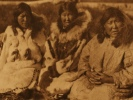

  
[Intangible Textual Heritage](../../../index)  [Native
American](../../index)  [Inuit](../index) 
[Siberian](../../../asia/index.htm#siberia)  [Index](index) 
[Previous](eos18) 

------------------------------------------------------------------------

[Buy this Book at
Amazon.com](https://www.amazon.com/exec/obidos/ASIN/B002EQAB3E/internetsacredte)

------------------------------------------------------------------------

  
*The Eskimo of Siberia*, by Waldemar Bogoras, \[1913\], at Intangible
Textual Heritage

------------------------------------------------------------------------

### Note

   NOTE. — Sounds are rendered according to the [same system as that
applied in my Chukchee Texts](../../../asia/cm/cm02), published in this
series. The following additional symbols have been used: *ï*, long glide
*ie;* *ụ* like Eng. *u* in *hut;* *f, v,* bilabial; *z*, sonant of *s;*
*c*, like Eng. *sh;* *x*, velar fricative; *ṛ* velar *r;* ‘ aspiration;
· palatalization.

 Please note that in this volume, as in the Chukchee Mythology
referenced above, the unicode characters employed are not identical to
those used in the printed book. See the note at the end of the [index
page for *Chukchee Mythology*](../../../asia/cm/index).--CW.
