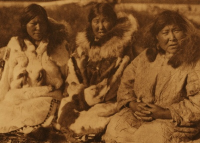

  
[Intangible Textual Heritage](../../../index)  [Native
American](../../index)  [Inuit](../index) 
[Siberian](../../../asia/index.htm#siberia) 

------------------------------------------------------------------------

[Buy this Book at
Amazon.com](https://www.amazon.com/exec/obidos/ASIN/B002EQAB3E/internetsacredte)

------------------------------------------------------------------------

<table width="75%">
<colgroup>
<col style="width: 50%" />
<col style="width: 50%" />
</colgroup>
<tbody>
<tr class="odd">
<td width="50%" data-valign="TOP"> 
Inuit Women, photo by Edward Curtis (Public Domain Image)</td>
<td width="50%" data-valign="CENTER"><h1 id="the-eskimo-of-siberia" data-align="center">The Eskimo of Siberia</h1>
<h3 id="by-waldemar-bogoras" data-align="center">by Waldemar Bogoras</h3>
<h5 id="leiden-new-york-1913" data-align="center">[Leiden &amp; New York, 1913]</h5></td>
</tr>
</tbody>
</table>

------------------------------------------------------------------------

[Contents](#contents)    [Start Reading](eos00)    [Page
Index](pageidx)    [Text \[Zipped\]](eos.txt.gz)

------------------------------------------------------------------------

|                                                                                                                           |
|---------------------------------------------------------------------------------------------------------------------------|
|  |

This book is part of the same series (*The Jessup North Pacific
Expedition*) as [*Chukchee Mythology*](../../../asia/cm/index), which
was posted earlier at Intangible Textual Heritage. All of the notes on
that index page apply to this text as well. Also, Part III — Text is not
presented here as it is printed in the original language with only
interlinear translation. This amounts to about 3pp. of deleted material.

------------------------------------------------------------------------

 [Title Page](eos00)  
[CONTENTS.](eos01)  

### I. Folk-Tales

[1. The Dead Bride.](eos02)  
[2. The Carrier of Seaweed.](eos03)  
[3. The One without Arms.](eos04)  
[4. The Girl who watched in the Night-Time.](eos05)  
[5. Creation of the World.](eos06)  
[6. The Girl in the Iron Box.](eos07)  
[7. The Eagle-Boy.](eos08)  
[8. The Old Woman and the Wild Beasts.](eos09)  
[9. The Brothers held Captive on an Island.](eos10)  
[10. The Man who used Magic against the Storm.](eos11)  
[11. The Hare frees the Sun.](eos12)  
[12. Raven swallows Blubber.](eos13)  
[13. The Woman and the Doer of Violence.](eos14)  
[14. Creation of St. Lawrence Island.](eos15)  
[15. The Contest between the Giant and the Plover.](eos16)  
[16. The Shaman A´bla.](eos17)  

 

[II. — SONGS.](eos18)  
[NOTE.](eos19)  
