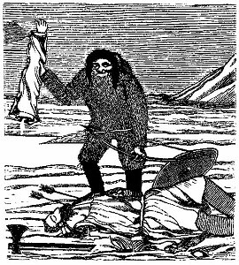

[Sacred-Texts](../../../index.md) [Native
American](../../index) [Inuit](../index.md)

------------------------------------------------------------------------

<table data-align="center" width="75%">
<colgroup>
<col style="width: 50%" />
<col style="width: 50%" />
</colgroup>
<tbody>
<tr class="odd">
<td></td>
<td><h1 id="tales-and-traditions-of-the-eskimo" data-align="center">Tales and Traditions of the Eskimo</h1>
<h3 id="by-henry-rink" data-align="center">by Henry Rink</h3>
<h5 id="london-1875" data-align="center">[London, 1875]</h5>
<h6 id="reduced-to-html-by-christopher-m.-weimer-apr.-2003" data-align="center">{Reduced to HTML by Christopher M. Weimer, Apr. 2003}</h6></td>
</tr>
</tbody>
</table>

------------------------------------------------------------------------

<table data-align="center">
<colgroup>
<col style="width: 50%" />
<col style="width: 50%" />
</colgroup>
<tbody>
<tr class="odd">
<th></th>
<td><a href="tte0">Frontispiece</a></td>
</tr>
<tr class="even">
<th></th>
<td><a href="tte0-0">Title Page</a></td>
</tr>
<tr class="odd">
<th></th>
<td><a href="tte0-1">PREFACE.</a></td>
</tr>
<tr class="even">
<th></th>
<td><a href="tte0-2">CONTENTS.</a></td>
</tr>
<tr class="odd">
<th> </th>
<td></td>
</tr>
<tr class="even">
<th>The Eskimo</th>
<td></td>
</tr>
<tr class="odd">
<th></th>
<td><a href="tte1-0">INTRODUCTORY REMARKS.</a></td>
</tr>
<tr class="even">
<th style="text-align: right;" data-valign="top">I.</th>
<td><a href="tte1-1">SUBSISTENCE AND MODE OF LIFE.</a> 
</td>
</tr>
<tr class="odd">
<th style="text-align: right;" data-valign="top">II.</th>
<td><a href="tte1-2">LANGUAGE.</a> 
</td>
</tr>
<tr class="even">
<th style="text-align: right;" data-valign="top">III.</th>
<td><a href="tte1-3">SOCIAL ORDER, CUSTOMS, AND LAWS.</a> 
</td>
</tr>
<tr class="odd">
<th style="text-align: right;" data-valign="top">IV.</th>
<td><a href="tte1-4">RELIGION.</a> 
</td>
</tr>
<tr class="even">
<th style="text-align: right;" data-valign="top">V.</th>
<td><a href="tte1-5">TRADITIONAL TALES, SCIENCE, AND ARTS.</a> 
</td>
</tr>
<tr class="odd">
<th style="text-align: right;" data-valign="top">VI.</th>
<td><a href="tte1-6">PROBABLE ORIGIN AND HISTORY.</a> 
</td>
</tr>
<tr class="even">
<th style="text-align: right;" data-valign="top">VII.</th>
<td><a href="tte1-7">INFLUENCE OF CONTACT WITH EUROPEANS.</a> 
</td>
</tr>
<tr class="odd">
<th> </th>
<td></td>
</tr>
<tr class="even">
<th>Tales and Traditions</th>
<td></td>
</tr>
<tr class="odd">
<th></th>
<td><a href="tte2-000">INTRODUCTION TO THE TALES AND TRADITIONS.</a></td>
</tr>
<tr class="even">
<th style="text-align: right;" data-valign="top">1.</th>
<td><a href="tte2-001">KAGSAGSUK.</a> 
</td>
</tr>
<tr class="odd">
<th style="text-align: right;" data-valign="top">2.</th>
<td><a href="tte2-002">THE BLIND MAN WHO RECOVERED HIS SIGHT.</a> 
</td>
</tr>
<tr class="even">
<th style="text-align: right;" data-valign="top">3.</th>
<td><a href="tte2-003">IGIMARASUGSUK.</a> 
</td>
</tr>
<tr class="odd">
<th style="text-align: right;" data-valign="top">4.</th>
<td><a href="tte2-004">KUMAGDLAT AND ASALOK.</a> 
</td>
</tr>
<tr class="even">
<th style="text-align: right;" data-valign="top">5.</th>
<td><a href="tte2-005">AKIGSIAK.</a> 
</td>
</tr>
<tr class="odd">
<th style="text-align: right;" data-valign="top">6.</th>
<td><a href="tte2-006">THE FRIENDS.</a> 
</td>
</tr>
<tr class="even">
<th style="text-align: right;" data-valign="top">7.</th>
<td><a href="tte2-007">KATERPARSUK.</a> 
</td>
</tr>
<tr class="odd">
<th style="text-align: right;" data-valign="top">8.</th>
<td><a href="tte2-008">A TALE ABOUT TWO GIRLS.</a> 
</td>
</tr>
<tr class="even">
<th style="text-align: right;" data-valign="top">9.</th>
<td><a href="tte2-009">THE BROTHERS VISIT THEIR SISTER.</a> 
</td>
</tr>
<tr class="odd">
<th style="text-align: right;" data-valign="top">10.</th>
<td><a href="tte2-010">KUNUK THE ORPHAN BOY.</a> 
</td>
</tr>
<tr class="even">
<th style="text-align: right;" data-valign="top">11.</th>
<td><a href="tte2-011">THE FAITHLESS WIFE.</a> 
</td>
</tr>
<tr class="odd">
<th style="text-align: right;" data-valign="top">12.</th>
<td><a href="tte2-012">THE MAN WHO MATED HIMSELF WITH A SEA-FOWL.</a> 
</td>
</tr>
<tr class="even">
<th style="text-align: right;" data-valign="top">13.</th>
<td><a href="tte2-013">THE BARREN WIFE.</a> 
</td>
</tr>
<tr class="odd">
<th style="text-align: right;" data-valign="top">14.</th>
<td><a href="tte2-014">THE TWO BROTHERS.</a> 
</td>
</tr>
<tr class="even">
<th style="text-align: right;" data-valign="top">15.</th>
<td><a href="tte2-015">GIVIOK.</a> 
</td>
</tr>
<tr class="odd">
<th style="text-align: right;" data-valign="top">16.</th>
<td><a href="tte2-016">TIGGAK.</a> 
</td>
</tr>
<tr class="even">
<th style="text-align: right;" data-valign="top">17.</th>
<td><a href="tte2-017">MALAISE—THE MAN WHO TRAVELLED TO AKILINEK.</a> 
</td>
</tr>
<tr class="odd">
<th style="text-align: right;" data-valign="top">18.</th>
<td><a href="tte2-018">NAVARANAK OR JAVRAGANAK.</a> 
</td>
</tr>
<tr class="even">
<th style="text-align: right;" data-valign="top">19.</th>
<td><a href="tte2-019">AVARUNGUAK OR AGDLERUT.</a> 
</td>
</tr>
<tr class="odd">
<th style="text-align: right;" data-valign="top">20.</th>
<td><a href="tte2-020">THE GIRL WHO MARRIED AN ATLIARUSEK.</a> 
</td>
</tr>
<tr class="even">
<th style="text-align: right;" data-valign="top">21.</th>
<td><a href="tte2-021">THE LOST DAUGHTER.</a> 
</td>
</tr>
<tr class="odd">
<th style="text-align: right;" data-valign="top">22.</th>
<td><a href="tte2-022">ANGUTISUGSUK.</a> 
</td>
</tr>
<tr class="even">
<th style="text-align: right;" data-valign="top">23.</th>
<td><a href="tte2-023">SITLIARNAT.</a> 
</td>
</tr>
<tr class="odd">
<th style="text-align: right;" data-valign="top">24.</th>
<td><a href="tte2-024">THE REINDEER-HUNT OF MERKISALIK.</a> 
</td>
</tr>
<tr class="even">
<th style="text-align: right;" data-valign="top">25.</th>
<td><a href="tte2-025">NAMAK.</a> 
</td>
</tr>
<tr class="odd">
<th style="text-align: right;" data-valign="top">26.</th>
<td><a href="tte2-026">THE LONELY BROTHERS.</a> 
</td>
</tr>
<tr class="even">
<th style="text-align: right;" data-valign="top">27.</th>
<td><a href="tte2-027">SIKUTLUK.</a> 
</td>
</tr>
<tr class="odd">
<th style="text-align: right;" data-valign="top">28.</th>
<td><a href="tte2-028">THE GIRL WHO FLED TO THE INLANDERS.</a> 
</td>
</tr>
<tr class="even">
<th style="text-align: right;" data-valign="top">29.</th>
<td><a href="tte2-029">THE ORPHANS.</a> 
</td>
</tr>
<tr class="odd">
<th style="text-align: right;" data-valign="top">30.</th>
<td><a href="tte2-030">THE GIRL WHO WENT AWAY IN SEARCH OF HER BROTHER.</a> 
</td>
</tr>
<tr class="even">
<th style="text-align: right;" data-valign="top">31.</th>
<td><a href="tte2-031">THE DOG.</a> 
</td>
</tr>
<tr class="odd">
<th style="text-align: right;" data-valign="top">32.</th>
<td><a href="tte2-032">THE WIDOW'S VENGEANCE.</a> 
</td>
</tr>
<tr class="even">
<th style="text-align: right;" data-valign="top">33.</th>
<td><a href="tte2-033">A LAMENTABLE STORY.</a> 
</td>
</tr>
<tr class="odd">
<th style="text-align: right;" data-valign="top">34.</th>
<td><a href="tte2-034">UVIKIAK.</a> 
</td>
</tr>
<tr class="even">
<th style="text-align: right;" data-valign="top">35.</th>
<td><a href="tte2-035">THE SUN AND THE MOON.</a> 
</td>
</tr>
<tr class="odd">
<th style="text-align: right;" data-valign="top">36.</th>
<td><a href="tte2-036">NIVNITAK.</a> 
</td>
</tr>
<tr class="even">
<th style="text-align: right;" data-valign="top">37.</th>
<td><a href="tte2-037">THE BROTHER WHO WENT TO AKILINEK IN SEARCH OF HIS SISTER.</a> 
</td>
</tr>
<tr class="odd">
<th style="text-align: right;" data-valign="top">38.</th>
<td><a href="tte2-038">USSUNGUSSAK OR SAVNIMERSOK.</a> 
</td>
</tr>
<tr class="even">
<th style="text-align: right;" data-valign="top">39.</th>
<td><a href="tte2-039">THE CHILD-MONSTER.</a> 
</td>
</tr>
<tr class="odd">
<th style="text-align: right;" data-valign="top">40.</th>
<td><a href="tte2-040">THE KIVIGTOK.</a> 
</td>
</tr>
<tr class="even">
<th style="text-align: right;" data-valign="top">41.</th>
<td><a href="tte2-041">THE WOMAN WHO GOT CONNECTED WITH THE INGNERSUIT OR UNDER-WORLD PEOPLE.</a> 
</td>
</tr>
<tr class="odd">
<th style="text-align: right;" data-valign="top">42.</th>
<td><a href="tte2-042">ABOUT THE CHILDREN OF TWO COUSINS.</a> 
</td>
</tr>
<tr class="even">
<th style="text-align: right;" data-valign="top">43.</th>
<td><a href="tte2-043">THE GIRL WHO WAS STOLEN BY AN INLANDER.</a> 
</td>
</tr>
<tr class="odd">
<th style="text-align: right;" data-valign="top">44.</th>
<td><a href="tte2-044">THE CHILD THAT WAS STOLEN BY THE INLANDERS.</a> 
</td>
</tr>
<tr class="even">
<th style="text-align: right;" data-valign="top">45.</th>
<td><a href="tte2-045">THE ANGAKOK'S FLIGHT TO AKILINEK.</a> 
</td>
</tr>
<tr class="odd">
<th style="text-align: right;" data-valign="top">46.</th>
<td><a href="tte2-046">THE KAYAKERS IN CAPTIVITY WITH THE MALIGNANT INGNERSUIT.</a> 
</td>
</tr>
<tr class="even">
<th style="text-align: right;" data-valign="top">47.</th>
<td><a href="tte2-047">THE ORPRAN BOY ILIARSORKIK.</a> 
</td>
</tr>
<tr class="odd">
<th style="text-align: right;" data-valign="top">48.</th>
<td><a href="tte2-048">THE BROTHERS WHO WERE LOST ON THEIR JOURNEY UP THE FIORD.</a> 
</td>
</tr>
<tr class="even">
<th style="text-align: right;" data-valign="top">49.</th>
<td><a href="tte2-049">THE SOLITARY KAYAKER.</a> 
</td>
</tr>
<tr class="odd">
<th style="text-align: right;" data-valign="top">50.</th>
<td><a href="tte2-050">KASIAGSAK, THE GREAT LIAR.</a> 
</td>
</tr>
<tr class="even">
<th style="text-align: right;" data-valign="top">51.</th>
<td><a href="tte2-051">THE REVIVED WHO CAME TO THE UNDER-WORLD PEOPLE.</a> 
</td>
</tr>
<tr class="odd">
<th style="text-align: right;" data-valign="top">52.</th>
<td><a href="tte2-052">THE OLD BACHELOR.</a> 
</td>
</tr>
<tr class="even">
<th style="text-align: right;" data-valign="top">53.</th>
<td><a href="tte2-053">SALIK THE KIVIGTOK.</a> 
</td>
</tr>
<tr class="odd">
<th style="text-align: right;" data-valign="top">54.</th>
<td><a href="tte2-054">STORIES ABOUT THE ANCIENT KAVDLUNAIT.</a> 
</td>
</tr>
<tr class="even">
<th style="text-align: right;" data-valign="top">55.</th>
<td><a href="tte2-055">PISAGSAK AND THE KIVIGTOK.</a> 
</td>
</tr>
<tr class="odd">
<th style="text-align: right;" data-valign="top">56.</th>
<td><a href="tte2-056">THE ANGAKOK TUGTUTSIAK.</a> 
</td>
</tr>
<tr class="even">
<th style="text-align: right;" data-valign="top">57.</th>
<td><a href="tte2-057">THE WITCHCRAFT OF KULANGE.</a> 
</td>
</tr>
<tr class="odd">
<th style="text-align: right;" data-valign="top">58.</th>
<td><a href="tte2-058">THE OLD MEN'S REVENGE.</a> 
</td>
</tr>
<tr class="even">
<th style="text-align: right;" data-valign="top">59.</th>
<td><a href="tte2-059">ATERFIO.</a> 
</td>
</tr>
<tr class="odd">
<th style="text-align: right;" data-valign="top">60.</th>
<td><a href="tte2-060">INUGTUJUSOK.</a> 
</td>
</tr>
<tr class="even">
<th style="text-align: right;" data-valign="top">61.</th>
<td><a href="tte2-061">THE SONS WHO AVENGED THEIR MOTHER.</a> 
</td>
</tr>
<tr class="odd">
<th style="text-align: right;" data-valign="top">62.</th>
<td><a href="tte2-062">ERNERSIAK THE FOSTER-SON.</a> 
</td>
</tr>
<tr class="even">
<th style="text-align: right;" data-valign="top">63.</th>
<td><a href="tte2-063">THE OLD SOUTHLANDER.</a> 
</td>
</tr>
<tr class="odd">
<th style="text-align: right;" data-valign="top">64.</th>
<td><a href="tte2-064">NAUJARSUAK AND KUKAJAK.</a> 
</td>
</tr>
<tr class="even">
<th style="text-align: right;" data-valign="top">65.</th>
<td><a href="tte2-065">THE TWO FRIENDS RESCUED BY THE BENEVOLENT INGNERSUIT.</a> 
</td>
</tr>
<tr class="odd">
<th style="text-align: right;" data-valign="top">66.</th>
<td><a href="tte2-066">THE STRONG MAN ON THE ISLAND OF K’ERKA.</a> 
</td>
</tr>
<tr class="even">
<th style="text-align: right;" data-valign="top">67.</th>
<td><a href="tte2-067">NIAKUNGUAK.</a> 
</td>
</tr>
<tr class="odd">
<th style="text-align: right;" data-valign="top">68.</th>
<td><a href="tte2-068">AUGPILAGTOK.</a> 
</td>
</tr>
<tr class="even">
<th style="text-align: right;" data-valign="top">69.</th>
<td><a href="tte2-069">THE ANGAKOK ATAITSIAK PRACTISING HIS ART WITH THE BENEVOLENT INGNERSUIT.</a> 
</td>
</tr>
<tr class="odd">
<th style="text-align: right;" data-valign="top">70.</th>
<td><a href="tte2-070">THE STRONG MAN ON UMANAK.</a> 
</td>
</tr>
<tr class="even">
<th style="text-align: right;" data-valign="top">71.</th>
<td><a href="tte2-071">KIGUTIKAK WHO WAS CARRIED OFF BY THE WHALERS.</a> 
</td>
</tr>
<tr class="odd">
<th style="text-align: right;" data-valign="top">72.</th>
<td><a href="tte2-072">THE MAN NOT TO BE LOOKED AT BY THE EUROPEANS.</a> 
</td>
</tr>
<tr class="even">
<th style="text-align: right;" data-valign="top">73.</th>
<td><a href="tte2-073">THE ANGAKOK FROM KAKORTOK.</a> 
</td>
</tr>
<tr class="odd">
<th style="text-align: right;" data-valign="top">74.</th>
<td><a href="tte2-074">UTEREETSOK'S JOURNEY TO THE FAR NORTH.</a> 
</td>
</tr>
<tr class="even">
<th style="text-align: right;" data-valign="top">75.</th>
<td><a href="tte2-075">SAVANGUAK.</a> 
</td>
</tr>
<tr class="odd">
<th style="text-align: right;" data-valign="top">76.</th>
<td><a href="tte2-076">INUARUTLIGAK—WHOSE CHRISTIAN NAME WAS PETER RANTHOLL.</a> 
</td>
</tr>
<tr class="even">
<th style="text-align: right;" data-valign="top">77.</th>
<td><a href="tte2-077">AKUTAK AND INUINAK.</a> 
</td>
</tr>
<tr class="odd">
<th style="text-align: right;" data-valign="top">78.</th>
<td><a href="tte2-078">ARNARSARSUAK, THE KIVIGTOK WOMAN.</a> 
</td>
</tr>
<tr class="even">
<th style="text-align: right;" data-valign="top">79.</th>
<td><a href="tte2-079">AVATARSUAK, WHO WAS BAPTISED NATHAN.</a> 
</td>
</tr>
<tr class="odd">
<th style="text-align: right;" data-valign="top">80.</th>
<td><a href="tte2-080">ABOUT THE MEN FROM THE FIRTH VISITING THE PEOPLE AT THE OPEN SEA-SHORE.</a> 
</td>
</tr>
<tr class="even">
<th style="text-align: right;" data-valign="top">81.</th>
<td><a href="tte2-081">THE DESERTED WOMAN AND HER FOSTER-DAUGHTER.</a> 
</td>
</tr>
<tr class="odd">
<th style="text-align: right;" data-valign="top">82.</th>
<td><a href="tte2-082">ISIGARSIGAK.</a> 
</td>
</tr>
<tr class="even">
<th style="text-align: right;" data-valign="top">83.</th>
<td><a href="tte2-083">ATALIANGUAK.</a> 
</td>
</tr>
<tr class="odd">
<th style="text-align: right;" data-valign="top">84.</th>
<td><a href="tte2-084">A VISIT TO THE GIANTS.</a> 
</td>
</tr>
<tr class="even">
<th style="text-align: right;" data-valign="top">85.</th>
<td><a href="tte2-085">KAGSUK.</a> 
</td>
</tr>
<tr class="odd">
<th style="text-align: right;" data-valign="top">86.</th>
<td><a href="tte2-086">THE DREAM AND CONVERSION OF AKAMALIK.</a> 
</td>
</tr>
<tr class="even">
<th> </th>
<td></td>
</tr>
<tr class="odd">
<th></th>
<td style="text-align: center;"><strong>NOTE.—Of the following Tales only the principal parts have been selected {by the author}, 
and are given here in a very fragmentary form.</strong></td>
</tr>
<tr class="even">
<th style="text-align: right;" data-valign="top">87.</th>
<td><a href="tte2-087">SANGIAK, OR NERNGAJORAK</a></td>
</tr>
<tr class="odd">
<th style="text-align: right;" data-valign="top">88.</th>
<td><a href="tte2-088">ATLUNGUAK</a> 
</td>
</tr>
<tr class="even">
<th style="text-align: right;" data-valign="top">89.</th>
<td><a href="tte2-089">NAKASUNGNAK</a> 
</td>
</tr>
<tr class="odd">
<th style="text-align: right;" data-valign="top">90.</th>
<td><a href="tte2-090">THE ANGHIAK</a> 
</td>
</tr>
<tr class="even">
<th style="text-align: right;" data-valign="top">91.</th>
<td><a href="tte2-091">THE MOON</a> 
</td>
</tr>
<tr class="odd">
<th style="text-align: right;" data-valign="top">92.</th>
<td><a href="tte2-092">THE WOMAN WHO WANTED TO BE A MAN</a> 
</td>
</tr>
<tr class="even">
<th style="text-align: right;" data-valign="top">93.</th>
<td><a href="tte2-093">AN ANGAKOK FLIGHT</a> 
</td>
</tr>
<tr class="odd">
<th style="text-align: right;" data-valign="top">94.</th>
<td><a href="tte2-094">THE MEANS FOR GETTING CHILDREN</a> 
</td>
</tr>
<tr class="even">
<th style="text-align: right;" data-valign="top">95.</th>
<td><a href="tte2-095">KANGINGUAK</a> 
</td>
</tr>
<tr class="odd">
<th style="text-align: right;" data-valign="top">96.</th>
<td><a href="tte2-096">KIGDLINARARSUK</a> 
</td>
</tr>
<tr class="even">
<th style="text-align: right;" data-valign="top">97.</th>
<td><a href="tte2-097">A MAN LIVING ON KARUSUK</a> 
</td>
</tr>
<tr class="odd">
<th style="text-align: right;" data-valign="top">98.</th>
<td><a href="tte2-098">ATARSUATSIAK</a> 
</td>
</tr>
<tr class="even">
<th style="text-align: right;" data-valign="top">99.</th>
<td><a href="tte2-099">AMONG THE LAST ANGAKUT AT KANGERDLUGSUATSIAK</a> 
</td>
</tr>
<tr class="odd">
<th style="text-align: right;" data-valign="top">100.</th>
<td><a href="tte2-100">ATUNGAK, A TALE FROM LABRADOR</a> 
</td>
</tr>
<tr class="even">
<th style="text-align: right;" data-valign="top">101.</th>
<td><a href="tte2-101">MALARSUAK, A STORY FROM EAST GREENLAND</a> 
</td>
</tr>
<tr class="odd">
<th style="text-align: right;" data-valign="top">102.</th>
<td><a href="tte2-102">A TALE FROM LABRADOR</a> 
</td>
</tr>
<tr class="even">
<th style="text-align: right;" data-valign="top">103.</th>
<td><a href="tte2-103">AKLAUJAK, A TALE FROM LABRADOR</a> 
</td>
</tr>
<tr class="odd">
<th style="text-align: right;" data-valign="top">104.</th>
<td><a href="tte2-104">THE GIANT OF KANGERSUAK OR CAPE FAREWELL</a> 
</td>
</tr>
<tr class="even">
<th style="text-align: right;" data-valign="top">105.</th>
<td><a href="tte2-105">THE KIDNAPPERS</a> 
</td>
</tr>
<tr class="odd">
<th style="text-align: right;" data-valign="top">106.</th>
<td><a href="tte2-106">THE VISITING ANIMALS</a> 
</td>
</tr>
<tr class="even">
<th style="text-align: right;" data-valign="top">107.</th>
<td><a href="tte2-107">AVIGIATSIAK</a> 
</td>
</tr>
<tr class="odd">
<th style="text-align: right;" data-valign="top">108.</th>
<td><a href="tte2-108">THE BIRD'S CLIFF</a> 
</td>
</tr>
<tr class="even">
<th style="text-align: right;" data-valign="top">109.</th>
<td><a href="tte2-109">KUANAK, AN ANGAKOK IN SOUTH GREENLAND</a> 
</td>
</tr>
<tr class="odd">
<th style="text-align: right;" data-valign="top">110.</th>
<td><a href="tte2-110">AN ANGAKOK ON KEKERTARSUAK</a> 
</td>
</tr>
<tr class="even">
<th style="text-align: right;" data-valign="top">111.</th>
<td><a href="tte2-111">SINGAJUK AND HIS DESCENDANTS</a> 
</td>
</tr>
<tr class="odd">
<th style="text-align: right;" data-valign="top">112.</th>
<td><a href="tte2-112">THE COUSINS</a> 
</td>
</tr>
<tr class="even">
<th style="text-align: right;" data-valign="top">113.</th>
<td><a href="tte2-113">MANIK</a> 
</td>
</tr>
<tr class="odd">
<th style="text-align: right;" data-valign="top">114.</th>
<td><a href="tte2-114">THE LAND OF THE ISARUKITSOK BIRD</a> 
</td>
</tr>
<tr class="even">
<th style="text-align: right;" data-valign="top">115.</th>
<td><a href="tte2-115">KAKORTULIAK</a> 
</td>
</tr>
<tr class="odd">
<th style="text-align: right;" data-valign="top">116.</th>
<td><a href="tte2-116">THE KUINASARINOOK</a> 
</td>
</tr>
<tr class="even">
<th style="text-align: right;" data-valign="top">117.</th>
<td><a href="tte2-117">AN OLD MAN, WHO WAS ALWAYS ANXIOUS TO OUTDO OTHER PEOPLE</a> 
</td>
</tr>
<tr class="odd">
<th style="text-align: right;" data-valign="top">118.</th>
<td><a href="tte2-118">THE REVENGING ANIMALS</a> 
</td>
</tr>
<tr class="even">
<th style="text-align: right;" data-valign="top">119.</th>
<td><a href="tte2-119">THE IGDLOK</a> 
</td>
</tr>
<tr class="odd">
<th style="text-align: right;" data-valign="top">120.</th>
<td><a href="tte2-120">IVIANGERSOOK TRAVELLED ALL AROUND THE COAST OF GREENLAND</a> 
</td>
</tr>
<tr class="even">
<th style="text-align: right;" data-valign="top">121.</th>
<td><a href="tte2-121">A MARRIED COUPLE REMAINED CHILDLESS ON ACCOUNT OF THEIR BOTH BEING ANGAKOK</a> 
</td>
</tr>
<tr class="odd">
<th style="text-align: right;" data-valign="top">122.</th>
<td><a href="tte2-122">AN OLD MAN LOST HIS ONLY SON</a> 
</td>
</tr>
<tr class="even">
<th style="text-align: right;" data-valign="top">123.</th>
<td><a href="tte2-123">ANGAKORSIAK WAS VERY PROUD OF HIS ANGAKOK WISDOM</a> 
</td>
</tr>
<tr class="odd">
<th style="text-align: right;" data-valign="top">124.</th>
<td><a href="tte2-124">A GIRL NAMED TUAGTUANGUAK</a> 
</td>
</tr>
<tr class="even">
<th style="text-align: right;" data-valign="top">125.</th>
<td><a href="tte2-125">THE GIFTS FROM THE UNDER-WORLD</a> 
</td>
</tr>
<tr class="odd">
<th style="text-align: right;" data-valign="top">126.</th>
<td><a href="tte2-126">THE TUPILAK</a> 
</td>
</tr>
<tr class="even">
<th style="text-align: right;" data-valign="top">127.</th>
<td><a href="tte2-127">THE GRATEFUL BEAR</a> 
</td>
</tr>
<tr class="odd">
<th style="text-align: right;" data-valign="top">128.</th>
<td><a href="tte2-128">THE INHABITANTS OF AKILINEK</a> 
</td>
</tr>
<tr class="even">
<th style="text-align: right;" data-valign="top">129.</th>
<td><a href="tte2-129">THE MOTHER AND SON AS KIVIGTUT</a> 
</td>
</tr>
<tr class="odd">
<th style="text-align: right;" data-valign="top">130.</th>
<td><a href="tte2-130">THE HELP FROM INGNERSUIT</a> 
</td>
</tr>
<tr class="even">
<th style="text-align: right;" data-valign="top">131.</th>
<td><a href="tte2-131">THE REMOVAL OF DISCO ISLAND</a> 
</td>
</tr>
<tr class="odd">
<th style="text-align: right;" data-valign="top">132.</th>
<td><a href="tte2-132">THE AMAROK</a> 
</td>
</tr>
<tr class="even">
<th style="text-align: right;" data-valign="top">133.</th>
<td><a href="tte2-133">AN OLD BACHELOR</a> 
</td>
</tr>
<tr class="odd">
<th style="text-align: right;" data-valign="top">134.</th>
<td><a href="tte2-134">A GIRL NAMED ISSERFIK</a> 
</td>
</tr>
<tr class="even">
<th style="text-align: right;" data-valign="top">135.</th>
<td><a href="tte2-135">THE SUNRISE</a> 
</td>
</tr>
<tr class="odd">
<th style="text-align: right;" data-valign="top">136.</th>
<td><a href="tte2-136">THE ARNARKUAGSAK</a> 
</td>
</tr>
<tr class="even">
<th style="text-align: right;" data-valign="top">137.</th>
<td><a href="tte2-137">SAUGAK</a> 
</td>
</tr>
<tr class="odd">
<th style="text-align: right;" data-valign="top">138.</th>
<td><a href="tte2-138">THE BLOODY ROCK</a> 
</td>
</tr>
<tr class="even">
<th style="text-align: right;" data-valign="top">139.</th>
<td><a href="tte2-139">ISIGARSIGAK AND HIS SISTER</a> 
</td>
</tr>
<tr class="odd">
<th style="text-align: right;" data-valign="top">140.</th>
<td><a href="tte2-140">A WOMAN NAMED ARNASUGAUSSAK</a> 
</td>
</tr>
<tr class="even">
<th style="text-align: right;" data-valign="top">141.</th>
<td><a href="tte2-141">A TALE FROM EAST GREENLAND</a> 
</td>
</tr>
<tr class="odd">
<th style="text-align: right;" data-valign="top">142.</th>
<td><a href="tte2-142">ANOTHER TALE FROM EAST GREENLAND</a> 
</td>
</tr>
<tr class="even">
<th style="text-align: right;" data-valign="top">143.</th>
<td><a href="tte2-143">THE SWIMMER, A TALE FROM LABRADOR</a> 
</td>
</tr>
<tr class="odd">
<th style="text-align: right;" data-valign="top">144.</th>
<td><a href="tte2-144">THE NATIVES OF LABRADOR</a> 
</td>
</tr>
<tr class="even">
<th style="text-align: right;" data-valign="top">145.</th>
<td><a href="tte2-145">THE SHARK AS PROVIDER</a> 
</td>
</tr>
<tr class="odd">
<th style="text-align: right;" data-valign="top">146.</th>
<td><a href="tte2-146">A WOMAN NAMED ALEKAKUKIAK</a> 
</td>
</tr>
<tr class="even">
<th style="text-align: right;" data-valign="top">147.</th>
<td><a href="tte2-147">THE OCEAN-SPIDER</a> 
</td>
</tr>
<tr class="odd">
<th style="text-align: right;" data-valign="top">148.</th>
<td><a href="tte2-148">A WOMAN WHO WAS MATED WITH A DOG</a> 
</td>
</tr>
<tr class="even">
<th style="text-align: right;" data-valign="top">149.</th>
<td><a href="tte2-149">KATIGAGSE</a> 
</td>
</tr>
<tr class="odd">
<th style="text-align: right;" data-valign="top">150.</th>
<td><a href="tte2-150">ORDLAVARSUK</a> 
</td>
</tr>
</tbody>
</table>

Please note that all of the errata, given on page
473 of the printed version, have been incorporated into this edition
without further note.
