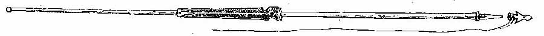
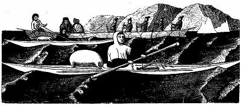

[Sacred-Texts](../../../index.md) [Native
American](../../index) [Inuit](../index.md)  
[Index](index) [Return to text](tte1-1.htm#p010.md)

------------------------------------------------------------------------

### facing page 10

*Thrower.*

*The large harpoon, with its thrower
attached.*

*Kayak paddle.*

*A kayaker in a half-jacket of skin, and a white
cotton jacket (present fashion). Travellers in umiak.*

------------------------------------------------------------------------

[Return to text](tte1-1.htm#p010.md)
