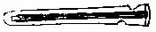
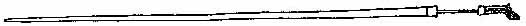
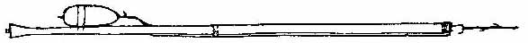
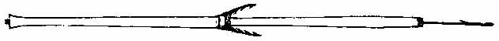

[Sacred-Texts](../../../index.md) [Native
American](../../index) [Inuit](../index.md)  
[Index](index) [Return to text](tte1-2.htm#p012.md)

------------------------------------------------------------------------

### facing page 12

|                                                                                  |                                                        |
|:--------------------------------------------------------------------------------:|:------------------------------------------------------:|
|                                                                     |                                           |
|                      *Thrower.*                       | *The large Lance or Spear.* |
|                                                                     |                                                        |
| *Smaller Hand-Spear (the point guarded by a sheath).* |                                                        |
|                                                                     |                                                        |
|                   *Bladder-arrow.*                    |                                                        |
|                                                                     |                                                        |
|                     *Bird-spear.*                     |                                                        |

------------------------------------------------------------------------

[Return to text](tte1-2.htm#p012.md)
