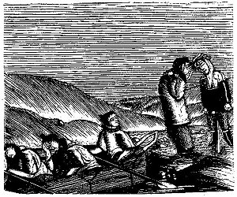

[Sacred-Texts](../../../index.md) [Native
American](../../index) [Inuit](../index.md)  
[Index](index) [Previous](tte2-033) [Next](tte2-035.md)

------------------------------------------------------------------------

### 34. UVIKIAK.

\[From one of the oldest manuscripts.\]

UVIKIAK was travelling to the north, accompanied by one son and two
daughters. Whenever he came to a favourable shore, the son kayaked ahead
of them, and when the others came up to the spot they had fixed to land
upon, he was already standing in waiting. They generally remained on
land for the night, and travelled further the next day; in the evening
the son roamed ahead, as usual, to await them ashore, but when they
landed and looked for him he was not to be seen. They pushed off again,
and having doubled a point of land and got into a bay, they saw his
lifeless body, standing erect, pierced with sharp weapons beneath his
arms, and his eyes covered with some of his entrails. At this sight his
father groaned with despair, and left the place to get hold of the
murderers. Some way off he observed some tents, and he went and asked,
"Have ye seen no travellers pass by this way?" "To p. 234 be sure we have: yesterday a boat passed by;
they were singing some kind of mock song about a young lad whose eyes
had been covered with his entrails, and at which they laughed and
scorned him." At this report

the father was still more provoked; and always lamenting the lost one,
they continued their journey of discovery, making inquiries at several
other places, where they always got the same information, that a boat
had newly passed by. Uvikiak still travelled on, with his wife and his
two daughters, never now coming on shore in the night. At last they
again reached some tents, and on making the usual inquiries, got the
answer that a boat had lately passed by, the crew of which were singing
very sadly about a young man they had killed; and the wrath of the old
Uvikiak somewhat subsided at their p. 235
mild words. They continued their journey for several days without being
able to sleep in the night for excitement; but at length they set foot
on the spot where lived the murderers. They put in and landed somewhat
at the back of their dwelling-place; and having got the boat on shore,
placed it keel upwards, and gathered crowberry plants and grass to cover
it up with. Uvikiak's wife betook herself under the boat, while he
himself went away with his daughters across the isthmus. They soon heard
a noise, and listening on one of the nearest hills, just above the spot
where they used to have dancing and other games,—they heard distinctly
that one of them was singing about Uvikiak's son. The song being
finished, two young men came walking up-hill, flushed with heat and
quite undressed. The new-comers at once inquired something about the
singers. "It is our master," they answered; "he was just singing about a
young man whom we happened to meet with down in the south, and killed—it
was mighty amusing!" In a great rage, Uvikiak instantly seized the one
of them, and the daughters the other. They soon got the better of both;
and having killed them, put them in exactly the same position as that in
which they had seen Uvikiak's son; after which they hid themselves at a
little distance. They had not to wait long before they heard a cry of
vengeance; but their hiding-place was not discovered; and they escaped
without any harm, and then returned to their home in the south.

------------------------------------------------------------------------

[Next](tte2-035.md)

 

 

 

 

 

 

 

 

 

 

 

 

 

 

 
