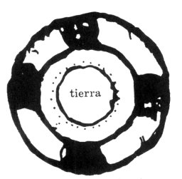

[Intangible Textual Heritage](../../../index)  [Native
American](../../index)  [Maya](../index)  [Index](index) 
[Previous](cbc12)  [Next](cbc14) 

------------------------------------------------------------------------

# VIII

### \[p. 26 C\] (NOTES ON ASTRONOMY)

(Small picture of a cross.) [3](#fn_230)

When the eleventh day of June shall come, it will be the longest
day. [4](#fn_231) When the thirteenth day of
September comes, this day and night are precisely

p. 87

the same &lt;in length&gt;. When the twelfth day of December shall come
the day 

<table data-align="LEFT">
<colgroup>
<col style="width: 100%" />
</colgroup>
<tbody>
<tr class="odd">
<td data-valign="CENTER"> 
FIG. 7.--Diagram showing the course of the sun in the heavens (Chumayel MS.).</td>
</tr>
</tbody>
</table>

is short, &lt;but&gt; the night &lt;begins to&gt; shorten. When the
tenth day of March comes, the day and night will be equal &lt;in
length.&gt;

This annulus in the center of the disk is white and indicates the course
of the sun. Between the two rings the black spots indicate the face of
the sun, which goes over the large black one and descends to the small
black one. Thus its movement is uniform, and this is its course here on
earth also. On the ground it is thus manifested plainly all over the
earth also. The progress of the sun is truly great as it takes its
course to enter into the great *Oro* [1](#fn_232) extended over the world. &lt;This is&gt;
the record &lt;of the motion&gt; of the sun as it is known here on
earth. /

|          |
|----------|
| p\. 27 C |

 

 [  
Click to view](img/fig08.jpg)  
FIG. 8--Diagram representing an eclipse of the sun  
(Chumayel MS.).

 

To the people on the sides of this half-section as pictured, the sun is
not eclipsed; [2](#fn_233) but for anyone who
is in the middle it is eclipsed. It is in conjunction with the moon when
it is eclipsed. It travels in its course before it is eclipsed. It
arrives in its course to the north, very great. It is all the same with
eclipses of the sun and moon before it arrives opposite to the sun.
&lt;This is&gt; the explanation so that Maya people may know what
happens to the sun and to the Moon.

p. 88

 

 [  
Click to view](img/fig09.jpg)  
FIG. 9--Diagram explaining the cause of solar and lunar eclipses
(Chumayel MS.). / \[p. 28 C\]

 

------------------------------------------------------------------------

### Footnotes

[86:3](cbc13.htm#fr_231) The cross probably
indicates that this is Christian teaching.

[86:4](cbc13.htm#fr_232) This date for the
summer solstice indicates that the passage was originally written at a
time when the Julian calendar was still current in Yucatan.

[87:1](cbc13.htm#fr_233) The translator does
not know the word *Oro* as an astronomical term. It is the name of the
gold disk which takes the place of the diamond on Spanish playing-cards
and may refer to sunlight in general.

[87:2](cbc13.htm#fr_234) *Chibil*, the Maya
word for an eclipse, also means eaten. Aguilar tells us that the Maya
believed that certain ants called *xulab* ate the sun or moon at the
time of an eclipse (Aguilar 1921, p. 304). This passage in the Chumayel
is evidently an attempt to correct such a belief, but it does not appear
to have been entirely successful, as Dr. Redfield reports that many
natives still believe that the moon is eaten by certain ants during an
eclipse (Redfield, Letter October 22, 1931).

There was, however, another explanation of the eclipse. Accompanied by
some information taken from European almanacs, we find in the Codex
Perez (p. 27) the statement that eclipses of the sun and moon are caused
by their being "covered" by the planets. Now the Maya Indians of San
Antonio in southern British Honduras give the name, xulab, to the deity
of the Morning Star who ranks only next to the Christian God in power.
The writer is inclined to connect this name with the ants called *xulab*
which by the Maya of northern Yucatan, are believed to eat the sun or
moon. The San Antonio Indians have been influenced by both the Chols and
Kekchis, and the idea in the north that the *xulab*-ants eat the moon
may well be a misunderstanding of a theory imported from the south to
the effect that eclipses were caused by certain planets. *Cf.* J. E.
Thompson 1930, p. 63.

------------------------------------------------------------------------

[Next: IX: The Interrogation of the Chiefs](cbc14)
