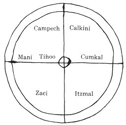

[Intangible Textual Heritage](../../../index.md)  [Native
American](../../index)  [Maya](../index)  [Index](index.md) 
[Previous](cbc20)  [Next](cbc22.md) 

------------------------------------------------------------------------

# XVI

### (A CHAPTER OF QUESTIONS AND ANSWERS)

 

   
FIG. 27--A map of northern Yucatan. [3](#fn_551) (Chumayel MS..md).

 

13 E¢nab &lt;was the day&gt; when the land was established. [4](#fn_552.md) 13 Cheneb [5](#fn_553.md) was when they measured off by paces the
cathedral, [6](#fn_554.md) the dark house of
instruction,

p. 126

the cathedral in heaven. Thus it was also measured off by paces here
&lt;on earth&gt;. Thirteen katuns was the total count, &lt;that is,
thir&gt;teen feet [1](#fn_555.md) in heaven. Four
feet, and from there nine feet, the total count of its extent in
heaven. [2](#fn_556.md) Then it is again measured
off by feet from the face of the earth. Four feet separate it from the
face of the earth.

Mani is the base of the land. Campeche is the tip of the wing of the
land. Calkini is the base of the wing of the land. Itzmal is the middle
of the wing of the land. Zaci is the tip of the wing of the land. Conkal
is the head of the land. [3](#fn_557.md)

In the middle of the town of Tihoo [4](#fn_558.md)
is the cathedral, the fiery house, [5](#fn_559.md)
the mountainous house, the dark house, for the benefit of God the
Father, God the Son and God the Holy Spirit.

Who enters into the house of God? Father, it is the one named
Ix-Kalem. [6](#fn_560.md)

What day did the Virgin conceive? Father, 4 Oc &lt;was the day&gt; when
she conceived.

What day did he come forth &lt;from her womb&gt;? On 3 Oc he came forth.

What day did he die? On 1 Cimi he died. Then he entered the tomb on 1
Cimi.

What entered his tomb? Father, a coffer of stone entered his tomb.

What entered in into his thigh? [7](#fn_561.md)
Father, it was the red arrow-stone. [8](#fn_562.md) It entered into the precious stone of
the world, there in heaven.

And his arm? Father, the arrow-stone; and that it might be
commemorated, [9](#fn_563.md) /

|          |
|----------|
| p\. 68 C |

it entered into the red living rock in the east. Then it came to the
north and entered into the white living rock. After that it entered the
black

p. 127

living rock in the west. Thus also &lt;it entered&gt; the yellow living
rock in the south. [1](#fn_564.md)

 [2](#fn_565.md) Son, how many deep hollows
&lt;are there&gt;? These &lt;are the holes&gt; for playing the
flute. [3](#fn_566.md)

Son, where is the cenote? [4](#fn_567.md) All are
drenched &lt;with&gt; its water. [5](#fn_568.md)
There is no gravel on its bottom; a bow is inserted over its
entrance. [6](#fn_569.md) &lt;It is&gt; the
church.

Son, where are the first marriages? The strength of the King [7](#fn_570.md) and the strength of the other
head-chiefs fail because of them, and my strength because of them also.
It is bread. [8](#fn_571.md)

Son, have you seen the green water-holes in the rock? There are two of
them; a cross is raised between them. They are a man's eyes.

Son, where are the first baptised ones? One has no mother, but has a
bead collar and little bells. It is *peeu*. [9](#fn_572.md)

Son, where is the food [10](#fn_573.md) which
bursts forth, and the fold of the brain &lt;and&gt; the lower end of
that which is inflated, [11](#fn_574.md) and the
dried fruit? It is the gizzard of a turkey.

Son bring me that which hooks the sky and the hooked tooth. They are a
deer and a gopher. [12](#fn_575.md)

p. 128

Son, where is the old woman with buttocks seven palms wide, the woman
with a dark complexion? It is &lt;the squash called&gt; *¢ol*. [1](#fn_576.md)

Son, show me the light complexioned woman with her skirt bound up who
sells white flints. It is &lt;the squash called&gt; *ca*. [1](#fn_576.md)

Son, bring me two yellow animals, one to be well boiled, and one shall
have its throat cut. I shall drink its blood also. It is a yellow deer
and a green calabash full of chocolate.

&lt;My&gt; sons, bring me here a score of those who bear flat stones and
two married ones. They are a quail [2](#fn_577.md)
and a dove. [3](#fn_578.md)

Son, bring me a cord of three strands, I wish to see it. It is an
iguana.

Son, bring . . . . [4](#fn_579.md) a mutual
confession of sin [5](#fn_580.md) that I may see
it here. It is the maguey. [6](#fn_581.md)

Son, bring me here that which stops the hole in the sky and the dew, the
nine layers of the whole earth. [7](#fn_582.md) It
is a very large maize tortilla. [8](#fn_583.md)

Son, have you seen the old man &lt;who is like&gt; an overturned
*comal*? [9](#fn_584.md) He has a large double
chin which reaches the ground. It is a turkey cock.

Son, bring me the old farmers, their beards come to their navels, also
their wives. It is a muddy arrowroot. [10](#fn_585.md)

Bring to me here with them the women who guard the fields, white
complexioned women. I will remove their skirts and eat them. It is a
jícama. [11](#fn_586.md) /

|          |
|----------|
| p\. 69 C |

Son, bring me the great gallants that I may view them. Perhaps they will
not dance badly when I see them. It is a turkey-cock.

p. 129

Son, where is the first collector? &lt;The answer is&gt; to undress, to
take off one's shirt, cape, hat and shoes. [1](#fn_587.md)

Son, where was it that you passed? Did you pass, perchance, to the high
rocky knoll which slopes down to the door of heaven, where there is a
gate in the wall? Did you see men in front of you, coming side by side?
Bolon C~~h~~aan [2](#fn_588.md) and the first
*Ah-kulel* [3](#fn_589.md) are there. It is the
pupils of the eyes and any pair of eyes.

Son, have you seen the rain of God? It passed beneath the mountains of
God; it entered beneath the mountains of God, where there is a cross on
the savannah. [4](#fn_590.md) There will be a ring
in the sky where the water of God has passed.

Son, where has the water of God passed when it comes forth from the
living rock? Father, &lt;from&gt; a man's head and all a man's teeth, it
passes through the opening in his throat and comes forth beneath.

Son, whom did you see on the road just now? . . . .  [5](#fn_591.md)

Son, what did you do with your companions who were coming close behind
you? Here are my companions. I have not left them. I await the judgment
of God when I shall come to die. This is a man's shadow.

Son, whom did you see on the road? Did you see perchance &lt;some&gt;
old men accompanied by &lt;their&gt; boys? Father, here are the old men
I saw on the road. They are with me; they do not leave me. This is his
great toe with the little &lt;toes&gt;.

Son, where did you see the old women carrying their step-children and
their other boys. Father, here they are. They are still with me so that
I can eat. I can not leave them yet. It is my thumb and the other
fingers.

Son, where did you pass by a water-gutter? [6](#fn_592.md) Father, here is the water-gutter; it is
right with me. This is my dorsal furrow.

Son, where did you see an old man astride a horse across a water-gutter?
Father, here is the old man. He is still with me. My shoulders are the
horse /

|          |
|----------|
| p\. 70 C |

on which you say the old man sits astride.

Son, this is the old man with you of which you spoke: it is manifest
truth and justice.

Son, go get the heart of the stone and the liver of the earth. . . .
 [7](#fn_593.md) I have seen one of them lying on
its back, and one lying on its face as though it were

p. 130

going into hell. They are a Mexican Agouti [1](#fn_594.md) and a Spotted Agouti, [2](#fn_595.md) also the first local chief and the first
Ah-kulel. [3](#fn_596.md) As for the heart of the
stone, it is the tips of the teeth; and that which covers the opening in
the neck of hell is a camote [4](#fn_597.md) and a
jícama.

Son, go and bring me here &lt;the girl&gt; with the watery teeth. [5](#fn_598.md) Her hair is twisted into a tuft; she is
a very beautiful maiden. Fragrant shall be her odor when I remove her
skirt and her &lt;other&gt; garment. It will give me pleasure to see
her. Fragrant is her odor and her hair is twisted into a tuft. It is an
ear of green corn cooked in a pit. [6](#fn_599.md)

Son, then you shall go and get an old man and the herb that is by the
sea. The old man is the *ac*, [7](#fn_600.md) and
&lt;the herb is&gt; a crab.

Son, then you shall go and get the stones from the bottom of a forest
pond. [8](#fn_601.md) It is the *tzac*. [9](#fn_602.md)

Son, then you shall bring here the stones of the savannah. It is a
quail. [10](#fn_603.md)

Also &lt;bring&gt; the first sorcerers, there are four [11](#fn_604.md) of them. They are the gopher, the
Spotted Agouti, the Mexican Agouti and the peccary.

Son, then go and get the thigh of the earth. It is the cassava. [12](#fn_605.md)

Son, go and bring here the green gallant and the green singer. It is a
wild turkey &lt;hen&gt; and cock. [13](#fn_606.md)

Son, you shall bring your daughter that I may see her in the sun
tomorrow. First the smaller one shall be brought and behind her shall
come the larger one. Her hair shall be bound with a feathered band; she
shall wear a head-scarf. I will take off her head-scarf. Also the
Ah-kulel is behind her. /

|          |
|----------|
| p\. 71 C |

p. 131

Son, then go and get a cluster [1](cbc22.htm#fn_607.md) of Plumeria flowers widely
separated. &lt;They should be&gt; there where the sun is tomorrow.
&lt;What is meant is&gt; roasted corn and honey.

Here I have rolled that which you have which is flat and round. [2](cbc22.htm#fn_608.md) There are many rolls of it in
the cave where you live. Then you shall roll it here that we may see it,
when it is time to eat. &lt;It is&gt; a fried egg.

------------------------------------------------------------------------

### Footnotes

[125:3](cbc21.htm#fr_553.md) This type of map is
fairly typical in Maya documents. Here as usual the principal town,
Tihoo (Merida), is in the center; but as a general thing the space
between the two outlying circles is divided into compartments, each of
which is occupied by the name of one of the border-sites. For a map of
this sort see Stephens, 1843, II, p. 264.

[125:4](cbc21.htm#fr_554.md) Probably a reference
to the Spanish occupation. 13 E¢nab was the day preceding 1 Cauac, from
which the Maya year which began in 1568 took its name, but this year
does not appear to have any special significance. 13 E¢nab would recur
every 260 days.

[125:5](cbc21.htm#fr_555.md) 13 Cheneb. This may
be a mistake of the copyist and intended either for the month Chen or
the day Eb. It is also possible that it was an occult word employed for
purposes of mystification.

[125:6](cbc21.htm#fr_556.md) Written *Ygleçia
mayor* in the text.

[126:1](cbc21.htm#fr_557.md) *Chek*, *chekel* and
*chekeb* designate a measure equaling the length of the human foot.
Perhaps the idea is that 13 katuns (13 x 7200?)in heaven correspond to
13 feet on earth, and that any sacred thing on earth must previously
exist in heaven.

[126:2](cbc21.htm#fr_558.md) Alternative
translation: toward heaven. This would indicate that we have here merely
the perpendicular measurement of the cathedral, but in that case the
number of feet designated would not be sufficient.

[126:3](cbc21.htm#fr_559.md) It will be seen that
the country is thought of as a vast bird whose wings extend from
Campeche to Valladolid (Zaci).

[126:4](cbc21.htm#fr_560.md) Tihoo is the modern
Maya name for Merida. In the older literature it is called Ichcanzihoo.

[126:5](cbc21.htm#fr_561.md) Maya, *kakal-na*. An
alternative translation would be "the enclosed house." This would better
fit Pio Perez' definition, which is the government building, the *casa
real*.

[126:6](cbc21.htm#fr_562.md) Ix-Kalem is a
feminine name, but it means little. Probably Ix-Kulem, the Holy One, is
intended.

[126:7](cbc21.htm#fr_563.md) Maya, *chac-bacel*,
which is the outside of the thigh or the thigh-bone.

[126:8](cbc21.htm#fr_564.md) The text actually
reads *chac haal-tun* which would mean the red water-hole in the rock,
but as an I between vowels is almost silent in Maya, we have made it
read chac *ha*&lt;*l*&gt;*al-tun*, which conforms with the word
*halal-tun*, arrow-stone, occurring in the answer to the following
question.

[126:9](cbc21.htm#fr_565.md) Maya *kinbezabal*:
this could mean either commemorated or warmed in the sun.

[127:1](cbc21.htm#fr_566.md) Here the text reverts
to pure Maya symbolism. The details of the crucifixion of Christ
apparently recalled to the Maya mind some of the ceremonies connected
with human sacrifice, in which the victim was probably considered the
representative of the god. Like the crown of thorns, a paper crown was
placed on his head, and the spear which pierced Christ's side appears to
have reminded the Maya writer of the arrow with which the priest struck
blood from the thigh of the sacrificial victim (Landa 1928, pp.
198-200). It is also possible that the legend of the stone arrow-points,
which entered the mythical rocks at the four corners of the world, was
associated in the mind of the writer with the rocks which were rent at
the time of the crucifixion.

[127:2](cbc21.htm#fr_567.md) The balance of this
chapter consists of a series of questions much resembling the series
entitled The Interrogation of the Chiefs in Chapter IX. Here, however,
no explanation is given as to the purpose of the catechism.

[127:3](cbc21.htm#fr_568.md) Maya *chul*, defined
as a flute. This is a direct flute or flageolet. An excellent picture of
this type of instrument is found in the Dresden Codex (p. 34 A) and
plainly shows the finger-holes along the side. Landa states that they
were made of cane or reeds. Another wind-instrument employed was a
trumpet called *hom*. This was made of a wooden tube to the end of which
was attached a long curved gourd, which probably gave it a flaring
mouth. Whistles made of reeds or bones and conch-shells were also blown
(Landa 1928, pp. 158-160).

[127:4](cbc21.htm#fr_569.md) Evidently a reference
to the cave type of cenote.

[127:5](cbc21.htm#fr_570.md) Probably either the
holy water or the water of baptism is meant.

[127:6](cbc21.htm#fr_571.md) A reference to the
arched doorway of the church.

[127:7](cbc21.htm#fr_572.md) Written *Rey* in the
text.

[127:8](cbc21.htm#fr_573.md) The key to this
riddle is not apparent.

[127:9](cbc21.htm#fr_574.md) *Peeu* is a small
early yellow maize which forms in forty days. The term is also applied
to anything small or dwarfed (Motul).

[127:10](cbc21.htm#fr_575.md) Maya *kauil*, an
obsolete word which has survived only in the term, *kauil-yah*, to beg
for food. In the old prophecies it is associated with bread. *Zatom uah,
zatom kauil*, bread shall be lost, food shall be lost, i.e. the crops
shall fail (Tizimin, p. 1).

[127:11](cbc21.htm#fr_576.md) Maya *peehe*, a term
applied to an inflated stomach or a full stomach. The question is based
on fancied resemblances seen in removing and cutting up the giblets of a
turkey.

[127:12](cbc21.htm#fr_577.md) Maya *ba*,
*Heterogeomys torridus* Merriam or *Orthegeomys scalops* Thomas,
possibly both. It is called *tuza* in Spanish. The Maya eat it.

[128:1](cbc21.htm#fr_579.md) *<u>¢</u>ol* is a
green flat squash and *ca* is another variety described as white and
striped with thick seeds (Motul). *Ca* is also the name of a stone used
to grind maize and cacao.

[128:2](cbc21.htm#fr_580.md) Maya bec~~h~~, a name
applied to *Eupsychortyx nigrogularis* Nelson (The Yucatan Bob-white),
and *Dactylortyx thoracicus sharpei* Nelson (Yucatan Long-toed Grouse)
(Bull. Mus. Comp. Zool. Harvard, vol. 50, p. 116). We have already seen
the quail associated with a stone. ([p. 94](cbc14.htm#page_94)..md)

[128:3](cbc21.htm#fr_581.md) Maya *mucuy*,
*Columbigallina rufipennis* Bonaparte (Ground dove), ibid. p. 117.

[128:4](cbc21.htm#fr_582.md) Here there is a
hiatus in the text.

[128:5](cbc21.htm#fr_583.md) The word for sin used
here, *tanal*, was considered antiquated already in the Sixteenth
Century. It has the same meaning in Chol and may have been borrowed from
that language (Motul Dictionary; LaFarge 1930, MS.). This mutual
confession was an ancient Maya custom and was usually practised in time
of sickness when death was imminent (Landa 1928, p. 188).

[128:6](cbc21.htm#fr_584.md) Mrs. S. G. Morley has
called the translator's attention to a lintel at Piedras Negras on which
a kneeling penitent is seen passing a cord of maguey spines through his
tongue (Charnay 1887, p. 250).

[128:7](cbc21.htm#fr_585.md) Like the Mexicans,
the Maya appear to have conceived that the world consisted of nine
layers. The uppermost was the surface of the earth, and the other eight
were the underworlds; in the lowermost reigned the god of the under
regions variously called Cumhau and Xibalba in Maya (Motul Dictionary)
and Mictlantecuhtli in Nahuatl (Seler 1923, pp. 17 and 22).

[128:8](cbc21.htm#fr_586.md) This is evidently the
"*tutiwa*" consisting of nine layers of tortillas and beans and employed
in connection with the Maya harvest festival and the rain-making
ceremony called c~~h~~achac (Tozzer 1907, pp. 160-162).

[128:9](cbc21.htm#fr_587.md) *Comal*, the Spanish
name for the dish or pan used for cooking tortillas, called *xamach* in
Maya.

[128:10](cbc21.htm#fr_588.md) *Chac* in the text.
It is usually spelled *chaac*, *Maranta arundinacea* L.

[128:11](cbc21.htm#fr_589.md) *Pachyrhizus erosus*
(L.) Urban, an edible root resembling a turnip but eaten raw.

[129:1](cbc21.htm#fr_590.md) It seems probable
that the compiler has omitted something here.

[129:2](cbc21.htm#fr_591.md) Bolon Chaan is
probably the name of a deity. It might be translated as Ninth Heaven. We
find him mentioned on page [106](cbc15.htm#page_106.md).

[129:3](cbc21.htm#fr_592.md) *Ah-kulel* means
mediator or deputy and is the title of a certain class of
town-officials. They were inferior to the *ah-cuch-cab*, or councillors,
and superior to the *tupil*, whom the Spaniards considered a sort of
constable.

[129:4](cbc21.htm#fr_593.md) We can not but
suspect that by the "mountain of God" the usual landmark consisting of a
heap of stones surmounted by a cross is meant.

[129:5](cbc21.htm#fr_594.md) A hiatus in the text.

[129:6](cbc21.htm#fr_595.md) Maya *yoc-ha*. It
also means river, but there are practically no rivers in northern
Yucatan.

[129:7](cbc21.htm#fr_596.md) A hiatus in the text
in which the Maya copyist has inserted a few disjointed syllables. See
text.

[130:1](cbc21.htm#fr_597.md) Maya, *haleu*,
*Cuniculus paca nelsoni* Goldman (?); Spanish *paca*.

[130:2](cbc21.htm#fr_598.md) Maya, *tzub*,
*Dasyprocta punctata yucatanica* Goldman; *aguti pinto*.

[130:3](cbc21.htm#fr_599.md) *Cf.* p. 129, note
 [3](#fn_589.md).

[130:4](cbc21.htm#fr_600.md) Maya *iz*, *Ipomæa
batatas* L.

[130:5](cbc21.htm#fr_601.md) Maya, *ix ha-liz co*.
*Ix* is the regular feminine prefix. *Haa* means water, and -*liz* is a
suffix indicating possession of what precedes. *Co* means either a tooth
or a kernel of maize. The phrase has been interpreted as "a woman of
Jalisco," which would no doubt be rendered Ix Halisco or Ix Halizco in
Maya, but Jalisco is so distant from Yucatan that the metaphor seems
rather unlikely. *Cf.* Mediz-Bolio 1930, p. 84.

[130:6](cbc21.htm#fr_602.md) Meat, maize and
squashes were frequently cooked in a heated pit by the Maya. Here the
ear of green corn was evidently cooked in the husk, which would preserve
the milky juice. The husk is compared to a garment and the corn-silk to
a twisted tuft of hair.

[130:7](cbc21.htm#fr_603.md) *Ac* is a tall grass
employed for thatching houses. It is called *barbon* in Spanish, which
means a man with a thick beard. One Yucatecan writer states that it is
"*Andropogon antillarum*" (MacKinney, 1889). *Ac* is also a turtle.

[130:8](cbc21.htm#fr_604.md) Maya *kax-ek*,
defined by Avendaño, apud Means 1917, p. 159.

[130:9](cbc21.htm#fr_605.md) The text reads
*ah-tzatzac*. The *tzac* is an unidentified variety of small fish.

[130:10](cbc21.htm#fr_606.md) *Cf.* p. 94, note
 [3](cbc14.htm#fn_266.md).

[130:11](cbc21.htm#fr_607.md) The text gives this
number as two.

[130:12](cbc21.htm#fr_608.md) Maya *¢iin*,
*Manihot esculenta* Crantz. *Cf.* [p. 96](cbc14.htm#page_96.md).

[130:13](cbc21.htm#fr_609.md) Maya *cutz* and
*ah-tzo*. *Ah-tzo* is a general term for turkey-cock. *Cutz* has been
identified as *Agriocharis ocellata* Cuvier, or Ocellated turkey (Bull.
Mus. Comp. Zool. Harvard, vol. 50, p. 115). There is another wild turkey
found in Yucatan, *Meleagris mexicana*, which may be called cutz also
(Tozzer 1907, p. 22).

------------------------------------------------------------------------

[Next: XVII: An Incantation](cbc22.md)
