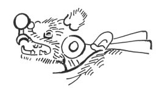
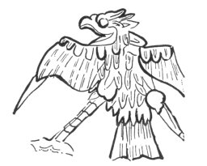
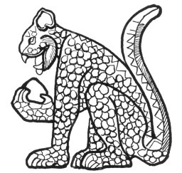

[Intangible Textual Heritage](../../../index)  [Native
American](../../index)  [Maya](../index)  [Index](index) 
[Previous](cbc34)  [Next](cbc36) 

------------------------------------------------------------------------

p. 196

# APPENDIX F

### TOLTEC MILITARY ORDERS IN YUCATAN

In the prophetic literature of the Maya we find the names of certain
animals mentioned in such manner as to suggest that they stand as the
symbols for something else and that the reference is not to the actual
animals. For example, we read: "There shall be no fox [1](#fn_1035) to bite them," [2](#fn_1036) "there shall be neither fox nor
kinkajou that will bite," [3](#fn_1037) "there
shall be neither fox, puma nor weasel: there shall be none that bite.
The claws of the puma shall be drawn; the claws of the jaguar shall be
drawn." [4](#fn_1038) "The time shall come
when the burrowing opossum [5](#fn_1039) and
the jaguar [6](#fn_1040) shall bite one
another." [7](#fn_1041) At first sight it
seems strange to find the comparatively harmless fox, kinkajou, weasel
and opossum classed with the jaguar and puma.

We can not but suspect that these fauna-names are referable to certain
persons and that the prophecies tell of a time when the people will be
freed of the presence of these unwelcome individuals. Indeed, a further
examination of the related material confirms this conjecture. In the
Book of Chilam Balam of Tizimin we read: "At the time &lt;of the
year&gt; 3 Kan the spots shall be removed from the red jaguars, the
white jaguars. [8](#fn_1042) The claws and
teeth shall be drawn from the jaguars [9](#fn_1043) of the Itzá." [10](#fn_1044)

We find further indications of the significance of these names of
animals in the following passages: "There is no kinkajou, there is no
fox, there is no weasel to suck men's blood; there are no pernicious
rulers." [11](#fn_1045) "The rulers shall be
cut off, when the claws of the eagle [12](#fn_1046) are cut, when the backs of the
kinkajou

p. 197

and the fox are clawed and torn" [1](#fn_1047)
"Then the burrowing opossums who are greedy for dominion shall bite one
another." [2](#fn_1048) For Katun 12 Ahau, a
period of good fortune, the prophecy states: "The burrowing opossum
shall flee. He shall give up his delegated mat [3](#fn_1049) and throne, and he shall go out into
the wilderness. Men shall be happy; things shall go well in the
towns." [4](#fn_1050) From this we infer that
these animals represent certain persons in authority, and such a
conclusion is amply confirmed by the following passage: "In the ninth
year of Katun 6 Ahau the puma (*coh*) and the jaguar (*balam*) claw one
another's backs. The puma (*coh*) is a *leon*. [5](#fn_1051) These are the head-chiefs
(*halach-uinicob*)." [6](#fn_1052)

We have already seen how the central organization at Mayapan may be
traced to a Toltec origin and followed to a certain extent the example
of the Nahua institutions of the highlands of Mexico. It has also been
noted that this foreign political structure was superimposed upon a form
of local government that was probably indigenous. [7](#fn_1053) We may therefore turn to the history
of the Nahua peoples of Mexico for an explanation of some symbols
connected with the higher ranks of the rulers in Yucatan.

Landa has given us to understand that with the exception of the Cocoms
and Xius who ruled at Mayapan, the so-called "lords" possessed delegated
powers only, and that it was only after the fall of that city that these
*halach-uinics* became the real rulers of the various independent states
into which the Spaniards found the country divided at the time of their
arrival. [8](#fn_1054) We have also noted in
one of the prophecies just quoted that the "burrowing opossum" is to
"give up his delegated mat and throne," or in other words, his
authority. Consequently it seems permissible to draw an analogy between
the *halach-uinics* symbolized by these animals and the *tecuhtli*, or
so-called "lords," of the Nahua peoples of Mexico.

Seler has convincingly shown that the Mexican "king" delegated many of
his functions to these men, and that the institution reached its highest
development when the latter were set to supervising the collection of
tribute and enforcing other rights which their own state had acquired
over a conquered people. [9](#fn_1055) Such
would also be the case in Yucatan where the Toltec conquerors appear to
have actually settled in the country and maintained their power for a
long time in spite of the fact that they could never have formed more
than a very small proportion of the population.

p. 198

Seler goes on to quote from the unpublished Sahagun manuscript a list of
mantles worn by persons of high rank in Mexico. A number of these are
described as representing the skins of animals which we have seen
mentioned in the Maya prophecies, such as the jaguar, kinkajou, puma,
wild-cat and coyote. [1](#fn_1056) From the
same source and from the Mexican picture-manuscripts he gives
descriptions and illustrations of warrior-costumes representing coyotes
and jaguars. [2](#fn_1057) He believes that
what he calls "royal rank" among the Mexicans went back in the first
instance to Quetzalcoatl and the Toltec dynasty, [3](#fn_1058) and we have already seen how Landa
traces the authority of the "lords" of Yucatan back to the same
source. [4](#fn_1059)

|                                                   |                                                   |
|---------------------------------------------------|---------------------------------------------------|
|   |   |

FIG. 47--Temple of the Warriors frescos: *a*, coyote-fox; [5](#fn_1060) *b*, eagle. (After Ann Axtell Morris.)

 

If we are right in ascribing a Mexican origin to a large part of the
symbolism discussed here, it is to the architectural remains of the
Toltec occupation of Yucatan that we should look for archæological
confirmation. The jaguar, it is true, appears frequently in the older
Maya art, indeed it goes back to some of the earliest monuments; but
before the appearance of an intrusive Nahua culture in Yucatan this
animal is always connected with the priesthood. Only in the Toltec
temples do we begin to find it a symbol of the warrior class, as in the
reliefs of the Temple of the Tigers and the platform just to the east of
it at Chichen Itzá. It is in the reliefs and frescos of that masterpiece
of Maya-Toltec architecture, the Temple of the Warriors, that we find
the most striking illustration of the animals symbolizing the Nahua
warrior-chieftains who once ruled over Yucatan. Many of them bear human
hearts in their claws, suggesting that the warriors whom they represent
captured victims for human

p. 199

sacrifice. Here we see the puma, [1](#fn_1061)
the jaguar [2](#fn_1062), the coyote or
fox [3](#fn_1063) and the eagle. [4](#fn_1064)

Although we have but little data on which to base an estimate of the age
of the Toltec remains at Chichen Itzá, it seems probable that the
political hegemony of this city preceded that of Mayapan. [5](#fn_1065) Consequently we can hardly expect too
close a correspondence between the references in the Books of Chilam
Balam and the sculptures at Chichen Itzá. The Maya writers of the
Spanish colonial period would have a much more vivid recollection of the
hegemony of Mayapan which ended about the middle of the Fifteenth
Century.

Among the Mexicans the jaguar was the strong and brave animal par
excellence, the companion of the eagle. Indeed "Eagle and Jaguar" was
the conventional designation of brave warriors. [6](#fn_1066) The coyote was regarded in a two-fold
aspect. He was the god of singing and dancing, but as a beast of prey he
was also a symbol of the warrior. Certain outstanding warriors appeared
both at dances and in battle clothed in a garment representing the
coyote. [7](#fn_1067) If it seems a little
strange to find the coyote serving as a symbol of bravery, we can not
but feel that a considerable stretch of the imagination was required to
consider the kinkajou in the same light. And yet such was the case.
Whether alone, or associated with the hawk, the kinkajou was, next to
the eagle and jaguar, regarded as one of the bravest and strongest
animals and the symbol of the bold warrior. [8](#fn_1068) "Hawk and Kinkajou" are often
mentioned in the Mexican myths and stories along with the "Eagle and
Jaguar." [9](#fn_1069)

The weasel (Maya *zabin* or *sabim*) seems a more appropriate animal in
this connection than either the coyote or kinkajou. Its association with
ideas pertaining to military affairs is shown by certain expressions
found in the Motul dictionary. "*Zabim-be, ah-zabim-be*: a look-out,
sentinel and spy, when no battle-line has been formed; also to keep a
look-out." "*Zabin-katun*: look-out

p. 200

or sentinel, when the battle-line has been formed, and to keep a
look-out in this manner." Literally, *zabim-be* means the weasel of the
road and *zabin-katun*, the weasel of the army. No portrayal of this
animal has yet been found and identified.

This leaves the so-called "burrowing opossum" to be accounted for. It
must be confessed that neither in Maya nor Mexican art have we found the
opossum playing the rôle assigned to him in the Books of Chilam Balam.
Frequently depicted in the Mexican picture-manuscripts, the animal
appears as

 

   
FIG. 48--Jaguar. Relief-carving at Chichen Itzá.

 

lord of the lower regions or as the associate of certain gods. In the
Maya Dresden Codex he is dressed as a dancer and brings on his back the
Regent of the New Year. [1](#fn_1070) Nowhere
do we find him associated with either war or chieftainship except in the
Books of Chilam Balam.

The frequent mention of these various animals in the Books of Chilam.
Balam is therefore of unusual interest. Although the meaning of the
jaguars and eagles at Chichen Itzá has long been known, we should be
tempted to ascribe a religious or mythological significance to the other
animals found in the reliefs and frescos of that city, if it were not
for the information contained in these manuscripts. As it is, they take
on the character of historical and political figures.

------------------------------------------------------------------------

### Footnotes

[196:1](cbc35.htm#fr_1042) Maya, *c~~h~~amac*,
a term applied in northern Yucatan to the Grey Fox, *Urocyon
cinereo-argenteus fraterculus* Elliot, identified by Goldman and Gaumer.
The same name appears to be given to the coyote in some part of the Maya
speaking area where the latter exists. *Cf.* Roys 1931, p. 331.

[196:2](cbc35.htm#fr_1043) Chumayel, p. 125.

[196:3](cbc35.htm#fr_1044) Maya, *cab-coh*,
literally honey-puma, called *oso melero* in Spanish and identified by
Goldman and Gaumer as the Aztec Kinkajou, *Potas flavus aztecus* Thomas.
*Cf.* Roys 1931, p. 329. The quotation is from Chumayel, p. 159.

[196:4](cbc35.htm#fr_1045) Tizimin p. 26; Mani
(Codex Perez) p. 80. *Coh* is the puma, *Felis concolor* L., and *zabin*
is the weasel, *Mustela tropicalis* Merriam. *Cf.* Roys 1931, pp. 330,
342.

[196:5](cbc35.htm#fr_1046) Maya, *holil-och*,
identified by Gaumer as *Marmosa gaumeri* Osgood, spec. nov. *Cf.* Roys
1931, p. 333.

[196:6](cbc35.htm#fr_1047) Maya, *chat-bolay*,
identified by Goldman as Hernandez's Jaguar, *Felis hernandesii
goldmani* Mearns, and called *tigre* in Spanish. Pio Perez (1866-77)
defines it as "*el leoncillo*" and Pacheco Cruz (1919, p. 14), as
"*tigrillo*." *Balam* is the usual Maya word for jaguar.

[196:7](cbc35.htm#fr_1048) Tizimin, p. 3.

[196:8](cbc35.htm#fr_1049) Maya, *chac-bob*,
*zac-bob*. *Bobil-che* was a general term for the *tigre*, or jaguar
(Relaciones de Yucatan, I, p. 169). It is possible that smaller felines
like the margay were also included by the term.

[196:9](cbc35.htm#fr_1050) Maya,
*bal*&lt;*a*&gt;*mil*.

[196:10](cbc35.htm#fr_1051) Tizimin, p. 10.

[196:11](cbc35.htm#fr_1052) Mani (Codex
Perez), p. 80.

[196:12](cbc35.htm#fr_1053) Maya,
*c~~h~~uyum-thul* (literally, that which holds a rabbit suspended) is
defined by the Motul dictionary, Spanish-Maya portion as "*Aguila o
especie della, ave de rapina*." In present-day Maya the word means both
an eagle and a large hawk (Pacheco Cruz, 1919, p. 62,) and elsewhere we
find the term defined as a hawk, osprey or kite (Motul, Maya-Spanish
portion). Another word, *coot* is variously defined as the red eagle and
the black eagle.

[197:1](cbc35.htm#fr_1054) Tizimin, p. 32.

[197:2](cbc35.htm#fr_1055) *Ibid*., p. 25.

[197:3](cbc35.htm#fr_1056) The mat, like the
throne, was a symbol of authority. *Cf.* p. 92, note
 [3](cbc14.htm#fn_257).

[197:4](cbc35.htm#fr_1057) Tizimin, p. 26.

[197:5](cbc35.htm#fr_1058) In many parts of
Spanish America the puma is called *leon*.

[197:6](cbc35.htm#fr_1059) Mani (Codex Perez),
p. 72.

[197:7](cbc35.htm#fr_1060) *Cf.* Appendix E.

[197:8](cbc35.htm#fr_1061) Landa 1928, pp.
70-72.

[197:9](cbc35.htm#fr_1062) Altmexikanischer
Schmuck und soziale und militärische Rangabzeichen, Seler 1904, pp.
509-619.

[198:1](cbc35.htm#fr_1063) *Ibid*., p. 518.

[198:2](cbc35.htm#fr_1064) *Ibid*., pp.
558-560.

[198:3](cbc35.htm#fr_1065) *Ibid*., p. 510.

[198:4](cbc35.htm#fr_1066) *Cf.* Appendix E.

[198:5](cbc35.htm#fr_1067) Mrs. Morris notes
that this animal wears the blue necklace common to the human warrior and
considers it to be a composite bear and coyote, identifying it with a
short-tailed long-haired animal which appears frequently in the
sculptured frieze of the same temple. As the coyote would be known only
from hearsay at Chichen Itzá, we might expect a less realistic treatment
than in the case of other animals. Morris, Charlot and Morris, Plate
165.

[199:1](cbc35.htm#fr_1068) See [Plate 1,
a](cbc03.htm#img_pl1a); also Morris, Charlot and Morris 1931, pp. 40-41.
Cit-chac-coh, literally Father-red-puma, appears to have been the name
of one of the war-gods. In the month of Pax the warriors and *nacom*
(war-chief) celebrated a festival to this deity, during which the
*nacom* was given divine honors as though he were himself the god. It
would seem from this that the war-chief was the especial representative
of this puma war-god. (Landa 1929, p. 84.)

[199:2](cbc35.htm#fr_1069) Morris, Charlot and
Morris 1931, Pl. 151.

[199:3](cbc35.htm#fr_1070) *Ibid*., Pl. 165;
see [fig. 47, a](#img_fig47a).

[199:4](cbc35.htm#fr_1071) *Ibid*., Pl. 164.

[199:5](cbc35.htm#fr_1072) Perhaps the most
likely estimate of this period would be from the introduction of the
Kukulcan cult some time in the Tenth Century A.D. to the conquest of the
city by Hunac Ceel at the end of the Twelfth Century. We are told that
the hegemony of Chichen Itzá lasted over two hundred years and that "at
one time this entire land was under the dominion of a lord who reigned
over the ancient city of Chichen Itzá. To him were tributary all the
lords of this province, and even from outside the province, from Mexico,
Guatemala, Chiapas and other provinces they sent presents in token of
peace and friendship" (Relaciones de Yucatan, I, pp. 176, 120-121).

[199:6](cbc35.htm#fr_1073) Seler 1923, p. 470.

[199:7](cbc35.htm#fr_1074) *Ibid*., p. 496.

[199:8](cbc35.htm#fr_1075) *Ibid*., p. 503.

[199:9](cbc35.htm#fr_1076) *Ibid*., p. 595.

[200:1](cbc35.htm#fr_1077) Seler 1923, pp.
506-509.

------------------------------------------------------------------------

[Next: Appendix G: The Americanization of Christianity](cbc36)
