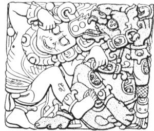

  
[Intangible Textual Heritage](../../../index)  [Native
American](../../index)  [Maya](../index) 

------------------------------------------------------------------------

[Buy this Book at
Amazon.com](https://www.amazon.com/exec/obidos/ASIN/0806104473/internetsacredte)

------------------------------------------------------------------------

<table width="75%">
<colgroup>
<col style="width: 50%" />
<col style="width: 50%" />
</colgroup>
<tbody>
<tr class="odd">
<td width="50%" data-valign="TOP"></td>
<td width="50%" data-valign="CENTER"><h1 id="maya-hieroglyphic-writing-excerpts" data-align="CENTER">Maya Hieroglyphic Writing (excerpts)</h1>
<h2 id="by-j.-eric-s.-thompson" data-align="CENTER">by J. Eric S. Thompson</h2>
<h4 id="section" data-align="CENTER">[1950]</h4></td>
</tr>
</tbody>
</table>

------------------------------------------------------------------------

[Contents](#contents)    [Start Reading](mhw06)

------------------------------------------------------------------------

|                                                                                                                           |
|---------------------------------------------------------------------------------------------------------------------------|
|  |

J. Eris S. Thompson was one of the leading 20th century Mayan scholars.
This is a set of excerpts from Thompson's massive opus on Mayan writing.
Mayan dates were the first elements of this writing system which were
decoded, so there is extensive discussion of the Mayan calendar in this
work. New portions of this book will be added in the near future, but it
is not feasible to post the entire book on the web at this point.

------------------------------------------------------------------------

 [Title Page](mhw00)  
[The Long Count](mhw06)  
[Appendix I. Divinatory Almanacs in the Books of Chilam Balam](mhwap1)  
[Appendix II. The Correlation Question](mhwap2)  
[Appendix III. Whorf's Attempts to Decipher the Maya
Hieroglyphs](mhwap3)  
[Appendix IV. Maya Calculations Far into the Past and into the
Future](mhwap4)  
[Appendix V. Determinants](mhwap5)  
