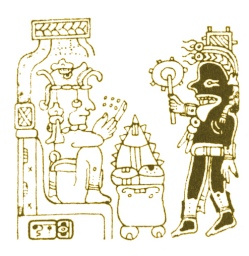

  
[Intangible Textual Heritage](../../../index.md)  [Native
American](../../index)  [Maya](../index.md) 

------------------------------------------------------------------------

[Buy this Book at
Amazon.com](https://www.amazon.com/exec/obidos/ASIN/0486236226/internetsacredte.md)

------------------------------------------------------------------------

<table width="75%">
<colgroup>
<col style="width: 50%" />
<col style="width: 50%" />
</colgroup>
<tbody>
<tr class="odd">
<td width="50%" data-valign="TOP"></td>
<td width="50%" data-valign="CENTER"><h1 id="yucatan-before-and-after-the-conquest" data-align="CENTER">Yucatan Before and After the Conquest</h1>
<h2 id="by-diego-de-landa-tr.-william-gates" data-align="CENTER">by Diego de Landa, tr. William Gates</h2>
<h4 id="section" data-align="CENTER">[1937]</h4></td>
</tr>
</tbody>
</table>

------------------------------------------------------------------------

[Contents](#contents)    [Start Reading](ybac00.md)

------------------------------------------------------------------------

|                                                                                                                           |
|---------------------------------------------------------------------------------------------------------------------------|
|  |

Among the many 'bad guys' in the history of sacred texts, the Friar
Diego de Landa has to occupy a special circle in hell. In 1562, de Landa
conducted an 'Auto de fé' in Maní where in addition to 5000 'idols,' he
burned 27 books in Maya writing. This one act deprived future
generations of a huge body of Mayan literature. He culturally
impoverished the descendents of the Mayas, and left only four codices
for scholars to puzzle over.

The document translated here is de Landa's apology, and one of the few
remaining contemporary texts which describe pre-conquest Mayan society,
science, and art in detail. As such it must be read in context. The
translator and editor, the distinguished Americanist William Gates,
provides plenty of background on de Landa, the decline of the Maya, and
what is today known about their ancient culture.

Although the vast majority of the information here is solid and
cross-documented, there is one notable lapse, de Landa's infamous [Mayan
alphabet](ybac45.htm#page_83.md), which bears no relation to the realities
of the hieroglyphic Mayan writing system. This has often been mis-used
to make points about the diffusion of letter forms, so it bears a close
look *in situ*.

------------------------------------------------------------------------

 [Title Page](ybac00.md)  
[Dedication](ybac01.md)  
[Contents](ybac02.md)  
[Introduction](ybac03.md)  
[Map](ybac04.md)  
[I. Description of Yucatan. Variety of Seasons](ybac05.md)  
[II. Etymology of the Name of this Province. Its Situation](ybac06.md)  
[III. Captivity of Gerónimo De Aguilar. Expedition of Hernandez De
Córdoba And Grijalva To Yucatan](ybac07.md)  
[IV. Expedition of Cortés to Cozumel. Letter to Aguilar and His
Friends](ybac08.md)  
[V. Provinces of Yucatan. Its Principal Ancient Structures](ybac09.md)  
[VI. Cuculcán. Foundation of Mayapán](ybac10.md)  
[VII. Government, Priesthood, Sciences, Letters and Books in
Yucatan](ybac11.md)  
[XIII. Arrival of the Tutul-xius and the Alliance They Made With the
Lords of Mayapán. Tyranny of Cocom, The Ruin of His Power and of the
City of Mayapán](ybac12.md)  
[IX. Chronological Monuments of Yucatan. Foundation of the Kingdom of
Sotuta. Origin of the Chels. The Three Principal Kingdoms of
Yucatan](ybac13.md)  
[X. Various Calamities Felt In Yucatan In the Period Before the Conquest
By the Spaniards: Hurricane, Wars, etc.](ybac14.md)  
[XI. Prophecies of the Coming of the Spaniards. History of Francisco de
Montejo, First Admiral of Yucatan](ybac15.md)  
[XII. Montejo Sails For Yucatan and Takes Possession of the Country. The
Chels Cede To Him the Site of Chichén Itzá. The Indians Force Him to
Leave](ybac16.md)  
[XIII. Montejo Leaves Yucatan With All His People and Returns to Mexico.
His Son, Francisco De Montejo, Afterwards Pacifies Yucatan](ybac17.md)  
[XIV. State Of Yucatan After the Departure of the Spaniards. Don
Francisco, Son of the Admiral Montejo, Re-Establishes the Spanish Rule
in Yucatan](ybac18.md)  
[XV. Cruelties of the Spaniards Toward the Indians. How They Excused
Themselves](ybac19.md)  
[XVI. State of the Country Before the Conquest. Royal Decree in Favor of
the Indians. Health of the Admiral Montejo. His Descendants](ybac20.md)  
[XVII. Arrival of the Spanish Franciscan Friars in Yucatan. Protection
They Gave to the Natives. Their Contests with the Spanish Military
Element](ybac21.md)  
[XVIII. Vices of the Indians. Studies of the Friars in the Language of
the Country. Their Teachings to the Indians. Conversions. Punishments of
Apostates](ybac22.md)  
[XIX. Arrival of Bishop Toral and Release of the Imprisoned Indians.
Voyage of the Provincial of San Francisco to Spain to Justify the
Conduct of the Franciscans](ybac23.md)  
[XX. Construction of the Houses of Yucatan. Obedience and Respect of the
Indians For Their Chiefs. Headgear and Wearing of Garments](ybac24.md)  
[XXI. Food and Drink of the Indians of Yucatan](ybac25.md)  
[XXII. Painting and Tattooing of the Indians. Their Orgies, Wines and
Banquets. Their Comedies, Music and Dances](ybac26.md)  
[XXIII. Industry, Commerce and Money. Agriculture and Seeds. Justice and
Hospitality](ybac27.md)  
[XXIV. Method of Counting of the Yucatecans. Genealogies. Inheritances
and Tutelage of the Orphans. The Succession of the Chiefs](ybac28.md)  
[XXV. Divorces Frequent Among the Yucatecans. Nuptial Customs](ybac29.md)  
[XXVI. Method of Baptism in Yucatan; How it was Celebrated](ybac30.md)  
[XXVII. Kind of Confessions Among the Indians. Abstinences and
Superstitions. Diversity and Abundance of Idols. Duties of the
Priests](ybac31.md)  
[XXVIII. Sacrifices and Self-Mortifications, Both Cruel and Obscene,
Among the Yucatecans. Human Victims Slain By Arrows, and
Others](ybac32.md)  
[XXIX. Arms of the Yucatecans. Military Chieftains. Militia and
Soldiers. Customs of War](ybac33.md)  
[XXX. Penalties and Punishments for Adulterers, Homicides and Thieves.
Education of the Young Men. Custom of Flattening the Heads of
Children](ybac34.md)  
[XXXI. Clothing and Ornaments of the Indian Women](ybac35.md)  
[XXXII. Chastity And Education of the Indian Women of Yucatan. Their
Chief Qualities and Their Household Economy. Their Devotion and the
Special Observances at the Time of Childbirth](ybac36.md)  
[XXXIII. Funerals. Burials of the Priests. Statues to Preserve the Ashes
of the Chiefs, and the Honors They Paid to Them. Their Belief Regarding
a Future Life, with Rewards and Punishments](ybac37.md)  
[XXXIV. Count of the Yucatecan Year. Characters of the Days. The Four
Bacabs and Their Names. Gods of the 'Unlucky' Days](ybac38.md)  
[XXXV. Festivals of the 'Unlucky' Days. Sacrifices For the Beginning of
the New Year Kan](ybac39.md)  
[XXXVI. Sacrifices for the New Year of the Character Muluc. Dances of
the Stilt-Walkers. Dance of the Old Women With Terracotta
Dogs](ybac40.md)  
[XXXVII. Sacrifices For the New Year With the Sign Ix. Sinister
Prognostics, and Manner of Conjuring Their Effects](ybac41.md)  
[XXXVIII. Sacrifices of the New Year of the Letter Cauac. The Evils
Prophesied and Their Remedy in the Dance of the Fire](ybac42.md)  
[XXXIX. The Author's Explanation as to Various Things in the Calendar.
His Purpose in Giving These Things Notice](ybac43.md)  
[XL. Months and Festivals of the Yucatecan Calendar](ybac44.md)  
[XLI. Cycle of the Mayas. Their Writings](ybac45.md)  
[XLII. Multitude of Buildings in Yucatan. Those of Izamal, of Merida,
and of Chichén Itzá](ybac46.md)  
[XLIII. For What Other Things the Indians Made Sacrifices](ybac47.md)  
[XLIV. The Soil and its Products](ybac48.md)  
[XLV. The Waters and the Fishes Found in Them](ybac49.md)  
[XLVI. How There Are Serpents and Other Poisonous Animals](ybac50.md)  
[XLVII. Of The Bees and Their Honey and Wax](ybac51.md)  
[XLVIII. Of the Plants, Flowers and Trees; of the Fruits and Other
Edibles](ybac52.md)  
[XLIX. Of the Birds](ybac53.md)  
[L. Of the Larger Animals, and of the Smaller Ones](ybac54.md)  
[LI. The Author's Conclusion and Appeal](ybac55.md)  
[LII. Criticism and Correction of Certain Statements](ybac56.md)  

### Additional Documents

[Letter in Maya to the King](ybac57.md)  
[Letter of Francisco de Montejo Xiu](ybac58.md)  
[Letter of Diego Rodríguez Bibanco](ybac59.md)  
[The Xiu Family Papers](ybac60.md)  
[The Map, and the Meeting at Maní](ybac61.md)  
[The 1685 page by Juan Xiu](ybac62.md)  
[Yucatan in 1579 Showing the Pre-Spanish Maya Chiefdoms](ybac63.md)  
[Yucatan in 1549 and 1579](ybac64.md)  
[The Ordinances of Tomás López](ybac65.md)  
[Proclamation Required to be Made by Every Chief of an Expedition to the
Indians at the Moment of Disembarking](ybac66.md)  
[Identification of Plant Names mentioned in Landa's text](ybac67.md)  
