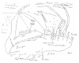

  
[Intangible Textual Heritage](../../../index.md)  [Native
American](../../index)  [Maya](../index)  [Index](index.md) 
[Previous](ybac03)  [Next](ybac05.md) 

------------------------------------------------------------------------

[Buy this Book at
Amazon.com](https://www.amazon.com/exec/obidos/ASIN/0486236226/internetsacredte.md)

------------------------------------------------------------------------

*Yucatan Before and After the Conquest*, by Diego de Landa, tr. William
Gates, \[1937\], at Intangible Textual Heritage

------------------------------------------------------------------------

p. xvi

[  
Click to enlarge](img/map.jpg.md)

**Key to above Map**

The wording in full is as follows, place names being extended as here
given.

From the Point of Cotoch to Puerto Real is 130 leagues in length. The
Point of Cotoch is one less than xx degrees. The mouth of Puerto Real is
more than *xxiii* degrees. From Yucatan to the island of Cuba is *ix*
leagues.

Cuzmil is an island 15 leagues long and *v* wide in *xx* degrees of this
part of the equinoctial.

The island of Mugeres is *xiii* or *xiiii* leagues below the point of
Cotoch, separated from *toracolvo* (?) two leagues. Chicheniza is ten
leagues from Izamal and *xi* from Valladolid.

**S:** Salamanca. **V:** Valladolid. **Chicheniza:** an ancient
settlement of Yucatan and where Montejo first settled. **T:** town of
Tikoch. **Y:** Yzamal, ancient town. **M:** Merida which anciently was
Tiho. **C:** ancient town called Calkini. **Mani:** city of the king and
*bue*°. **Ychpa:** the ancient city of Ychpa.

**Tg:** Land they call of war. **EB:** Straits of Bacalar. **RT:**
Rivers of Tahiza. **Los Y:** The uninhabited part of Yucatan. **BA:**
Baia de Ascension. **Las atiras:** The strips that traverse the length
of the coast, Zilam, Kichal, Caukel and Alzibo. **TV:** Tavasco, villa
de la Victoria. La Florida and its rivers and ports discovered as far as
Pánuco.

------------------------------------------------------------------------

[Next: I. Description of Yucatan. Variety of Seasons](ybac05.md)
