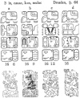

  
[Intangible Textual Heritage](../../../index.md)  [Native
American](../../index)  [Maya](../index)  [Index](index.md) 
[Previous](ybac10)  [Next](ybac12.md) 

------------------------------------------------------------------------

[Buy this Book at
Amazon.com](https://www.amazon.com/exec/obidos/ASIN/0486236226/internetsacredte.md)

------------------------------------------------------------------------

*Yucatan Before and After the Conquest*, by Diego de Landa, tr. William
Gates, \[1937\], at Intangible Textual Heritage

------------------------------------------------------------------------

p. 12

### SEC. VII. GOVERNMENT, PRIESTHOOD, SCIENCES, LETTERS AND BOOKS IN YUCATAN.

On the departure of Cuculcán the chiefs agreed that for the permanence
of the state the house of the Cocoms should exercise the chief
authority, it being the oldest and richest, or perhaps because its head
was at that time a man of greater power. This done, they ordained that
within the enclosure there should only be temples and residences of the
chiefs, and of the High Priest; that they should build outside the walls
dwellings where each of them might keep some serving people, and whither
the people from the villages might come whenever they had business at
the city. In these houses each one placed his mayordomo, who bore as his
sign of authority a short thick baton, and who was called the
**Caluac**. This officer held supervision over the villages and those in
charge of them, to whom he sent advices as to the things needed in the
chief's establishment, as birds, maize, honey, salt, fish, game,
clothing and other things. The **Caluac** always attended in the chief's
house, seeing what was needed and providing it promptly, his house
standing as the office of his chief.

It was the custom to hunt out the crippled and the blind in the
villages, and give them their necessities. The chiefs appointed the
governors and, if worthy, confirmed their offices to their sons. They
enjoined upon them good treatment of the common people, the peace of the
community, and that all should be diligent in their own support and that
of the lords.

Upon all the lords rested the duty of honoring, visiting and
entertaining Cocom, accompanying and making festivals for him, and of
repairing to him in difficult affairs. They lived in peace with each
other, and with much diversion according to their custom, in the way of
dances, feasts and hunting.

The people of Yucatan were as attentive to matters of religion as of
government, and had a High Priest whom they called **Ahkin May**, or
also **Ahaucan May**, meaning the Priest **May**, or the High Priest
**May**. He was held in great reverence by the chiefs, and had no
allotment of Indians for himself, the chiefs making presents to him in
addition to the offerings, and all the local priests sending him
contributions. He was succeeded in office by his sons or nearest kin. In
him lay the key to their sciences, to which they most devoted
themselves, giving counsel to the chiefs and answering their inquiries.
With the matter of sacrifices he rarely took part, except on it
festivals or business of much moment. He and his disciples appointed
priests for the towns, examining them in their sciences and ceremonies;
put in their charge the affairs of their office, and the setting of a
good

p. 13

example to the people; he provided their books and sent them forth. They
in turn attended to the service of the temples, teaching their sciences
and writing books upon them.

They taught the sons of the other priests, and the second sons of the
chiefs, who were brought to them very young for this purpose, if they
found them inclined toward this office.

The sciences which they taught were the reckoning of the years, months
and days, the festivals and ceremonies, the administration of their
sacraments, the omens of the days, their methods of divination and
prophecies, events, remedies for sicknesses, antiquities, and the art of
reading and writing by their letters and the characters wherewith they
wrote, and by pictures that illustrated the writings.

<table data-align="RIGHT">
<colgroup>
<col style="width: 100%" />
</colgroup>
<tbody>
<tr class="odd">
<td data-valign="CENTER"><a href="img/01300.jpg"> 
Click to enlarge</a> 
 
</td>
</tr>
</tbody>
</table>

They wrote their books on a long sheet doubled in folds, which was then
enclosed between two boards finely ornamented; the writing was on one
side and the other, according to the folds. The paper they made from the
roots of a tree, and gave it a white finish excellent for writing upon.
Some of the principal lords were learned in these sciences, from
interest, and for the greater esteem they enjoyed thereby; yet they did
not make use of them in public. [\*](#fn_7.md)

------------------------------------------------------------------------

### Footnotes

[13:\*](ybac11.htm#fr_7.md) The text figure shows
the general arrangement of the texts in both the Dresden and Madrid
codices; that in the Paris codex and on the monuments was quite
different.

Here, in section, or tzolkin 64 of the Dresden, we see the figure of
Itzamná in four different activities, in each accompanied by one of the
four major food animals, the turkey, iguana, fish and deer. Above each
are four glyphs, the first identical save for the subfix element in the
fourth column; this may be taken as en introductory to an invocation, or
chanting rhythm, such as actually found in one of our most important
Maya manuscripts, the *Ritual of the Bacabs*. The four glyphs across in
the second Line represent the North, West, South and East. In the next
position we see the head as of a 'lord,' wearing a ceremonial banded
headdress, preceded by the known signs for the four colors attached to
the four Directions: White, Black, Yellow, Red. In the bottom row the
repeated glyph of Itzamná, accepted as such from its constant occurrence
above his figure as shown here.

Finally, since the *composition* of the original codex of which the
existing 'Dresden codex' is rather clearly a copy, is to be placed from
its own internal evidence as relating to the moon and eclipse
calculations finally worked out probably at Copan, about the year 750 A.
D., the uncertainties involved in any effort to read this in the modern
forms of Yucatecan Maya (or other), are just about as great as should
one ignorant of historical English try to treat the text of Beowulf as
if it showed the spoken English of today.

------------------------------------------------------------------------

[Next: XIII. Arrival of the Tutul-xius and the Alliance They Made With
the Lords of Mayapán. Tyranny of Cocom, The Ruin of His Power and of the
City of Mayapán](ybac12.md)
