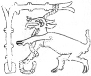
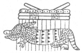
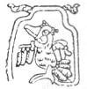
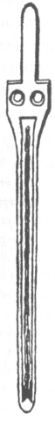
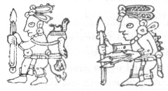
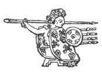

  
[Intangible Textual Heritage](../../../index)  [Native
American](../../index)  [Maya](../index)  [Index](index) 
[Previous](ybac11)  [Next](ybac13) 

------------------------------------------------------------------------

[Buy this Book at
Amazon.com](https://www.amazon.com/exec/obidos/ASIN/0486236226/internetsacredte)

------------------------------------------------------------------------

*Yucatan Before and After the Conquest*, by Diego de Landa, tr. William
Gates, \[1937\], at Intangible Textual Heritage

------------------------------------------------------------------------

p. 14

### SEC. XIII. ARRIVAL OF THE TUTUL-XIUS AND THE ALLIANCE THEY MADE WITH THE LORDS OF MAYAPAN. TYRANNY OF COCOM, THE RUIN OF HIS POWER AND OF THE CITY OF MAYAPAN.

The Indians relate that there came into Yucatan from the south many
tribes with their chiefs, and it seems they came from Chiapas, although
this the Indians do not know; but the author so conjectures from the
many words and verbal constructions that are the same in Chiapas and in
Yucatan, and from the extensive indications of sites that have been
abandoned. They say that these tribes wandered forty years through the
wilderness of Yucatan, having in that time no water except from the
rains; that at the end of that time they reached the Sierra that lies
about opposite the city of Mayapán, ten leagues distant. Here they began
to settle and erect many fine edifices

[  
Click to enlarge](img/01400.jpg)  
EIGHTH CENTURY STONE RESIDENCE IN THE SIERRA DISTRICT.  
Photo by Maler  

in many places; that the inhabitants of Mayapán held most friendly
relations with them, and were pleased that they worked the land as if
they were native to it. In this manner the people of the **Tutul-xiu**
subjected themselves to the laws of Mayapán, they intermarried, and thus
the lord Xiu of the Tutul-xius came to find himself held in great esteem
by all. [\*](#fn_8)

p. 15

These tribes lived in such peace that they had no conflicts and used
neither arms nor bows, even for the hunt, although now today they
are

|                    |
|--------------------|
|  |

excellent archers. They only used snares and traps, with which they took
much game. They also had a certain art of throwing darts by the aid of a
stick as thick as three fingers, hollowed out for a third of the way,
and six palms long; with this and cords they threw with force and
accuracy. [†](#fn_9)

They had laws against delinquents which they executed rigorously; such
as against an adulterer, whom they turned over to the injured party that
he might either put him to death by throwing a great stone down upon his
head, or he might forgive

|                    |
|--------------------|
|  |

him if he chose. For the adulteress there was no penalty save the
infamy, which was a very serious thing with them. One who ravished a
maiden was stoned to death, and they relate a case of a chief of

|                    |
|--------------------|
|  |

the Tutul-xiu who, having a brother accused of this crime, had him
stoned and afterwards covered with a great heap of rocks. They also say
that before the foundation of the city they had another law providing
the punishment of adulterers by drawing out the intestines through the
navel.

|                    |
|--------------------|
|  |

The governing Cocom began to covet riches, and to that end negotiated
with the garrison kept by the kings of Mexico in Tabasco and Xicalango,
that he would put the city in their charge.

|                    |
|--------------------|
|  |

In this way he introduced the Mexicans into Mayapán, oppressed the poor,
and made slaves of many. The chiefs would have slain him but for fear of
the Mexicans. The lord of the Tutul-xiu never gave his consent to this.
Then those of Yucatan, seeing themselves so fixed, learned from the
Mexicans the art of arms, and thus became masters of the bow and arrow,
of the lance, the axe, the buckler, and strong cuirasses made of quilted
cotton [‡](#fn_10) together with other
implements of war. Soon they no longer stood in awe of nor feared the
Mexicans, but rather held them of slight moment. In this situation
several years passed.

This Cocom was the first who made slaves; but out of this evil carne the
use of arms to defend themselves, that they might not all become slaves.
Among the successors of the Cocom dynasty was another

p. 16

one, very haughty and an imitator of Cocom, who made another alliance
with the Tabascans, placing more Mexicans within the city, and began to
act the tyrant and to enslave the common people. The chiefs then
attached themselves to the party of Tutul-xiu, a man

|                    |
|--------------------|
|  |

patriotic like his ancestors, and they plotted to kill e Cocom. This
they did, killing at the same time all of his sons save one who was
absent; they sacked his dwelling and possessed themselves of all his
property, his stores of cacao and other fruits, saying that thus they
repaid themselves what had been stolen from them. The struggles between
the Cocoms, who claimed that they had been unjustly expelled, and the
Xius, went on to such an extent that after having been established in
this city for more than five hundred years, they abandoned and left it
desolate, each going to his own country.

------------------------------------------------------------------------

### Footnotes

[14:\*](ybac12.htm#fr_8) The historical problem
involved in this paragraph is far from settled. The word **xiu** is the
common term for 'plant' in both Aztec and Maya, and we are told that the
Tutul-xius were Mexicans. Their significant symbol was a plant, just as
that of the Cocoms was the **kambul** or pheasant. They were called
foreigners by the Cocoms, but they certainly became the dominant element
in western Yucatan, and finally at the fall of Mayapán claimed to be the
defenders of 'true Maya,' and the present paragraph is clearly a Xiu
'apologia.' Nevertheless the evidence for very strong Mexicanization of
customs and religion around the year 1000 is unquestioned, although the
language does not seem to have been affected, as was English by the
Normans. And finally, Landa's statement as to the closer similarity
between Yucatecan Maya and the language of the Chiapans is definitely
correct, Tzeltal and Maya being the two branches of the Mayance family
moss nearly alike.

[15:†](ybac12.htm#fr_9) p.
16 The dart thrower, **hulche** in Maya, **atlatl** in Mexican,
is a weapon common throughout ancient America generally. The text
illustrations above are all taken from the Madrid Maya codex, except the
last, which is Mexican. In the first a deer is caught by a spring trap
set at a stream; in the next an armadillo is caught in a box trap, and
in the next a turkey in a net or noose. The two hunters both carry
**hulches**, the first as he sets out and the other as he returns with
the deer on his back. The last figure is an Aztec warrior.

[15:‡](ybac12.htm#fr_10) A curious error in the
Landa manuscript occurs here, stating that they wore "heavy coats of
*salt* and cotton." The garment is the well-known **ichca-huipil**,
corrupted in Yucatan to **escuypil**, of heavy quilted or 'tied' cotton
strong enough to withstand arrows. Now in Maya **taab** (with double
**a**) means 'to tie,' while **tab** (short **a**) means 'salt.' The
error in the text would seem to have come from a mistranslation by Landa
of what was told to him in Maya.

------------------------------------------------------------------------

[Next: IX. Chronological Monuments of Yucatan. Foundation of the Kingdom
of Sotuta. Origin of the Chels. The Three Principal Kingdoms of
Yucatan](ybac13)
