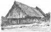
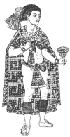

  
[Intangible Textual Heritage](../../../index.md)  [Native
American](../../index)  [Maya](../index)  [Index](index.md) 
[Previous](ybac23)  [Next](ybac25.md) 

------------------------------------------------------------------------

[Buy this Book at
Amazon.com](https://www.amazon.com/exec/obidos/ASIN/0486236226/internetsacredte.md)

------------------------------------------------------------------------

*Yucatan Before and After the Conquest*, by Diego de Landa, tr. William
Gates, \[1937\], at Intangible Textual Heritage

------------------------------------------------------------------------

p. 32

### SEC. XX. CONSTRUCTION OF THE HOUSES OF YUCATAN. OBEDIENCE AND RESPECT OF THE INDIANS FOR THEIR CHIEFS. HEADGEAR AND WEARING OF GARMENTS.

In building their houses their method was to cover them with an
excellent thatch they have in abundance. or with the leaves of a palm
well adapted to that purpose, the roof being very steep to prevent its
raining through. They then run a wall lengthways of the whole house,
leaving certain doorways into the half which they call the back of the
house, where they have their beds. The other half they whiten with a
very fine whitewash, and the chiefs also have beautiful frescos
there.

<table data-align="RIGHT">
<colgroup>
<col style="width: 100%" />
</colgroup>
<tbody>
<tr class="odd">
<td data-valign="CENTER"><a href="img/03200.jpg"> 
Click to enlarge</a> 
 
</td>
</tr>
</tbody>
</table>

This part serves for the reception and lodging of guests, and has no
doorway but is open along the whole length of the house. The roof drops
very low in front as a protection against sun and rain; also, they say,
the better to defend the interior from enemies in case of necessity.

The common people build the chiefs’ dwellings at their own expense. The
houses having no doors, it is held a grave offense to do any wrong to
another's house; in the back, however, they have a small door for
household uses. They sleep on beds made of small rods, covered with
mats, and with their mantles of cotton as covering. In the summer they
sleep in the front part of the house on the mats, especially the men.
Away from the house the entire village sows the fields of the chief,
cares for them, and harvests what is required for him and his household;
and whenever they hunt and fish, or at the salt gathering time, they
always give a part to the chief; in these matters everything is always
in common.

If the chief should die his eldest son would succeed him, but the others
would always be much respected, favored and held as lords. The leading
men, lower than the chief, are favored in all these matters according to
who they are, or the favor shown them by the chief. The priests live
upon their benefices and offerings. The chiefs govern the town, settling
suits, ordering and adjusting the affairs of the commonwealths, doing
all through the hands of the leading men. These latter are much honored
and obeyed, especially the wealthy, the chiefs visiting them and holding
court at their houses for the settlement of affairs and business, this
being done principally at night.

p. 33

\[paragraph continues\] Whenever the
chiefs leave the town they have a great company in attendance, and the
same when they leave their houses.

The Indians of Yucatan are people of good physique, tall, robust and of
great strength, and commonly are all bow-legged from having in their
infancy been carried astride the mother's hip when they are taken
somewhere. It was held as a grace to be cross-eyed, and this was
artificially brought about by the mothers, who in infancy suspended a
small plaster from the hair down between the eyebrows and reaching the
eyes; this constantly binding, they finally became cross-eyed. They also
had their heads and foreheads flattened from infancy by their mothers.
Their ears were pierced for earrings and much scarified from the
sacrifices. They did not grow beards and say that their mothers were
used to burn their faces with hot cloths to prevent the growth. Nowaday
beards are grown, although they are very rough, like hogs’ bristles.

<table data-align="RIGHT">
<colgroup>
<col style="width: 100%" />
</colgroup>
<tbody>
<tr class="odd">
<td data-valign="CENTER"><a href="img/03300.jpg"> 
Click to enlarge</a> 
 
</td>
</tr>
</tbody>
</table>

They allowed their hair to grow like the women; on top they ringed it,
making a, good tonsure. Thus it grew long below but short on the crown;
it was braided and wound around the head, with an end left behind like a
queue. All the men used mirrors, and the women not; and to call a man a
cuckold they said his wife had put the mirror in his hair behind his
head. They bathed a great deal, not troubling to cover themselves before
the women, except such as they might do with the hand. They were devoted
to perfumes, having bouquets of flowers and odorous plants, arranged
with much care and art. They painted their faces and bodies red,
disfiguring themselves, though to them it seemed handsome.

Their clothing was a strip of cloth a hand broad that served for
breeches and leggings, and which they wrapped several times about the
waist, leaving one end hang in front and one behind. These ends were
embroidered by their wives with much care and with featherwork. They
wore large square mantles, which they threw over the shoulders. They
wore sandals of hemp or deerskin tanned dry, and then no other
garments. [\*](#fn_20.md)

------------------------------------------------------------------------

### Footnotes

[33:\*](ybac24.htm#fr_20.md) The foregoing portrait
of Nezahualpilli, king of Tezcoco, attributed to Ixtlilxochitl, although
Mexican, illustrates well the garments here described.

------------------------------------------------------------------------

[Next: XXI. Food and Drink of the Indians of Yucatan](ybac25.md)
