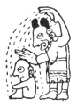

  
[Intangible Textual Heritage](../../../index)  [Native
American](../../index)  [Maya](../index)  [Index](index) 
[Previous](ybac29)  [Next](ybac31) 

------------------------------------------------------------------------

[Buy this Book at
Amazon.com](https://www.amazon.com/exec/obidos/ASIN/0486236226/internetsacredte)

------------------------------------------------------------------------

*Yucatan Before and After the Conquest*, by Diego de Landa, tr. William
Gates, \[1937\], at Intangible Textual Heritage

------------------------------------------------------------------------

### SEC. XXVI. METHOD OF BAPTISM IN YUCATAN; HOW IT WAS CELEBRATED.

Baptism is not found anywhere in the Indies save here in Yucatan, and
even with a word meaning to be born anew or a second time, the same as
the Latin *renascer*. Thus in the language of Yucatan **sihil** means
'to be born anew,' or a second time, but only however in composition;
thus **caput-sihil** means to be reborn. [\*](#fn_22) Its origin we have been unable to learn,
but it is something

p. 43

they have always used and for which they have had such devotion that no
one fails to receive it; they had such reverence for it that those
guilty of sins, or who knew they were about to sin, were obliged to
confess to the priest, in order to receive it; and they had such faith
in it that in no manner did they ever take it a second time. They
believed that in receiving it they acquired a predisposition to good
conduct and habits, protection against being harmed by the devils in
their earthly affairs, and that through it and living a good life they
would attain a beatitude hereafter which, like that of Mahomet,
consisted in eating and drinking.

Their custom of preparing for baptism was as follows: the Indian women
raised the children to the age of three, placing for the boys a small
white plaquet, fastened to the head in the hair of the tonsure; the
girls wore a thin cord tied very low about the waist, to which was
attached a small shell over the private parts; to remove these two
things was regarded among them as a sin and disgraceful, until the time
of the baptism, which was given between the ages of three and twelve;
until this ceremony was received they did not marry.

Whenever one desired to have his child baptised, he went to the priest
and made his wish known to him, who then published this in the town,
with the day chosen, which they took care should be of good omen. This
being done, the solicitant, being thus charged with giving the fiesta,
selected at his discretion some leading man of the town to assist him in
the matter. Afterwards they chose four other old and honored men to
assist the priest on the day of the ceremony, these being chosen with
the priest's cooperation. In these elections the fathers of all the
eligible children took part, for the fiesta was a concern of all; those
so chosen were called **Chacs**. For the three days before the ceremony
the parents of the children, as well as the officials, fasted and
abstained from their wives.

On the day, all assembled at the house of the one giving the fiesta,
and

|                    |
|--------------------|
|  |

brought all the children who were to be baptized, and placed them in the
patio or court of the house, all clean and scattered with fresh leaves;
the boys together in a line, and the girls the same, with an aged woman
as matron for the girls, and a man in charge of the boys. [\*](#fn_23)

p. 44

When this was done the priest proceeded to the purification of the
house, expelling the demon. To do this they placed four benches in the
four corners of the patio, on which the four **chacs** seated
themselves, with a long cord tied from one to the other, in such fashion
as that the children were [corralled](errata.htm#5) in the middle, after
which those parents who had fasted stepped over the cord, into the
circuit. Afterwards, or previously, they placed in the middle another
bench on which the priest seated himself, with a brazier and a little
ground maize and incense. Then the boys and girls came to him in order,
and he put a little of the ground maize and incense into the hand of
each, and they threw it into the brazier. When all had done this, they
took up the brazier and the cord held by the chacs; they also threw a
little wine in a vase and then gave it all to an Indian to carry away
from the village, enjoining him not to drink the wine or to look behind
him on his return; and in this manner they said that the demon had been
exorcised. [\*](#fn_24)

After this they swept the patio and took away the leaves that were
scattered at the beginning, which were of a tree called **sihom**, and
scattered others of a tree called **copó**, laying down mats while the
priest changed his vestures. He next entered wearing a tunic of red
feathers, worked with other varicolored feathers, and with other long
feathers pendant from the ends; on his head he wore a sort of miter of
the same feathers, while beneath the tunic there hung to the ground
strips of cotton like tails. He carried a hyssop made of a short, finely
decorated stick, and the tails of certain serpents like
rattlesnakes; [†](#fn_25) all this with neither
more nor less gravity than that of a pope crowning an emperor, and a
serenity that was a marvel to behold. The chacs then went to the
children and placed on the heads of all white cloths which their mothers
had brought for the purpose. [‡](#fn_26) They
asked of the largest ones whether they had done any bad thing, or
obscene conduct, and if any had done so, they confessed them and
separated them from the others.

When this was done the priest called on all to be silent and seated, and
began to bless the children, with tong prayers, and to sanctify them
with the hyssop, all with great serenity. After this benediction he
seated himself, and the one elected by the parents as director of the
fiesta took a bone given him by the priest, went to the children and
menaced each one with the bone on the forehead, nine times. After this
he wet the bone in a jar of water he carried, and with it anointed them
on the forehead, the face, and between the fingers of their hands and
the bones of their feet, without saying a word. This liquor was
confected out of certain flowers and ground cacao, dissolved

p. 45

in virgin water, as they call it, taken from the hollows of trees or of
rocks in the forest.

After this unction the priest rose, removed the white cloths from their
heads, as well as others they wore suspended from the shoulders
containing a few feathers of very beautiful birds and some grains of
cacao, all of which were collected by one of the **chacs**. Then with a
stone knife the priest cut away the small bead or counter each had worn
fastened to his head. After this the other assistants of the priest
brought a bunch of flowers and a pipe such as the Indians smoked; with
these they menaced each child nine times, and then gave him the bouquet
to smell and the pipe to smoke. After this they gathered the presents
brought by the mothers, which were things to cat, and gave these to each
child to eat there. Then they brought a fine chalice of wine and quickly
offered it to the gods, invoking them with devout prayers to receive
this small gift from the children; this chalice they then gave to
another officiant called **cayom**, that he might empty it at a single
draught; for him to stop to take breath in this was regarded as
something sinful.

When this was over the girls took their leave first, their mothers
removing the cord and shell they had worn about the girdle in sign of
their chastity; this gave license for them to be married, when such
might seem best to their parents. Then the boys took their leave, and
the fathers came bearing the heap of mantles they had brought, and gave
them with their own hands to the assistants and the officiants. The
fiesta then ended with long eating and drinking; and this fiesta was
called **em-ku**, which means 'the descent of the god.' The one then who
had instituted and borne the cost of the ceremony, in addition to his
three previous days of abstinence and fast, was obliged to continue this
for yet other nine days; this they did inviolably.

------------------------------------------------------------------------

### Footnotes

[42:\*](ybac30.htm#fr_22) **Sihil** means 'to be
born' simply; **caput-sihil** 'to be born a second time,' and is the
specific term in Maya for baptism, being distinct from
**caput-cuxtal**,' to come to life a second time.'

[43:\*](ybac30.htm#fr_23) The marginal
illustration is from the Madrid Codex, in a clause where the act is
repeated in like style in four illustrations, and obviously refers to
child baptism, the only place in tither codex where the ceremony seems
to be referred to. Clearly the actual ceremony was far more elaborate
and impressive, this being one of the many cases where the scanty
details related by Landa, and the isolated references we have so far
been able to identify in the codices and the few post-Conquest Maya
manuscripts, like the Chumayel, just barely supplement and touch each
other enough to show how much existed, and how full the civilization
was, and how little we yet know of it—as it actually was, and how it was
lived.

[44:\*](ybac30.htm#fr_24) There is a confusion
in this section, between child and adult baptism, which latter having
necessarily been of a different ceremonial nature, is not given by
Landa.

[44:†](ybac30.htm#fr_25) See illustration of
this aspersarium on page 79.

[44:‡](ybac30.htm#fr_26) **Suhuy nok**, or
'virgin cloth,' as still known in Yucatan.

------------------------------------------------------------------------

[Next: XXVII. Kind of Confessions Among the Indians. Abstinences and
Superstitions. Diversity and Abundance of Idols. Duties of the
Priests](ybac31)
