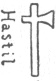
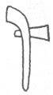
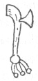
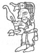
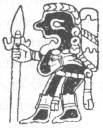
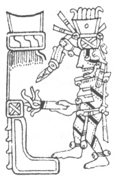

  
[Intangible Textual Heritage](../../../index)  [Native
American](../../index)  [Maya](../index)  [Index](index) 
[Previous](ybac32)  [Next](ybac34) 

------------------------------------------------------------------------

[Buy this Book at
Amazon.com](https://www.amazon.com/exec/obidos/ASIN/0486236226/internetsacredte)

------------------------------------------------------------------------

*Yucatan Before and After the Conquest*, by Diego de Landa, tr. William
Gates, \[1937\], at Intangible Textual Heritage

------------------------------------------------------------------------

### SEC. XXIX. ARMS OF THE YUCATECANS. MILITARY CHIEFTAINS. MILITIA AND SOLDIERS. CUSTOMS OF WAR.

They had offensive and defensive arms. The offensive were bows and
arrows carried in their quivers, tipped with flints and very sharp
fishes’ teeth, which they shot with great skill and force. The bows were
of a beautiful yellowish wood, marvelously strong and more straight than
curved, with cords of their hemp fibres. The length of the bow is always
somewhat less than that of the one who carries it. The arrows are made
of reeds that grow in the lagoons, and more than five palms long, in
which is fixed a piece of thin wood, very strong, in which again is
fastened the flint. They do not know or use poisons, though from no lack
of them. They had

|                    |
|--------------------|
|  |

hatchets of a certain metal and of this shape, fastened in a handle of
wood. These served them both as arms in war, and then at home for
working wood. The metal being soft, they gave it an edge by beating with
a stone. They had short lances a man's height in length, pointed

|                    |
|--------------------|
|  |

with very hard flint; besides these they had no other arms.

|                    |
|--------------------|
|  |

For defense they had shields made of split and woven reeds, and covered
with deer hide. They wore protective jackets of cotton, quilted in
double thicknesses, [\*](#fn_29) which were very
strong. Some of the chiefs and captains wore helmets of wood, but these
were not common. With these arms they went to war, adorned with
feathers, and with skins of tigers and lions, when they possessed them.
They had two captains, one perpetual and hereditary, the other elected
for three years with a great deal of ceremony. This latter was selected
to

|                    |
|--------------------|
|  |

celebrate the festivals of the month **Pax**, which

|                    |
|--------------------|
|  |

falls on the 12th of May; and during a war he commanded the second corps
of the army. [†](#fn_30)

This captain was called nacon; during these three years he was forbidden
to hold converse with women, even with his wife, or to eat met. They
held him in great respect, and supplied him with fish and iguanas, which
are a sort of edible lizards; during this period he must not become
drunk, and

p. 51

the vessels and household articles for his use were kept apart; he was
not served by a woman, and mingled little with the townsfolk.

|                    |
|--------------------|
|  |

The three years passed as stated. These two captains arranged matters
for wars, and put things in their order. In each district there were men
chosen as the soldiery, and when the occasion came they presented
themselves with their arms; these were called the **holcánes**, and if
there were not enough of them, others were collected; they were then
given instructions and divided. Marching led by a lofty banner they set
out from the town in complete silence, and then taking their enemies by
surprise, fell on them with great cries and fierceness.

On the roads and passages the enemy set defenses manned by archers,
barricades of stakes and trees, and more often of stone. After a victory
they cut off the jawbones from the dead, and hung them clean of flesh on
their arms. In these wars they made great offerings of the spoils, and
if they captured some renowned man they promptly sacrificed him, not to
leave alive those who could later inflict injury upon them. The rest
became captives of war in the power of those who took them.

These **holcánes** received no pay except in time of war, and then they
were given certain money by the captains, but not much, because it came
from their own funds; or if they lacked the needful, the town helped
them. The town also supplied their food, which the women prepared for
them; this they carried on their backs for the lack of animals, and thus
the wars were of short duration. After the war the soldiers harassed the
people in the districts greatly, under color of the war, while this
lasted, requiring services and gifts; if any of them succeeded in
killing some captain or chief he was greatly honored and feted.

------------------------------------------------------------------------

### Footnotes

[50:\*](ybac33.htm#fr_29) Landa here again makes
the curious mistake before noted, of stating that they wore strong
quilted coats of cotton and *salt*, in two layers. (See page
[16](ybac12.htm#page_16).)

[50:†](ybac33.htm#fr_30) The illustration of a
copper axe on the preceding page is from the Landa manuscript itself.
The axes in the margin above are from Aztec and shown to have been of
copper both by the p. 51 distinctive color,
and place-names elsewhere. The three lower figures are all from the
Madrid Maya codex, showing a warrior with **hulché**, or throwing stick,
and spears; the god **Ekchuah** with knapsack and long lance, and the
war-god putting fire and sword to a building.

------------------------------------------------------------------------

[Next: XXX. Penalties and Punishments for Adulterers, Homicides and
Thieves. Education of the Young Men. Custom of Flattening the Heads of
Children](ybac34)
