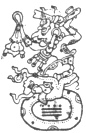

  
[Intangible Textual Heritage](../../../index.md)  [Native
American](../../index)  [Maya](../index)  [Index](index.md) 
[Previous](ybac40)  [Next](ybac42.md) 

------------------------------------------------------------------------

[Buy this Book at
Amazon.com](https://www.amazon.com/exec/obidos/ASIN/0486236226/internetsacredte.md)

------------------------------------------------------------------------

*Yucatan Before and After the Conquest*, by Diego de Landa, tr. William
Gates, \[1937\], at Intangible Textual Heritage

------------------------------------------------------------------------

### SEC. XXXVII. SACRIFICES FOR THE NEW YEAR WITH THE SIGN IX. SINISTER PROGNOSTICS, AND MANNER OF CONJURING THEIR EFFECTS.

In the year whose dominical letter was **Ix** and the augury
**Sac-sini**, after the election of the president for the celebration of
the festival, they made an image of the demon called **Sac-uvayeyab**,
and carried it to the piles of stone at the North, where they had left
the other one the year before. They then made a statue of the god
**Itzamná** and set that in the president's house, then all together,
with the roadway prepared, they went devoutly to the image of
**Sac-uvayeyab**. On arrival they offered incense in the usual way, cut
of the head of a fowl, and placed the image on a wooden stand called
**Sac-hia**, and then carried it ceremoniously and with dances they
called **alcab-tan kam-ahau**. [\*](#fn_36.md) They
brought to the road the usual drinks, and on arriving at the house they
set this image before the statue of **Itzamná**, and there made their
offerings, and distributed them; to the

|                    |
|--------------------|
|  |

statue of **Sac-uvayeyab** they offered the head of a turkey, patés of
quail with other things, and their drink.

Others drew blood and with it anointed the stone of the demon
**Sac-acantun**, and they then kept the idols as they had done the year
before, offering them incense until the last day. Then they carried
**Itzamná** to the temple and **Sac-uvayeyab** to the place of the West
to leave him there to be gotten the next year.

The evils the Indians feared for the ensuing year if they were negligent
in these ceremonies were loss of strength, fainting and ailments of the
eyes; it

p. 66

was held a bad year for bread and a good one for cotton. And this year
bearing the dominical **Ix**, and which the Bacab **Sac-sini** ruled,
they held an ill-omened, with many evils destined to occur; for they
said there would he great shortage of water, many hot spells that would
wither the maize fields, from which would follow great hunger, and from
the hunger thefts, and from the thefts slavery for those who had
incurred that penalty therefor. From this would come great discords,
among themselves or with other towns. They also said that this year
would bring changes in the rule of the chiefs or the priests, because of
he wars and discords.

Another prognostic was that some men who should seek to become chiefs
would fail in their aim. They also said that the locusts would come, and
depopulate many of their towns through famine. What the evil one
ordained that they should do to avert these ills, some or all of which
were due to fall on them, was to make an idol of **Kinch-ahau Itzamná**,
which they should put in the temple, where they should burn incense and
make many offerings and prayers to the god, together with the drawing of
their blood for the anointing of the stone of the demon **Sac-acantun**.
They danced much, and the old women danced as was their custom; in this
festival they also built a new oratorio for the demon, or else renewed
the old, and gathered there for sacrifices and offerings to him, all
going through a solemn revel; for this festival was general and
obligatory. There were some very devout persons who of their own
volition made another idol like the above, and placed it in other
temples, where they made offerings and revels. These revels and
sacrifices were held to be very acceptable to the idols, and as remedial
for freeing them from the ills indicated as to come.

------------------------------------------------------------------------

### Footnotes

[65:\*](ybac41.htm#fr_36.md) This may be rendered:
"Hasten to receive the Lord."

------------------------------------------------------------------------

[Next: XXXVIII. Sacrifices of the New Year of the Letter Cauac. The
Evils Prophesied and Their Remedy in the Dance of the Fire](ybac42.md)
