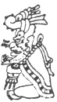
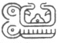
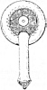
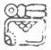

  
[Intangible Textual Heritage](../../../index.md)  [Native
American](../../index)  [Maya](../index)  [Index](index.md) 
[Previous](ybac43)  [Next](ybac45.md) 

------------------------------------------------------------------------

[Buy this Book at
Amazon.com](https://www.amazon.com/exec/obidos/ASIN/0486236226/internetsacredte.md)

------------------------------------------------------------------------

*Yucatan Before and After the Conquest*, by Diego de Landa, tr. William
Gates, \[1937\], at Intangible Textual Heritage

------------------------------------------------------------------------

p. 70

### SEC. XL. MONTHS AND FESTIVALS OF THE YUCATECAN CALENDAR.

|                                                 |              |     |                                                 |
|-------------------------------------------------|--------------|-----|-------------------------------------------------|
|   | POP’         |     |   |
|                                                 | *A* July 16: |     | 12 **Kan**                                      |
|                                                 |              |     |                                                 |

The first day of **Popp**, which is the first month of the Indians, was
its New Year, a festival much celebrated among them, because it was
general, and of all; thus the whole people together celebrated the
festival for all their idols. To do this with the greater solemnity, on
this day they renewed all the service things they used, as plates,
vases, benches, mats and old garments, and the mantles around the idols.
They swept their houses, and threw the sweepings and all these old
utensils outside the city on the rubbish heap, where no one dared touch
them, whatever his need.

For this festival the chiefs, the priest and the leading men, and those
who wished to show their devoutness, began to fast and stay away from
their wives for as long time before as seemed well to them. Thus some
began three months before, some two, and others as they wished, but none
for less than thirteen days. In these thirteen days then, to continence
they added the further giving up of salt or pepper in their food; this
was considered a grave penitential act among them. In this period they
chose the chacs, the officials for helping the priest; on the small
plaques which the priests had for the purpose, they prepared a great
number of pellets of fresh incense for those in abstinence and fasting
to burn to their idols. Those who began these fasts, did not dare to
break them, for they believed it would bring evil upon them or their.
houses.

When the New Year came, all the men gathered, alone, in the court of the
temple, since none of the women were present at any of the temple
ceremonies, except the old women who performed the dances. The women
were admitted to the festivals held in other places. Here all clean and
gay with their red-colored ointments, but cleansed of the black soot
they put on while fasting, they came. When all were congregated, with
the many presents of food and drink they had brought, and much wine they
had made, the priest purified the temple, seated in pontifical garments
in the

|                    |
|--------------------|
|  |

middle of the court, at his side a brazier and the tablets of incense.
The chacs seated themselves in the four corners, and stretched from one
to the other a new rope, inside of which all who had fasted had to
enter, in order to drive out the evil spirit, as I related in chapter 96
(Sec. XXVI). When the evil one had been driven out, all began their
devout prayers, and the chacs made

p. 71

new fire and lit the brazier; because in the festivals celebrated by the
whole community new fire was made wherewith to light the brazier. The
priest began to throw in incense, and all came in their order,
commencing with the chiefs, to receive incense from the hands of the
priest, which he gave them with as much gravity as if he were giving
them relics; then they threw it a little at a time into the brazier,
waiting until it ceased to burn.

After this burning of the incense, all ate the gifts and presents, and
the wine went about until they became very drunk. Such was the festival
of the New Year, a ceremony very acceptable to their idols. Afterwards
there were others who celebrated this festival, in this month **Pop’**,
among their friends, and with the chiefs and the priests, these latter
being always first in their banquets and drinking.

|                                                 |               |     |                                                 |
|-------------------------------------------------|---------------|-----|-------------------------------------------------|
|   | UO            |     |   |
|                                                 | *e* August 6: |     | 6 **Kan**                                       |
|                                                 |               |     |                                                 |

In the month **Uo** the priests, and the physicians and sorcerers (who
were one) began, with fasting and the rest, to prepare to celebrate
another festival. The hunters and fishermen began to celebrate on the
7th of **Sip**, each celebrating for himself on his own day. First the
priests celebrated their fete, which was called **Pocam** \['the
washing'\]; gathered in their regalia in the house of the chief, they
first cast out the evil spirit as was their custom; after that they
brought out their books and spread them upon the fresh leaves they had
prepared to receive them. Then with many prayers and very devoutly they
invoked an idol they called **Kinch-ahau Itzamná**, who 

|                    |
|--------------------|
|  |

they said was the first priest, offered him their gifts and burned the
pellets of incense upon new fire; meanwhile they dissolved in a vase a
little verdigris and virgin water which they say was brought from the
forests where no woman had been, and anointed with it the tablets of the
books for their purification. After this had been done, the most learned
of the priests opened a book, and observed the predictions for that
year, declared them to those present, preached to them a little
enjoining the necessary observances, and then assigning this festival
for the coming year to the priest or chief who should then perform it;
if he should die within the year his sons were under obligation to carry
it for the deceased. After this they ate the gifts and food that had
been brought, and drank until they were filled; thus they ended this
festival, in which at times they gave the dance **okot-uil**.

p. 72

|                                                 |                |     |                                                 |
|-------------------------------------------------|----------------|-----|-------------------------------------------------|
|   | SIP            |     |   |
|                                                 | *f* August 25: |     | 13 **Kan**                                      |
|                                                 |                |     |                                                 |

On the following day the physicians and sorcerers gathered in the house
of one of them, with their wives. The priest exorcised the evil spirit.
After that they opened the wrappings of their medicines, in which they
had brought

|                    |
|--------------------|
|  |

foolish things, including (each of them) small idols of the goddess of
medicine whom they called **Ixchel**, from whom this festival was called
**Ihcil-Ixchel**, as well as certain little stones called am, and with
which it was their custom to cast the lots. Then with great devotion
they invoked the gods of medicine by their prayers, these being called
**Itzamná**, **Cit-bolontun** and **Ahau-chamahes**, the priests
offering the incense, burned in braziers with new fire;

|                    |
|--------------------|
|  |

meanwhile the chacs covered the idols and the small stones with a blue
bitumen like that of the books of the priests. [\*](#fn_38.md)

After this each one wrapped up the implements of his office, and taking
the pouch on his back all danced a dance they called **Chantuniah**.
After the dance the men sat by themselves, and the women by themselves;
and after putting

|                    |
|--------------------|
|  |

over the festival until the next year, they ate the presents, and became
drunk without regard; except the priests, who as they say refrained from
the wine, to drink it when alone and at their pleasure.

The next day the hunters gathered in the house of one of them, bringing
their wives, like the others; the priests came and exorcised the evil
spirit in their manner. Then they placed in the center the materials
prepared for the sacrifice of the incense and the new fire, and the blue
bitumen. Then with worship the hunters invoked the gods of the chase,
**Acanum**, **Suhuy-sib**, **Sipitabai**, and others; they distributed
the incense, which they then threw in the brazier; while it burned each
one took an arrow and the skull of a deer, which the chacs anointed with
the blue pitch; some then danced with these, as anointed, in their
hands, 

|                    |
|--------------------|
|  |

while others pierced their ears and others

|                    |
|--------------------|
|  |

their tongues, and passed seven leaves of a broadish plant called
**ac**, through the holes. When this was done, the priest first and then
the officers of the festival at once made their offerings, and thus
dancing they served the wine and became drunk.

p. 73

Immediately

|                    |
|--------------------|
|  |

on the following day the fishermen celebrated their festival in the same
order as the others, except that what was anointed was the fishing
tackle, and they did not pierce the ears but tore them on the sides;
they danced a dance called **chohom**, and when all this was done they
blessed a tall thick tree trunk and set it up erect. After this festival
had been celebrated in the towns, it was the custom for the chiefs to go
with many of the people to the coast, where they had great fishing and
sport, having taken with them a great quantity of drag-nets, hooks and
other fishing equipment. The gods who were the patrons of this festival
were: **Ahkakne-xoi**, **Ahpua**, **Ahcitz-amalcum**.

|                                                 |                   |     |                                                 |
|-------------------------------------------------|-------------------|-----|-------------------------------------------------|
|   | SOTZ              |     |   |
|                                                 | *e* September 14: |     | 7 Kan                                           |
|                                                 |                   |     |                                                 |

In the month **Sotz** the proprietors of the bee-hives prepared
themselves to celebrate their festival in **Tzec**, and although the
chief preparation here was fasting, there was no obligation save on the
priest and the officers who assisted therein, and it was voluntary on
the part of the rest.

|                                                 |                |     |                                                 |
|-------------------------------------------------|----------------|-----|-------------------------------------------------|
|   | TZEC           |     |   |
|                                                 | *d* October 4: |     | 1 **Kan**                                       |
|                                                 |                |     |                                                 |

|                    |
|--------------------|
|  |

When the day of the festival had come, they all gathered in the
appointed house, and did as in the others, except that there was no
drawing of blood, since the patrons were the Bacabs, and especially
**Hobnil**. They made many offerings, and especially to the four
**chacs** they gave four platters with balls of incense in the middle of
each, and painted on the rims with figures of honey, to bring abundance
of which was the purpose of the ceremony. They ended it with wine as
usual, in plenty, the hive owners giving honey for it in abundance.

|                                                 |                 |     |                                                 |
|-------------------------------------------------|-----------------|-----|-------------------------------------------------|
|   | XUL             |     |   |
|                                                 | *c* October 24: |     | 8 **Kan**                                       |
|                                                 |                 |     |                                                 |

In the twelfth chapter (Sec. VI) was related the departure of Kukulcán

p. 74

from Yucatan, after which some of the Indians said he had departed to
heaven with the gods, wherefore they regarded him as a god and
appointed, a time when they should celebrate a festival for him as such;
this the whole country did until the destruction of Mayapán. After that
destruction

<table data-align="LEFT">
<colgroup>
<col style="width: 100%" />
</colgroup>
<tbody>
<tr class="odd">
<td data-valign="CENTER"><a href="img/07400.jpg"> 
Click to enlarge</a> 
INCENSE BURNER 
</td>
</tr>
</tbody>
</table>

only the province of Maní kept this up, while the other provinces in
recognition of what they owed to Kukulcán made presents, one each year,
turn and turn about, of four or sometimes five magnificent banners of
feathers, sent to Maní; with which they kept this festival in that
manner, and not in the former ways.

On the 16th of **Xul** all the chiefs and priests assembled at Maní, and
with them a great multitude from the towns, all of them after preparing
themselves by their fasts and abstinences. On the evening of that day
they set out in a great procession, with many comedians, from the house
of the chief where they had gathered, and marched slowly to the temple
of Kukulcán, all duly decorated. On arriving, and offering their
prayers, they set the banners on the top of the temple, and below in the
court set each of them his idols on leaves of trees brought for this
purpose; then making the new fire they began to burn their incense at
many points, and to make offerings of viands cooked without salt or
pepper, and drinks made from their beans and calabash seeds. There the
chiefs and those who had fasted stayed for five days and nights, always
burning copal and making their offerings, without returning to their
homes, but continuing in prayers and certain sacred dances. Until the
first day of **Yaxkin** these comedians frequented the principal houses,
giving their plays and receiving the presents bestowed on them, and then
taking all to the temple. Finally, when the five days were passed, they
divided the gifts among the chiefs, priests and dancers, collected the
banners and idols, returning them to the house of the chief, and thence
each one to his home. They said and believed that Kukulcán descended on
the last of those days from heaven and received their sacrifices,
penances and offerings. This festival they called **Chicc-kaban**. [\*](#fn_39.md)

p. 75

|                                                 |                  |     |                                                 |
|-------------------------------------------------|------------------|-----|-------------------------------------------------|
|   | YAXKIN           |     |   |
|                                                 | *b* November 13: |     | 2 **Kan**                                       |
|                                                 |                  |     |                                                 |

In this month of **Yaxkin** they began to get ready, as usual, for the
general festival they would celebrate in **Mol**, on the day appointed
by the priest for all the gods; they called it **Olob-sab-kamyax**.
After they were gathered in the temple and the same ceremonies and
incense burning as in the previous festivals had been gone through with,
they anointed with the blue pitch all the instruments of all the various
occupations, from that of the priest to the spindles of the women, and
even the posts of their houses. For this festival they assembled all the
boys and girls, and in place of the painting and the ceremonies they
gave to each nine little blows on the knuckles of their hands, outside;
for the girls this was done by an old woman, vestured in a robe of
feathers, who brought them there; from this she was called **Ixmol**,
meaning the bringer together. These blows they gave them that they might
grow up expert craftsmen in their fathers’ and mothers’ occupations. The
conclusion was a fine drinking affair, with eating of the offerings,
except that we must not believe that the devout old woman was allowed to
become so drunk as to lose the feathers of her robe on the road.

p. 76

|                                                 |                 |     |                                                 |
|-------------------------------------------------|-----------------|-----|-------------------------------------------------|
|   | MOL             |     |   |
|                                                 | *A* December 3: |     | 9 **Kan**                                       |
|                                                 |                 |     |                                                 |

In this month the bee-keepers held another festival like they did in the
month **Tzec**, to the end that the gods might provide flowers for the
bees.

One of the most arduous and difficult things these poor people had to do
was the making of images of wood, which they called the gods. Thus they
had a particular month designated for this work, 

|                    |
|--------------------|
|  |

and this was the month **Mol**, or some other if the priest said it was
right. Those then who wished to make them first consulted the priest,
and after taking his counsel went to the artisans; they say that the
artisans always excused themselves, believing that either they or some
one of their household would die or would suffer heart attacks or
strokes; when however they had accepted, the chacs whom they had chosen
to serve in the matter, together with the priest and the artisan, began
their fasts. While they were fasting, he who was to have the idols went
himself or else sent to the woods for the material, which was always
cedar. When the wood arrived they built a small fenced-in hut of thatch,
in which they put the wood and a large urn into which to put the idols,
and

|                    |
|--------------------|
|  |

to keep them covered up while they were working. They put incense to be
burned to the four deities called the **Acantuns**, which they brought
and placed at the four cardinal points. They also brought the
instruments with which to scarify themselves or draw blood from their
ears; and also the tools for carving their black gods. When all these
were ready in the hut, the priest, the chacs and the artisan shut
themselves in the hut, and they began their making the gods, from time
to time cutting their ears and anointing the statues herewith, and
burning the incense. Thus they worked until they were finished, their
families bringing to them their food and needs; during the period they
were not to consort with their wives, even in thought; nor could any one
enter that place where they worked.

|                                                 |                  |     |                                                 |
|-------------------------------------------------|------------------|-----|-------------------------------------------------|
|   | CH’EN            |     |   |
|                                                 | *g* December 23: |     | 3 **Kan**                                       |
|                                                 |                  |     |                                                 |

They worked in much reverence and fear, as they say, making the gods.
When they were finished and the idols perfected, the owner made them the
finest present he was able, of birds, game and their money, to pay for
the labor of those who had made them. Then they removed them from the
hut and set them in another enclosure of branches prepared for them in
the court. where the priest blessed them with great solemnity, and an
abundance of

p. 77

devout prayers; but first the priest and the artisans removed the soot
with which they had covered themselves during their fasting. Then having
exorcised the evil one and burned the sanctified incense, they put the
images wrapped n a cloth in a chest and delivered them to their owner,
who very devotedly received them. Afterwards the good priest preached a
little on the excellence of the artisans’ profession, or making new
images of the gods, and on the ills that would have attended them had
they not been faithful to the precepts of abstinence and fasting. After
that they ate much and drank more.

|                                                 |                 |     |                                                 |
|-------------------------------------------------|-----------------|-----|-------------------------------------------------|
|   | YAX             |     |   |
|                                                 | *e* January 12: |     | 10 **Kan**                                      |
|                                                 |                 |     |                                                 |

In whichever of the months **Ch’en** or **Yax** were designated by the
priest, and on the day set by him, they celebrated a festival they
called **Oc-na**, meaning the 'renovation of the temple,' in honor of
the **Chacs**, regarded as the gods of the maize fields. In this
festival they consulted the predictions of the Bacabs, as we have told
at more length in chapters 111 to 116 (Secs. XXXV to XXXVIII), and in
conformity with the order there given. Each year they celebrated this
festival and renewed the idols of terra cotta, and their braziers, since
it was the custom for each idol to have his own little brazier for
burning his incense; and if it was necessary they built a new house, or
repaired the old one, placing on the wall the record of these things,
with their characters.

A: January 29: **1 Imix**. Here begins the calendar of the Indians,
saying in their language, **Hun Imix**. [\*](#fn_40.md)

|                                                 |                 |     |                                                 |
|-------------------------------------------------|-----------------|-----|-------------------------------------------------|
|   | SAC             |     |   |
|                                                 | *d* February 1: |     | 4 **Kan**                                       |
|                                                 |                 |     |                                                 |

|                    |
|--------------------|
|  |

The hunters, who had celebrated one festival in the month **Sip**, now
celebrated another in the month **Sac**, on a day set by the priest,
doing this to appease the anger of the gods against them and their
fields because of the blood they shed in their hunting; for they
regarded with abhorrence any shedding of blood except in their
sacrifices. For this reason, whenever they went to the hunt, they
invoked the god and burned incense to him; and if possible later they
anointed the faces with blood from the heart of the game.

p. 78

*f*: February 17: **7 Ahau**. On whatever day of the year **7 Ahau**
fell they celebrated a very great festival with incense and offerings,
and restrained drinking; and since this was a movable feast it was in
the care of the priests to publish it in sufficient time ahead, that
they might fast in due manner.

|                                                 |                  |     |                                                 |
|-------------------------------------------------|------------------|-----|-------------------------------------------------|
|   | CEH              |     |   |
|                                                 | *c* February 21: |     | 11 **Kan**                                      |
|                                                 |                  |     |                                                 |

 

|                                                 |               |     |                                                 |
|-------------------------------------------------|---------------|-----|-------------------------------------------------|
|   | MAC           |     |   |
|                                                 | *b* March 13: |     | 5 **Kan**                                       |
|                                                 |               |     |                                                 |

On some one of the days of this month **Mac** the oldest people
celebrated a festival to the **Chacs**, the gods of sustenance, and
**Itzamná**. One or two days ahead of this they performed the following
ceremony, which they called **tupp-kak** ('fire-quenching'). They hunted
for as many animals and creatures

|                    |
|--------------------|
|  |

of the fields as they could, and as there were in the country. With
these they gathered in the temple court, where the chacs and the priest
placed themselves in the corners to exorcise the evil spirit according
to custom, and each with a jar of water, as brought there to him. In the
middle they placed, set up erect, a large bundle of dry sticks, tied
together; then first burning the incense in the braziers they set fire
to the sticks, and as they burned they drew out the hearts of the birds
and animals, liberally, and threw them into the flames. If they had been
unable to get any of the larger animals, such as tigers, lions or
caimans, they made hearts out of incense instead. If they had killed
any, they brought their hearts for the fire. Then when the hearts were
all consumed, the chacs extinguished the fire with their jars of water.
This and the coining festival were to obtain the needed rains

|                    |
|--------------------|
|  |

for their maize crops in the ensuing year; they thereupon celebrated the
fiesta.

This was done in a different manner from the others, since for this they
did not fast, except that the provider of the festival did his fast.
When the time arrived, all the townsfolk, the priest and the officials
assembled in the temple court, where they had a pyramid of stones, with
stairways, all clean and dressed with green branches. The priest then
gave the prepared incense to the one providing, and he burned it in the
brazier, whereby they said the evil spirit was exorcised. This being
done with their accustomed reverence, they spread the lower step of the
pyramid with mud from the well, and the other steps with blue pitch.

p. 79

They used much incense and invoked **Itzamná** and the **Chacs** with
prayers and rituals, and made their offerings. When this had been done
they took their comfort in eating and drinking what had been offered,
confident that their service and invocations would bring a prosperous
new year.

|                                                 |               |     |                                                 |
|-------------------------------------------------|---------------|-----|-------------------------------------------------|
|   | KANKIN        |     |   |
|                                                 | *A* April 16: |     | 12 **Kan**                                      |
|                                                 |               |     |                                                 |

 

|                                                 |               |     |                                                 |
|-------------------------------------------------|---------------|-----|-------------------------------------------------|
|   | MUAN          |     |   |
|                                                 | *g* April 22: |     | 6 **Kan**                                       |
|                                                 |               |     |                                                 |

During the month **Muan** the owners of cacao plantations made a
festival for the gods **Ekchuah**, **Chac** and **Hobnil**, who were
their protectors. To do this they went to the property of one of them,
where they sacrificed a dog spotted with the colors of the cacao, burned
incense to their idols, and offered up iguanas of the blue sort, with
certain bird's feathers, and other game; then they gave to each one of
the officers a branch of the cacao fruit. After the sacrifice and the
prayers they ate the gifts and drank, but (as they tell) no more than
three draughts of the wine, no more than this having been brought. After
this they went to the house of him who had provided the fiesta, for
various diversions.

|                                                 |             |     |                                                 |
|-------------------------------------------------|-------------|-----|-------------------------------------------------|
|   | PAX         |     |   |
|                                                 | *f* May 12: |     | 13 **Kan**                                      |
|                                                 |             |     |                                                 |

In this month of **Pax** they celebrated a festival called
**Pacum-chac**, for which the priests and chiefs of the smaller villages
gathered at the larger towns, where they all watched for five nights in
the temple of **Cit-chac-coh**, with prayers, offerings and incense, as
has been related of the festival to Kukulcán in the month **Xul**, in
November. Before these days were passed, they all went to the house of
their war general, the **Nacon** (of whom we spoke in chapter 101) (See.
XXX), and with great pomp they conducted him to the temple, offering
incense to him as to an idol, and then seating and incensing him as if
he were a god; there he and they stayed through the five days, during
which they ate and drank of the gifts that had been brought to the
temple, and performed a great dance in the style of war manoeuvers,
called in their language **Holcan-okot**, or the dance of the warriors.
After these five days they went on to the fiesta which, since it was for
matters of war and victory over their enemies, was very solemn.

p. 80

First they went through the ceremony and sacrifices of the Fire, as I
told under the month **Mac**; then in the usual manner they drove out
the evil spirit with great solemnity. After this came prayers and the
offering of gifts and incense, and while they were doing this the chiefs
and those who had before assisted in this, again carried the **Nacon**
on their shoulders around the temple, with incense. When they returned
with him, the priests sacrificed a dog, drew out its heart and presented
it between two platters to the demon, while the **chacs** each broke
large jars full of liquor, and with this ended the festival. When it was
over they ate and drank the gifts that had been brought, and then
reconducted the **Nacon** to his home, with great ceremony, but without
perfumes.

There they held a great fiesta in which the lords and the priests and
leading men drank to intoxication, and the rest of the people went to
their towns; but the **Nacon** did not join in the intoxication. On the
next day, when the effects of the wine had passed off, all the lords and
priests of the towns who had remained at the chief's house and taken
part in this last act, received from him a great quantity of incense
prepared for the purpose, which had been blessed by the holy priests. He
then joined them and gave a long discourse in which with much emphasis
he enjoined on them the festivals they should, in their own towns,
celebrate for the gods, that the coming year might yield many things for
their support. After the address, all departed with much expression of
affection and noise, each going to his town and home.

There they busied themselves with the fiestas, which according to the
circumstances, continued until the month **Pop’**, and which they called
**Sabacilthan**, and performed as follows. They looked through the town
for the richest men able to afford the costs of the fiesta, and set a
day, to provide the most entertainment during the remaining three months
before the new year. They gathered at the house of the feast maker, went
through the ceremonies of driving away the evil spirit, burning copal,
with offerings and dances, and making themselves such wine kegs, and
such was the excess in these fiestas for these three months that it was
painful to see them; for they went about scratched and bruised and
red-eyed with the drink, all for this love of the wine for which they
had destroyed themselves.

|                                                 |             |     |                                                 |
|-------------------------------------------------|-------------|-----|-------------------------------------------------|
|   | KAYAB       |     |   |
|                                                 | *e* June 1: |     | 7 **Kan**                                       |
|                                                 |             |     |                                                 |

 

|                                                 |              |     |                                                 |
|-------------------------------------------------|--------------|-----|-------------------------------------------------|
|   | POP’         |     |   |
|                                                 | *d* June 21: |     | 1 **Kan**                                       |
|                                                 |              |     |                                                 |

p. 81

|              |                                                 |              |
|--------------|-------------------------------------------------|--------------|
| VAYEB        |   | Xma-kaba kin |
| *c* July 11: |                                                 | **Kan**      |

It has been told in the preceding chapters how the Indians began their
year following these 'nameless days,' preparing there as with vigils for
the celebration of the New Year festival; in the same interval they
celebrated the festival of the **Uvayeyab** demon, for which they left
their houses, which otherwise they left as little as possible; they
offered besides gifts for the general festival, and counters for their
gods and those of the temples. These counters they thus offered they
never took for their own use, nor anything that was given to the god,
but with them bought incense for burning. During these days

they neither combed nor washed, nor otherwise cared for themselves,
neither men nor women; neither did they perform any servile or heavy
work, fearing lest evil fall on them.

------------------------------------------------------------------------

### Footnotes

[72:\*](ybac44.htm#fr_38.md) The first two figures
on this page are from the Dresden Codex, showing **Ixchel** as goddess
p. 73 of medicine; of the rest, from the
Madrid codex, in one the god **Ekchuah** traps the deer; next a vulture
or **kuch** preys on the slain deer, and a hunter strikes a rattlesnake
as it bites him; in the next a peccary, **citám**, is caught in a spring
trap, and in the next an aspersarium, previously described, is being
used in what is known as the 'chapter of the bees.' A little further on,
under the month **Xul**, is shown one of the very handsome handled
incense burners, of which a number of specimens have been found.

[74:\*](ybac44.htm#fr_39.md) We probably have here
a survival from an earlier adjustment of the calendar, as shown both by
the month-names and the ceremonies. **Xul** means 'end, termination,'
and on the 16th they created new fire, and continued offerings and other
ceremonies for the last five days of the month, paralleling those later
carried on before the New Year beginning the 1st of **Pop’**. **Kin**
means 'sun, day, time,' so that **Yaxkin** means 'new time.' And so even
in the later changed arrangement they kept the month **Yaxkin** for the
renewal of all utensils p. 75 with preparation
for the very sacred ceremonial carving of the new images in the
following month Mol, and carried through into **Chen**. In the
accompanying figures, taken from the Madrid codex, the makers are
ceremonially garbed in the habiliments of the gods, and are using what
must have been the hardened copper tools elsewhere referred to by Landa,
and such as have been actually recovered from the sacred cenote. Then in
the months **Ch’en** or **Yax** followed the **Oc-na** ('house-entering'
ceremony) or renovation of the temples, in honor of the gods of the
fields.

In Landa's time the 16th of **Xul** fell on Nov. 8th, **Yaxkin**
beginning Nov. 13th, and **Mol** ending just at the winter solstice,
Dec. 22nd. Owing to our ignorance still as to just how the natural
seasons and the months were kept adjusted without our quadrennial leap
year method, we have not yet solved the question of the varying New Year
dates found through all Middle America; but it is most interesting that
this **Xul-Yaxkin** incidence should be tied in so closely with
Quetzalcóatl, in whom we have the most tangled problem in the whole
field. Nevertheless, while such specific seasonal ceremonies as
planting, harvesting, hunting, etc., must somehow have been kept lined
up to their regular month associations, still such a purely historical
religious ceremony as this could remain fixed in the months once
allotted, regardless of seasonal questions.

'What we can say with certainty is that, some thousand years before
Landa wrote, the Mayas knew that 1507 true solar years of 365.2422 days
equalled 1508 'vague' years of 361 days; so that New Year's or any other
fixed date would keep falling behind not quite a quarter day every year,
to come back in place again only after 1507 revolutions. So that we have
here a case where clearly 'New Year' ceremonies were celebrated far out
of their current place at Landa's time, and in a secondary 'survival'
form, attached to the transitory presence of Quetzalcóatl in Yucatan
(according to the traditions), while the greater and fuller
sin-cleansing five-day ceremonies fell in July.

[77:\*](ybac44.htm#fr_40.md) The 'book of
divination,' of lucky and unlucky days, called **tzolkin**, meaning
'day-count' in Maya, **ch’olkih** in Quiché, and **tonalamatl** in
Aztec, was a period of 260 days, revolving continuously without regard
to the calendar. It began with the day **1 Imix** and ended with **13
Ahau**, successively combining the thirteen numerals with the twenty
day-names.

------------------------------------------------------------------------

[Next: XLI. Cycle of the Mayas. Their Writings](ybac45.md)
