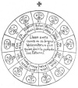
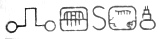

  
[Intangible Textual Heritage](../../../index)  [Native
American](../../index)  [Maya](../index)  [Index](index) 
[Previous](ybac44)  [Next](ybac46) 

------------------------------------------------------------------------

[Buy this Book at
Amazon.com](https://www.amazon.com/exec/obidos/ASIN/0486236226/internetsacredte)

------------------------------------------------------------------------

*Yucatan Before and After the Conquest*, by Diego de Landa, tr. William
Gates, \[1937\], at Intangible Textual Heritage

------------------------------------------------------------------------

### SEC. XLI. CYCLE OF THE MAYAS. THEIR WRITINGS.

Not only did the Indians have a count for the year and months, as has
been before set out, but they also had a certain method of counting time
and their matters by ages, which they counted by 20-year periods,
counting thirteen twenties, with one of the twenty signs in their
months, which they call **Ahau**, not in order, but going backwards as
appears in the following circular design. In their language they

<table data-align="RIGHT">
<colgroup>
<col style="width: 100%" />
</colgroup>
<tbody>
<tr class="odd">
<td data-valign="CENTER"><a href="img/08101.jpg"> 
Click to enlarge</a> 
 
</td>
</tr>
</tbody>
</table>

call these periods **katuns**, with these making a calculation of ages
that is marvelous; thus it was easy for the old man of whom I spoke in
the first chapter to recall events which he said had taken place 300
years before. Had I not known of this calculation I should not have
believed it possible to recall after such a period. [\*](#fn_41)

As to who it was that arranged this count of katuns, if it was the evil
one it was so done as to serve in his honor; if it was a man, he must
have been a great idolater, for to these **katuns** he added all the
deceptions, auguries and impostures by which these people walked in
their misery, completely blinded in error. Thus this was the science to
which they gave most credit, held in highest regard, and of which

p. 82

not even all the priests knew the whole. The way they had for counting
their affairs by this count, was that they had in the temple two idols
dedicated to two of these characters. To the first, beginning the count
with the cross above the circular design, they offered worship, with
services and sacrifices to secure freedom from ills during the twenty
years; but after ten years of the first twenty had passed, they did no
more than burn incense and do it reverence. When the twenty years of the
first had passed, they began to follow the fates of the second, making
their sacrifices; and then having taken away that first idol, they set
up another for veneration during the next ten years.

*Verbi gratia*. The Indians say that the Spaniards finally reached the
city of Merida in the year of Our Lord's birth 1541, which was exactly
at the first year of the era of **Buluc** (11) **Ahau**, which is in
that block where the cross stands; also that they arrived in the month
**Pop’**, which is the first month of their year. If the Spaniards had
not arrived, they would have worshipped the image of **Buluc Ahau**
until the year ’51, that is for ten years, and then would have set up
another idol for **Bolon** (9) **Ahau** up to the year ’61, when they
would remove it from the temple and replace it with the idol for **Vuc
Ahau**, then following the predictions of **Bolon Ahau** for another ten
years, thus doing with all in their turn. Thus they venerated each
**katun** for twenty years, and during ten years they governed
themselves by their superstitions and deceits, all of which were so many
and such as to hold in error these simple people, that one would have to
marvel over it who did not know the things of Nature and the experience
the devil possesses in dealing with them.

These people also used certain characters or letters, with which they
wrote in their books about the antiquities and their sciences; with
these, and with figures, and certain signs in the figures, they
understood their matters, made them known, and taught them. We found a
great number of books in these letters, and since they contained nothing
but superstitions and falsehoods of the devil we burned them all, which
they took most grievously, and which gave them great pain.

Of their letters we give here an *a*, *b*, *c*, their cumbersomeness not
permitting more, because for all the aspirations of the letters they use
one character, and then for uniting the parts another, going on in this
way *ad infinitum*, as in the following example. **Le** means a lasso,
and to hunt with one; to write it with their letters, they wrote them
with three, at the aspiration of the **l** the vowel **e**, put before
it; in this they are not at fault, although they use the **e** if they
wish to do so for definiteness. Example: **e l e lé**; afterwards they
put the syllable joined:  

p. 83

**Há** means water; because the sound of the letter *aitch* is composed
of *a*, *h*, before it, they put it at the beginning with **a**, and **a
ha** at the end in this fashion: 

|                    |
|--------------------|
|  |

They also wrote in syllables, but in one and the other style: I only put
it here in order to give a complete account of the matters of this
people. **Ma in kati** means 'I do not wish,' and they write it in
syllables in this manner: 
 Here begins their *a*, *b*, *c:*

[  
Click to enlarge](img/08302.jpg)

The letters that do not appear are wanting in this language; and they
have others in addition to ours, for other things where they are needed.
But they no longer use any of the characters, especially the young
people who have learned ours.

------------------------------------------------------------------------

### Footnotes

[81:\*](ybac45.htm#fr_41) The center of the
wheel reads: They call this count in their language **vazlazon katun**,
which means the 'revolution of the katuns.'

------------------------------------------------------------------------

[Next: XLII. Multitude of Buildings in Yucatan. Those of Izamal, of
Merida, and of Chichén Itzá](ybac46)
