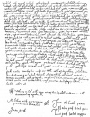

  
[Intangible Textual Heritage](../../../index)  [Native
American](../../index)  [Maya](../index)  [Index](index) 
[Previous](ybac56)  [Next](ybac58) 

------------------------------------------------------------------------

[Buy this Book at
Amazon.com](https://www.amazon.com/exec/obidos/ASIN/0486236226/internetsacredte)

------------------------------------------------------------------------

*Yucatan Before and After the Conquest*, by Diego de Landa, tr. William
Gates, \[1937\], at Intangible Textual Heritage

------------------------------------------------------------------------

p. 114

### Letter in Maya to the King

[  
Click to enlarge](img/11400.jpg)  
  

An exact duplicate of the above, in wording and handwriting, and
accompanied by a Spanish translation, both the Maya and Spanish versions
signed as by eight caciques of Calkini, Numkiní and other towns, the
signatures being all in the same writing as the body of the letter, was
published, with facsimile of the Maya version, in the great *Cartas de
Indias*, in 1877.

Its value as a real expression of Maya sentiment is considerably
invalidated by the fact, only shown by the recent discovery of the above
duplicate, in the same writing, and signed by another set of caciques,
as one of *several more like letters*, dated all together within a few
days. The one in the *Cartas de Indias* is dated February 11th, and this
February 12th. In short, they are as stated in the following letter from
Montejo Xiu, the Lord of Maní, concocted by the friars to influence the
king. Readers of the single one published have been impressed by this
'spontaneous' affection, but one may doubt whether Philip II was
impressed by—shall we say?—the duplicity of affection. Anyhow, politics
before the Council of the Indies, or before the United States Senate,
seems quite alike.

p. 115

*Translation of the Letter shown in Facsimile*.

Because we, your majesty's vassals, all understand the desire your
majesty has that we shall be saved, and to provide sufficient ministers
in your majesty's dominions to enlighten, instruct and teach those who
are ignorant, and that although far from those realms of Castile, your
majesty has the same care for us as if we were near, and that it is your
pleasure and care that we be told what is most truly needed, according
to our inferiority and capacity, and our poverty in temporal goods;
Wherefore we make known before your majesty that from the beginning of
our conversion to Christianity we have been taught the doctrine by the
Franciscan friars, and they have preached and in their poverty do preach
and teach us the law of God. We love them as true fathers, and they love
us as true sons, and because of sufferings and infirmities and
persecutions of the demon, they have been very few in this country, and
since no others arrive, as it is so far from that land of Castile.

For this cause we beg that you will have compassion on our souls, and
will send us Franciscan friars who will guide us and teach us the way of
God; and especially those of them who have been in this country, and
went back from here to Castile. those who know well our language in
which to preach and teach us; they are called fray Diego de Landa, fray
Pedro Gumiel of the province of Toledo, and especially fray Diego de
Landa for he is great, sufficient, worthy and good in the eyes of our
Father God, who calls on us much to be Christians; Miguel de la Puebla
and the other padres, as many as you see good to send. And because we
understand that jointly and quickly we may do service whereby your
majesty with Christian heart desires us all good, and so we trust that
we may be quickly aided by your majesty, whom may God shine on and ever
increase your vision in his service.

Here in Yucatan on the twelfth day of February of the year 1567.

We are subjects of your majesty's realm and kiss your majesty's sacred
hands. Signed as for MELCHIOR PECH, governor of Samahil province; JUAN
PECH; JUAN EK, town governor of Suma, PEDRO PECH, town governor of Kini,
LUIS PECH, town governor of Moxop’ip’.

------------------------------------------------------------------------

[Next: Letter of Francisco de Montejo Xiu](ybac58)
