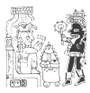

  
[Intangible Textual Heritage](../../../index.md)  [Native
American](../../index)  [Maya](../index)  [Index](index.md) 
[Previous](ybac66.md) 

------------------------------------------------------------------------

[Buy this Book at
Amazon.com](https://www.amazon.com/exec/obidos/ASIN/0486236226/internetsacredte.md)

------------------------------------------------------------------------

*Yucatan Before and After the Conquest*, by Diego de Landa, tr. William
Gates, \[1937\], at Intangible Textual Heritage

------------------------------------------------------------------------

p. 161

### Identification of Plant Names mentioned in Landa's text

**tixzula**: lirio; probably Hymenocallis americana, Jacq. (Molina
Solis).

**ixlaul**: laurel; Stemmadenia insignis, Miers.

**nicte**: the generic name for Plumerias.

yerbamora or nightshade; **pahalcan**: Solanum nigrum, L.

doradilla; **muchcoc**: Selaginella, lapidophylla, Spring.

**yaxpahalche**: Piper Gaumeri, Trel.

zarzaparilla; **coceeh**: Smilax mexicana, Griseb.

"kind of hemp": **halal**? Scirpus validus, Vahl.

**ixim**: maize; Zea mayz, L.

beans, frijoles; **buul**: Phaseolus vulgaris, L.

peppers: Capsicum genus.

"root, growing like the turnip . . . is the fruit": **chicam**?; jícama;
Pachyrhizus erosus L.

"root which grows like the turnip, short, fat, and round": **chicam**,
jicama; Pachyrrhizus erosus, L.

"root that grows under the earth"; peanut? Arachis hypogaea, Schlecht,
Cham.

"there are two other kinds of good roots they use as food":

   a—**iz**, camote, sweet potato; Ipomoea batatas L.

   b—**maxcal**, **macal**, yam; Dioscorea alata L.

"tree with fruit like round gourds": jícara? **luch**; Crescentia
cujete, L.

"smaller gourds": **lac**? Lagenaria siceraria, Standl.

"incense tree": **pom**, copal; Protium copal, Engl.

"handsome tree that grows by wells": **yaxche**, ceiba; Ceiba pentandra,
L.

**kulche**: cedar; Cedrela mexicana, M. Roemer.

"sort of yellowish tree": **ya**, sapote; Achras sapota L.

brasil; **chacte**: Caesalpinia platyloba, Wats.

**zoon**: Guaiacum sanctum L.

"causes sores": **chechem**; Metopium Brownei Jacq.

"tree with double thorns": **subim**, cornezuelo; Acacia Collinsii,
Safford.

"use for tying in building": **hol**; Hibiscus tiliaceus L.

"another . . . of which they make bows and lances": **chulul**?;
Apoplanesia paniculata, Presl.

"for pillows is superior to tow": **piim**; Ceiba aesculifolia HBK.

"wine-tree which the Indians esteem so highly": **balche**; Lonchocarpus
longistylus, Pittier.

**niiche**: grapes; Coccoloba uvifera L.

**abal**: plums; Spondias mombin L., or S. purpurea L.

bananas: platanos; Musa paradisiaca L., or M. sapientum L.

"very large tree that bears a large, longish fruit": **chacal haas**;
Calocarpum mammosum L.

**ya**: sapote; Achras sapota L.

**ox**: ramón; Brosimum alicastrum, Sw.

"another (tree) exceedingly beautiful which bears a fruit like large
eggs": **put**, papaya; Carica papaya L.

p. 162

**uayam**: guaya; Talisia olivaeformis HBK.

**pichi**: guayava; Psidium guajava L.

**on**: aguacate; Persea americana, Mill.

"this tree bears a small, tasty, yellow fruit": **chucum**?
Pithecolobium albicans, Kunth.

"there are artichokes that are very spiny and ugly": **chacuob**,
pitahaya; Cereus undatus, Haw.

"small, rather spiny tree bearing a fruit shaped like a slender
cucumber": **chom**? Bromelia karatas L.

"small tree . . . bearing spiny pods like chestnuts": **kuxub**,
achiote; Bixa orellana L.

"one kind (of palm) serves for the thatching of the houses": **xaan**,
huano; Inodes japa, Standl.

"the other is a low, spiny palm": **tuk**? Acrocomia mexicana, Karw.?

"the other kind (of cotton tree) ... lasts five or six years";
**taman**; Gossypium barbadense L or G. Schottii Watt, Wild and Cult.

[  
Click to enlarge](img/16200.jpg.md)

\_\_\_\_\_\_\_\_\_\_\_\_\_\_\_\_\_\_\_\_\_\_\_\_\_\_\_\_\_\_\_\_\_\_\_\_\_\_\_

It should be noted that the pronunciation of all Maya words is as in
Spanish, with the following exceptions: **c** is always hard; **x** is
sounded like *sh* in English, **Xiu** being like *Shu*. The letter **k**
and the stop consonants **p** **t** **ch** and **tz**, when marked by an
apostrophe, as **p’** **t’** **ch’** **tz’**, are preceded by a muscular
tension and then sounded explosively, the usual technical term being
'glottal stop.' Thus **tz’** sounds to the English ear as if it were
**dz**, and is usually so written in Yucatan, as in the town **Dzitás**,
near [Chichén](errata.htm#10.md) Itzá. The Mayance languages lack our
'sonants' **d**, hard **g**, **j**, **z**, as also **f**; Yucatecan Maya
also lacks the **r**. Double vowels are to be sounded as such, with
accent on the first.

 
