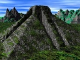

  
[Intangible Textual Heritage](../../index)  [Native American](../index.md) 
[Index](index)  [Next](mmp01.md) 

------------------------------------------------------------------------

[Buy this Book at
Amazon.com](https://www.amazon.com/exec/obidos/ASIN/B002E9HIF0/internetsacredte.md)

------------------------------------------------------------------------

  
*The Myths of Mexico and Peru*, by Lewis Spence, \[1913\], at Intangible
Textual Heritage

------------------------------------------------------------------------

# THE MYTHS OF MEXICO AND PERU

## by Lewis Spence

#### London: George Harrap

#### \[1913\]

#### Scanned, proofed and formatted at Intangible Textual Heritage, March 2001, by John Bruno Hare. This text is in the public domain in the US because it was published prior to 1923.

------------------------------------------------------------------------

[Next: Illustrations](mmp01.md)
