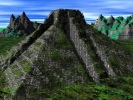

  
[Intangible Textual Heritage](../../index)  [Native American](../index.md) 
[Index](index)  [Previous](mmp02)  [Next](mmp04.md) 

------------------------------------------------------------------------

[Buy this Book at
Amazon.com](https://www.amazon.com/exec/obidos/ASIN/B002E9HIF0/internetsacredte.md)

------------------------------------------------------------------------

  
*The Myths of Mexico and Peru*, by Lewis Spence, \[1913\], at Intangible
Textual Heritage

------------------------------------------------------------------------

#### CONTENTS

#### CHAPTER

#### I. THE CIVILISATION OF MEXICO

#### II. MEXICAN MYTHOLOGY

#### III. MYTHS AND LEGENDS OF THE ANCIENT MEXICANS

#### IV. THE MAYA RACE AND MYTHOLOGY

#### V. MYTHS OF THE MAYA

#### VI. THE CIVILISATION OF OLD PERU

#### VII. THE MYTHOLOGY OF PERU

#### BIBLIOGRAPHY

#### INDEX AND GLOSSARY

------------------------------------------------------------------------

[Next: Chapter I: The Civilisation of Mexico](mmp04.md)
