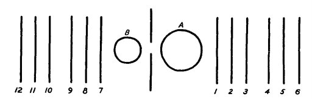
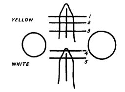
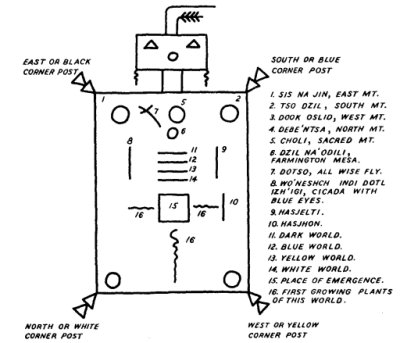

  
[Intangible Textual Heritage](../../../index)  [Native
American](../../index)  [Navajo](../index)  [Index](index) 
[Previous](omni02)  [Next](omni04) 

------------------------------------------------------------------------

# THE ORDER OF THINGS, OR THE AGE OF ANIMAL HEROES

## THE FIRST HOGAN\[45\]

Hash'ke ba'jilte, a powerful medicine man of the Blue Bird Clan, gave
many of the origin myths to Sandoval.

First Man planned to build a home.

He dug a shallow pit in the earth and raised the poles. For the main
poles First Man used the Black Bow, which is called Altqin dilqil.\[46\]
There were two parts of this Black Bow, and two other parts, one cut
from the Male Reed and one from the Female Reed.\[47\] The other poles
were those at hand. Then the whole structure was covered with earth and
grass, and the first dwelling was built. First Woman ground white corn
into meal, and they powdered the poles with the meal, and they sprinkled
it inside the dwelling from East to West.

First Main said as he sprinkled the cornmeal: "May my home be sacred and
beautiful, and may the days be beautiful and plenty."

Today there is a hogan ceremony, and a song is sung as the poles are
raised.

Now after the first hogan was built and they had seen four dark and four
light clouds rising First Man said that they were tired and that they
must rest. He asked if anyone had brought the river stones. The badger
said that he had five. First Man said that he would heat four and leave
one. He had a plan to build two sweat houses out of the remaining
poles.\[48\]

There are four parts of a chant sung at this time. It is the Sweat House
Chant. One part is like this:

He made it. He made it. He made it.  
At the place where the people emerged from the underworld,  
Near the Lake of Emergence, he made it.  
He made it with the female wood and the male wood.  
He made it with the Black Mesa rock.  
He made it with the hard river rock.  
He made it with the help of The-Most-High-Power-Whose-Ways-Are-Fearful.

\[45. Informant's note: The first began was not like the hogans of
today.

Franciscan Fathers (1910, p. 327); Nusbaum (1922.)

46\. Informant's note: The Dark or Black Bow is symbolic of the Slayers
of the Enemies. It is a symbol of the overthrow of evil.

47\. Informant's note: The Male and the Female Reeds are the symbols of
the male and the female principles.

48\. Informant's note: The building of the sweat house is very special,
details will be given later.\]

p. 14

Many chants are sung during this ceremony--the Horned Toad Chant, the
Twin Brothers Chant, the Bear Chant, and the Mirage Stone Chant.\[49\]

## THE CREATION OF THE SUN AND MOON\[50\]

After the hogan was finished everyone rested.

The dwelling was occupied by Atse'hastqin, First Man, and Atse'esdza,
First Woman. All their belongings were piled inside. The woman lay with
her feet to the West, and the man lay with his feet to the East. Their
heads crossed and their thoughts mingled, and these thoughts were
sacred.

Now in the hogan there were also two other persons: Atse'ashki, First
boy, and Atse'ataed, First Girl. They were not the children of First Man
and First Woman, but the Turquoise Boy and the White Shell Girl who had
come with the others from the underworld. Now First Boy lay to the south
side of the hogan, and First Girl to the north. They lay down when they
saw the period of darkness descending, and they listened. First Man and
First Woman whispered together, but First Boy could not distinguish the
words one from another. Each time the Dark Cloud covered them the four
lay down, and First Man and First Woman whispered.

This happened four times, then First Boy stood and said: "What is this
secret thing that you plan? We have lost our sleep through four dark
spaces."

"It is not an unwise thing that we plan," said First Man. "We plan for
the time which is to come, how we shall live, and how the people will
live upon this earth. It is nothing but that, my child." And First Woman
repeated what her husband had said. When First Boy heard this he agreed
that it was better that the two should continue their planning.

First Man and First Woman whispered together during many nights. They
planned with the help of the
All-Wise-Coyote-Who-Was-Formed-in-the-Water. The three devised a scheme
that would meet the problems that would later come to pass. They planned
that there should be a sun, and day and night." They said that the
Coyote, called First Angry, had brought unhappiness and spoiled their
life

\[49. Mindelleff (1898, pt. 2, pp. 475-517); Stevenson (1891, pp.
239-242, 273-275); Cushing (1923, p. 163).

Recorder's note: The hogan faces the East. Hebrews of antiquity fronted
their edifices to the East.

50\. Informant's note: Some medicine men say that the Turquoise Boy was
without sex, or a hermaphrodite.

Stevenson (1891, p. 275) Alexander (1916, pp. 166-169, and note 31, p.
286) Matthews (1897, p. 80).

51\. Alexander (1916, p. 155) Matthews (1897, pp. 80-81); Franciscan
Fathers (1912, p. 36): The Black Yei or Fire God, Hashch'esh'zhini;
Parsons (1923, pp. 135-162).\]

p. 15

down below, and that he was not the proper person to have with them with
this time. He should be kept away.

They spread a beautiful buckskin on the ground. This was the skin of a
deer not killed by a weapon.\[52\] On the buckskin they placed a perfect
turquoise, round like the sun. It was as large as the height of an
average man if he stretched his arm upward. They stood 12 tail feathers
from the eagle around it, and also 12 tail feathers from the flicker. On
the great turquoise they marked a mouth and nose and eyes. They made a
yellow streak below the mouth on top of the chin.

Now, although they had stationed four guards to he on the lookout for
the Coyote, Atse'hashke', he came and asked them what they were doing.
They told him: "Nothing whatsoever". He said: "So I see," and went away.

After that they visited the different places where there was fire under
the earth. In one of these places they found Hashche'zhini, the Black
Yei, who is also called the Fire God. He was asked to use his fire to
heat the great turquoise which they had planned to use as their sun.

They placed a perfect white shell on the buckskin below the turquoise
that was to become the sun. This great, perfect, white shell was to
become the moon. First Man planned to heat it with the first crystal
that he had used for his fire.

By this time they had posted two circles of guards around the place
where they were planning; but even with this precaution the Coyote came
to them. He appeared in their midst and said: "This must be something
that you are planning." But they assured him that he saw nothing; they
said that they were just sitting there. And again the Coyote left them.
First Man called the guards together and asked them why they had let the
one whose name was Atse'hashke' pass. They said that they had not seen
the Coyote. First Man then placed three circles of guards around the
sacred buckskin.

The Holy Ones asked the Turquoise Boy to enter the great, perfect
turquoise that was to become the sun; and they asked the White Shell
Girl to enter the great, perfect, white shell that was to become the
moon. The Turquoise Boy was to carry a whistle made from the Male Reed.
This whistle had 12 holes in it, and each time that the Turquoise Boy
would blow on his whistle the earth would move one month in time. The
White Shell Girl was also to carry a whistle. It was made from the
Female Reed, and with it she should move the tides of the sea.

\[52. Interpreter's note: Medicine men prize highly the skin of a deer
not killed by a weapon. A deer struck by a car in the winter of 1935
brought the Navaho who found it two cows In exchange.\]

p. 16

Just as this was planned the Coyote came among them and said: "well, my
cousins, there is something that you are planning. What is it?"

First Man answered: "We are planning nothing at all. We are just sitting
here."

"Very well," said the Coyote, "I wanted to know, that was all." And he
went away.

After he had gone they planned the 12 months of the year.\[53\]

## THE TWELVE MONTHS OF THE YEAR

(Fig. 1)

October is the first month of the year and of winter, which is called
qai. October's name is Gah'ji, meaning Back-to-Back, or the
Parting-of-the-Seasons. It is the time when the deer come, the time to
hunt. Nalashi, the tarantula, is its feather or headdress. Nlchi achi,
little cold, is its heart. The blue hanging haze is over this month.
Women

FIGURE I.--The Calendar Stone: The plan of the twelve months of the
year. *A*, Sun; *B*, Moon. 1, January; 2, February; 3, March; 4, April;
5, May; 6, June; 7, July; 8, August; 9, September; 10, October; 11,
November; 12, December. (The drawing of the Calendar Stone was given by
Sandoval.)

shell corn, thrash, and store food f or the winter. It is the month when
mountain sheep breed.

November is the second month. It is called Nlchi'tso'si, the month or
Time of Slender Winds. Its heart is Nlchi'tso'si, Slender Wind. Its
feather is Hastin sakai (Orion), the Old Man with Legs Spread. It is
also a month for hunting. The women gather certain grass and plant seeds
on warm days,\[54\] which later they dry and grind into flour for the
different bread cakes eaten in winter. The antelope breed.

The third month of the year is December. It is called Nlchi'tso', the
Great Wind. Its heart is also the Great Wind. Its feather is

\[53 Recorder's note: The drawing of the Calendar Stone was checked by
Sam Ahkeah and Gerald Nallor.

Informant's and interpreter's note: First Man made the marks on the
buckskin. Later the people of Blue House had the Calendar Stone in their
keeping. A medicine woman guarded it. The story of the sun and the moon
and the 12 months were upon it. Hastin Tlo'tsi hee's (Sandoval's)
ancestress, Ezdzan at'a', the Hopi woman, was the guardian of this
Stone. Later it was hidden near the Carriso Mountains.

64 Recorder's note: Edible seeds known to the Navaho. (Any of the genus
*Chenopodium*.)\]

p. 17

Atse'etso, the Big First One.\[55\] Digging sticks are prepared in this
month. They are made with the stone ax; and the wood is dried in the
dwellings so that when the planting time comes the sticks will be smooth
and well seasoned. The women make moccasins, and they tan the hides from
the hunting season. It is the time to begin to tell the sacred stories.
The deer breed.

January is the fourth month. Its name is Zas'ntl'tis, Crusted Snow. Its
heart is Tqin, Ice. Akaisda'hi, Which-Awaits-the-Dawn, is its feather.
This is the Milky Way. The young men hear the sacred stories and learn
to become hatqa'li, Singers or shamen. This is the time when
preparations are made for the coming growing season. There are many
ceremonies. The women cook the food and take part in certain rituals.
The coyotes breed.

February, the fifth month, is called Atsa'biyazh, Baby Eagle. Nol'i, the
Hail, is its heart. Its feather is Gahat'ei, the Rabbit Tracks (star
cluster in Canis Major). It is the month of the changeable winds. The
First Chief of the Winds shakes the earth and awakens the sleeping
plants, the bear, the lizards and the snakes. The first plants start to
come up. After this month the sacred stories must not be told to the
young people. The rabbits breed.

The sixth month, March, is called Wozhchid.\[56\] It is the month when
eaglets chirp in the shell and the antlers of the deer drop. Its heart
is Becha na'chil,\[57\] Sudden Spring Storms. Its feather is Dede'nii,
the mountain sheep bird.\[58\] When you see these birds in the canyons
it is spring. The mountain sheep drop their young. Nlchi'dotlish, the
Blue Wind, moves over the earth and the first leaves come forth.
Ceremonies are held to bless the fields before the seeds are planted.

April, the seventh month and the beginning of Shiji, summer, is called
Da'chil, the month of little leaves. Its heart is Niyol, Wind-in-Action.
Bit'aa, meaning little leaves, is its feather. Rabbits have their young.
Nlchi'dilqil, the Black Wind, shakes the earth and it thunders. The
leaves grow bigger and darker in color; and the people make ready for
the planting.

May is the eighth month. It is called Dotso after the All-Wise Fly in
the sacred legends. Its heart is Ayei'ne'denaiyote, meaning a mixture of
rain and spring snow. Nlchi'dilqil, the Black Wind, is its feather. The
grass becomes a darkish green. The antelope drop their young.
Nlchi'litsui, the Yellow Wind, shakes the earth and it thunders. The
flowers come forth and plants open their leaves. It is

\[55. Recorder's note: Atse etso, the Big First One; part of Scorpio.

56\. Informant's note: The meaning is not known.

57\. Recorder's note: The spelling of this word is not certain.

58\. Informant's note: Dede'nii, the mountain sheep bird is the
phoebe.\]

p. 18

the time to plant. The early part of this month is called the planting
time.

The ninth month, June, is called Yaish jash'chili, When-Few Seeds-Ripen.
Its heart is Hado'yazhe, Little Heat. Jadi'yazhe, Little Antelope, is
its feather. The women gather the first edible seeds, and they are used
as the first fruits of the season. They gather the cactus fruit. This is
the month of the first rain ceremonies.

July, the tenth month, is called Jas'tso, the great seed ripening. Big
Heat, Hado'tso, is its heart. Nltsa'najin, Dark Streaks of Rain, is its
feather. It is the time when people gather many seeds and guard their
fields. The deer drop their young. Dilye'he, the Pleiades, are seen in
the early morning; and the fawns have their pattern on their rumps.

The eleventh month, August, is called Binint A'tso'si, Little Ripening.
Its heart is A'tso'si, Light Ripening. Nltsa'bakha', the Male Rain, is
its feather. The ears form on the corn and everything ripens. It is the
time when wild fruits are gathered--the sourberry, the chokecherry, and
yucca fruit.

The last month of the year and of summer is September. (See fig.
1.)\[59\] It is called Binint a'tso, the Harvest Time. Binint a'tso,
Great Ripening, is its heart. Nltsa'baad, the Female Rain, is its
feather. Nuts are gathered. The corn is harvested and taken to the
dwellings. The first foodstuffs are stored for the winter. And the
Ceremony of All Blessings is held in thanksgiving.

When everything was in readiness they called Hashche'zhini from Heavy
Rock where he lived. He came to heat the turquoise that was to become
the sun. The Turquoise Boy stepped into the sun with his whistle, which
was made from the male reed. This whistle had 12 holes in it; and each
time he blew on it the earth would move one space or month. First Man
heated with his crystal the Great White Shell that was to become the
moon. The White Shell Girl stepped into the moon. She carried her
whistle, made from the female reed, which also had 12 holes in it. And
whenever she blew upon it she would help move the earth and the tides.
These two Holy Beings were to form the seasons and the months and the
days.

The Turquoise Boy asked to have 102 trails; and the White Shell Girl
asked to have 100 trails. They were to cross in the months of March and
September. The Sun was to turn back in June, and again in December.

The Turquoise Boy said: "Everything is right so far, but I will not
travel for nothing. I will travel if I am paid with the lives of the
people of the earth, all the human beings, the animals which have four
legs, the birds and insects of the air, the fishes and all the people

\[59. Informant's note: Some medicine men believe the original plan was
for 13 months.\]

p. 19

of the under-water." And then the White Shell Girl repeated the same
thing. She also wanted to be paid with the lives of the living.\[60\]

After everything was finished and four circles made around the whole,
the Coyote, Atse'hashke', went to the great yei, Hasjelti, and demanded
to know why he had not been allowed to have a part in the planning. He
said that the others had tried to keep it a secret, but that he had
known all that had happened. This made Hasjelti very angry, and seeing
this, the Coyote ran away. He ran straight to the place where the others
were planning and appeared in their midst. He asked First Man why he had
kept everything a secret. He turned to First Woman and asked her why she
had kept this thing from him. Then he told them everything that they had
planned. He said that they had even set the month when he should visit
his woman. He warned them that be had come for the purpose of spoiling
their plan.

Atso'haske' drew five lines over other marks he had made in the sand. He
told the people that unless they could guess their proper meanings they
would suffer greatly. Now the little Breeze whispered in First Man's ear
and told him what to say. The first line was made of turquoise and it
represented the green leaves. The second line drawn was of white shell.
First Man said that he thought of ripe leaves and falling leaves. The
third mark was made of jet; and he said that it stood for the dark,
black mountains after the leaves had fallen. The fourth line was made of
white bead. First Man said that it was the snow on the mountains. The
fifth mark was of crystal, and its meaning was of snow and ice on the
frozen rivers and lakes. (See fig. 2.)

The Coyote spoke, "All right, everything you have guessed correctly. I
thought of all those things as I made the five marks. By your

FIGURE 2.--Atse'hashke' the Coyote's five marks: 1, The turquoise mark;
2, the white shell mark; 3, the jet mark; 4, the white bead mark; 5, the
crystal mark. (Gerald Nallor obtained this diagram from a medicine man
at Shiprock.)

\[60. Recorder's note: The Arctic Highlanders say: "Will ye have eternal
darkness and eternal life, or light and death?"\]

p. 20

guessing you have made the summer months six, and the winter months six;
and you expect to count by the changes of the moon. But I will put in
some extra days so that the months will not be even. Sometimes frost
will come early, and sometimes it will remain late. First plants will
sometimes freeze, and so also will animals. Sometimes the full moon will
come before the end of the month; and at the end of the year you will
find that you have 13 moon periods instead of 12." The Coyote continued.
"You have in your minds that it was I who spoiled your way of living
down in the underworlds. It was not my plan."

Then he addressed First Woman. "Why did you keep this sacred thing from
me? When you asked me to steal the Water Buffalo's babies you said that
you had suffered many things because of your husband's plan. Everything
was well when I did as you wished. I have kept the female Water Buffalo
baby; and by keeping her I am able to call the male rain and the female
rain and all the different clouds and vapors. It is well. I followed
your desires so that the people might have the seasons and the flowers
and all that grows from the earth during the different times of the
year. Your plan was for the benefit of those to come. But now I will
place the female child back into the River. Whenever you wish rain you
will have to go for the Water Buffalo's girl baby; and after you have
used her power you will have to return her to the River again." He told
them where they would find her; and he said that they would know when
they should use her. "Now go ahead with your plans, Brothers,"\[61\] he
said, and with that he left them.

After the Coyote had departed the others spread the blue sky above the
earth. In the East they placed a black pole to hold up the eastern end
of the sky. A blue one was planted in the South, a yellow one in the
West, and a white one in the North. A hole was placed in the sky and
sealed with water. Around the outer edge of the sky was placed a white
ring, a yellow ring, a blue ring, and a black ring. They formed the
border. They were placed there for the purpose of protecting the sky so
that it would remain solid forever. No power on the earth or above the
earth should harm it. And around the four posts they placed the same
colors.

After all was finished they placed the sun in the sky, and also, they
placed the moon there. And they placed Dilye'lle, the Pleiades there;
and Atse'etso, the Big First One; and the Coyote's Feather,
Atse'etso'si, which is also called the Slender One; and Baalchini, the
children of Dilye'ha and Atse'etso'si; and Hastin sakai,
The-Old-Man-with-Feet-Apart; and the Rabbit Tracks, Gahat'ei; and

\[61 Informant's note: The Coyote used the word "brother" first and last
In all speeches after this.\]

p. 21

Akaisda'hi, Moving-toward-the-Dawn; and Nahokhos bokho,
The-Main-Pole-which-Holds-All; and Nahokhos bakhai,
The-Revolving-Male-Warrior-with-his-Bow-and.-Arrows; and his wife,
Nahokhos baadi, Who-Carries the-Fire-in-her-Basket.\[62\]

## THE SUN'S PATH

Above the mountain called Tso dzil\[62\] there is a square hole in the
sky. And this hole in the sky is mirrored in a lake which lies between
the two highest peaks of the mountain. There were three names given to
the hole in the sky: the first is called Tse'an an hi'habetine, the
Place Where the Most High Power Came Up; the second is Sash yota'betine,
the Bear's Upper Sky Path; and the third name is Hojon yota'betine,
Whose Ways Are Beautiful's Path. It is said that the Sun stops at this
place at midday and eats his lunch; and the place where he stops and
eats is called Nitsi ya'hatsis, The Place Where the Sun Man Has His
Lunch and His Horse Eats Out of a Basket.

### THE SKY AND THE EARTH

Then came the Earth Woman, Nahosdzan'esdza'. First Man told her that she
was to be the wife of the Sky. She would face the East, and her husband
over her, would face the West. And whenever the Fog covered the Earth
they would know that the Sky had visited Nahosdzan'esdza'.

After that they set the corner posts and stretched the Sky in the four
directions.

About twenty chants were sung at this time, and after the first ten
sections of the first chant, the Sun Chant, the Sun began to move

\[62. Informant's note (checked with interpreter): Yaya ni'sin is the
name of the corner or sky posts. Dilye'he, the Pleiades. Atse'etso, the
forepart of Scorpio. Atse'etso'si, the belt and sword of Orion.
Baalchini, the central double stars in the lower part of the Hyades,
Hastin sakai, Orion. The left foot is Rigel and the right foot is
Betelgeuse. Gahat'ei, the star cluster under Canis Major, Akaisda'hi,
the Milky Way. Nahokhos bokho, the North Star. Nahokos bakhai, Ursa
Major, the Big Dipper. Nahokos baadi, Cassiopeia, but some medicine men
say Ursa Minor.

Lowie (1908): "According to the naturalistic theory, constellations are
apperceived by primitive man as objects or persons according to the
characteristics that appear to him, and an explanatory tale is added"
(p. 123); e. g., The Pleiades--"the Shoshone tale of Coyote and his
daughters"; the "Plains' legend of the girl who turns into a bear, and,
after killing the tribesmen, pursues her brothers, who ascend to become
a constellation" (the Dipper) (p. 126).

Tozzer (1908, p. 28); Matthews (1897, p. 80, notes 67-70, pp. 223-224).

Interpreter's notes: 1. The Coyote added his own star, Mai'bizo, which
is sometimes called So dondizidi, the No-Month Star. This is identified
as Canopus. 2. The Coyote Man was thrown into the sky, and is known as
Atse'etso'si. The Baalchini are his children by the woman Dilye'he, the
Pleiades. Those who know of the Coyote cult and its weird rites
understand incestuous relationship. 3. Dilye'he, the Pleiades, is
sometime represented as the mother-in-law who must not meet her
son-in-law, Aste'etso'ei, but must continually run from him. The myth of
the Coyote Man is the origin of the mother-in-law taboo.

61\. Informant's note: Tso dzil is Mount Taylor.\]

p. 22

away. The next chant was for the Moon, and after a little time, it also
began to move away.

Today different medicine men use different chants and prayers for this
ceremony; but the chants of the Sun and Moon and Earth are always sung.
Some say that black magic and evil entered the plan at this time, but
others hold that it was not until later.

Now after the Sun rose in the sky the Dark Cloud that covered the
earlier worlds during half periods became the night. The White Cloud was
the dawn, and the sun's light became our day. And along the far horizons
where the first ones used to see the blue and yellow clouds, there
appeared the twilight and the false dawn.

The first day-period that the sun was raised in the sky the heat was
unbearable. So the Holy Ones stretched out the four corners of the sky
and this raised the sun still higher in the heavens. After they had done
this four times it was like it is today. There was room on the earth for
everyone, and the sun's warmth was right for the growing plants and the
animals and the people.

FIGURE 3--Sand Painting of the Earth, (The plan of the earth.) From the
top of the mask projects a breath feather, tied with a white cotton
string, the spider's gift. Coral and turquoise ear pendants are
Indicated. The body is dark gray. Borders, mask, neck, etc. The two arms
and two legs are kos ischin, triangles set upon one another and
symbolizing forming clouds or cloud terraces. (Sani Ahkeah and Gerald
Nallor got this from medicine men at Shiprock.)

p. 23

Now it was the same with the earth as it was with the sky. They planned
just how the earth should be.\[64\] (Fig. 3.) They made the face of the
earth white, with eyes and nose and mouth. They made earrings of
turquoise for the ears; and for a border they placed a black ring, a
blue ring, a yellow ring, and a white ring, which is the earth's edge.
These rings are for the earth's protection; no power shall harm her.

## THE MOUNTAINS SACRED TO THE DÎNÉ

First Man and First Woman formed six sacred mountains from the soil that
First Man had gathered from the mountains in the Third World and kept in
his medicine bag.\[65\] As before they placed Sis na'jin in the East,
Tso dzil in the South, Dook oslid in the West, and Debe'ntsa in the
North. They placed a sacred mountain, which they called Chol'i'i, on the
earth; and they made the mountain, Dzil na'odili, around which the
people were to travel.

There were four Holy Boys. These beings First Man called to him. He told
the White Bead Boy\[66\] to enter the mountain of the East, Sis na' jin.
The Turquoise Boy\[67\] he told to go into the mountain of the South,
Tso dzil. The Abalone Shell Boy\[68\] entered the mountain of the West,
Dook oslid. And into the mountain of the North, Debe'ntsa, went the Jet
Boy.\[69\]

Now the mountains to the East and South were dissatisfied. The East
wanted the Turquoise Boy and the South wanted the White Bead Boy for
their bodies. There was quite a lot of trouble; the mountains would
tremble as though they would fall to pieces, and it was a good time
before they were satisfied. The other mountains were happy in their
bodies and there was no trouble between them.

First Man and First Woman called other Holy Beings to them.

They put the Beautiful Mixed Stones Boy and Girl into the sacred
mountain called Chol'i'. They put the Pollen Boy and Grasshopper
Girl\[70\] into Dzil na'odili. They asked the Rock Crystal Girl to go
into Sis na' jin. They put the White Corn Girl into Tso dzil; the Yellow
Corn Girl into Dook Oslid; and the Darkness Girl into Debe'ntsa.\[77\]

After the Holy Beings had entered the Sacred Mountains First Man and
First Woman dressed them according to their positions on the earth.

\[64. Informant's note: The Sand Painting of the Earth and the
description.

65\. Recorder's note: see page 9, ftn. 32, this bulletin.

66\. Informant's and interpreter's notes: The White Bead Boy is also
called the Dawn Boy and the Rock Crystal Boy.

67\. Informant's note: The Turquoise Bead Boy is called the Daylight
Boy.

68\. Informant's note: The Abalone Shell Boy is called the Twilight Boy.

69\. Informant's note: the Jet Boy is called the Darkness Boy and the
Obsidian Boy.

70\. Informant's note: The Pollen Boy and the Grasshopper Girl are also
called the Beautiful Goods Boy and Girl.

71\. Interpreter's note: Early remains near San Francisco Peak not
mentioned by the informant, but spoken of by others.\]

p. 24

They fastened Sis na' jin to the earth with a bolt of white lightning.
They covered the mountain with a blanket of daylight, and they decorated
it with white shells, white lightning, black clouds, and male rain. They
placed the white shell basket on the summit; and in this basket two eggs
of the hasbi'delgai, the pigeon. They said that the pigeons were to be
the mountain's feather; and that is why there are many wild pigeons in
this mountain today. And lastly they sent the bear to guard the doorway
of the White Bead Boy in the East.

Tso dzil they fastened to the earth with a stone knife. They covered
this mountain of the South with a blue cloud blanket; and they decorated
it with turquoise, white corn, dark mists, and the female rain. They
placed a turquoise basket on the highest peak, and in it they put two
eggs of the blue bird, doli. Blue birds are Tso dzil's feather. They
sent the big snake to guard the doorway of the Turquoise Boy in the
South.

Dook oslid was fastened to the earth with a sunbeam. They covered the
mountain of the West with a yellow cloud. They adorned it with haliotis
shell, yellow corn, black clouds, and the male rain, and they called
many animals to dwell upon it. They placed the abalone shell basket on
the summit; and in it they placed the two eggs of the tsidiltsoi, the
yellow warbler. These birds were to become its feather. The Black Wind
was told to go to the West and guard the doorway of the Abalone Shell
Boy.

They fastened the mountain of the North, Debe'ntsa, to the earth with a
rainbow. Over it they spread a blanket of darkness. They decorated it
with bash'zhini', obsidian, black vapors, and different plants and
animals. The basket they placed on its highest peak was of obsidian; and
in it they put the two eggs of the chagi, the blackbird. The blackbirds
are the mountain's feather. The lightning was sent to guard the Jet
Boy's doorway in the North.

First Man and First Woman fastened the Sacred Mountain Chol'i'i to the
earth with a streak of rain. They decorated it with the pollens, mixed
chips of stone precious to them, the dark mists, and the female rain.
And they fastened Dzil na'odili to the earth with the sun's rays; and
they decorated it with the beautiful goods of all kinds, the dark
clouds, and the male rain. They left the summits of these mountains
free. But some say that Dzil na'odili was fastened to the earth with
Tse'hadahonige, the mirage stone; and those people associate the Mirage
Boy and the Carnelian Girl with this mountain."

All the mountains have their prayers and chants which are called
Dressing the Mountains. All the corner posts have their prayers and
chants, as have the stars and markings in the sky and on the earth. It
is their custom to keep the sky and the earth and the day and the night
beautiful. The belief is that if this is done, living among the people
of the earth will be good.

\[72. Matthews, 1897, pp. 78-79, similar legend.\]

p. 25

One of the Mountain Chants:\[73\]

For ages and ages the plans have been made.  
For ages and ages the plans of the Holy Mountains have been made.

For Sis na' jin, the mountain of the East, the plan was made.  
The plan was made in the home of the First Man.  
The planning took place on top of the Beautiful Goods.  
They planned how a strong White Bead Boy should be formed;  
How the White Bead Boy should be formed, and  
How the Chief of the Mountain should be made.  
How he should be made like the Most-High-Power-Whose-Ways-Are-Beautiful.

For Tso'dzil, the mountain of the South, the plan was made.  
The plan was made in the home of the First Man.  
The planning took place on the top of the Beautiful Goods.  
They planned how a strong Turquoise Boy should be formed;  
How the Turquoise Boy should be formed, and  
How the Chief of the Mountain should be made.  
How he should be made like the Most-High-Power-Whose-Ways-Are-Beautiful.

For Dook oslid, the mountain of the West, the plan was made.  
The plan was made in the home of the First Man.  
The planning took place on the top of the Beautiful Goods.  
They planned how a strong Abalone Shell Boy should be formed;  
How the Abalone Shell Boy should be formed, and  
How the Chief of the Mountain should be made.  
How he should be made like the Most-High-Power-Whose-Ways-Are-Beautiful.

For Debe'ntsa, the mountain of the North, the plan was made.  
The plan was made in the home of the First Man.  
The planning took place on the top of the Beautiful Goods.  
They planned how a strong Jet Boy should be formed;  
How the Jet Boy should be formed, and  
How the Chief of the Mountain should be made.  
How he should be made like the Most-High-Power-Whose-Ways-Are-Beautiful.

For Dzil na'odili, the Center Mountain, the plan was made.  
The plan was made in the home of the First Man.  
The planning took place on the top of the Beautiful Goods.  
They planned how a strong Earth's Breath should be formed;  
How the Banded Rock should be used, and  
How the Chief of the Mountain should be made.  
How he should be made like the Most-High-Power-Whose-Ways-Are-Beautiful.

For Chol'i'i, the Sacred Mountain, the plan was made.  
The plan was made in the home of the First Man.  
The planning took place on the top of the Beautiful Goods.  
They planned how the strong Earth's Heart should be formed;  
How the Mixed Chips should be used, and  
How the Sacred Mountain should be made.  
How she should be made like the
Most-High-Power-Whose-Ways-Are-Beautiful.

\[73. Informant's note: Matthews recorded the Mountain Top Chant; also
another Mountain Chant, Dzil ki'ji jikae'shash na'dle, relates the
metamorphoses of the bear and the horned rattlesnake (Matthews, 1887,
pp. 385-467).\]

p. 26

The Ceremony that has come down to us from this story is called the
Mountain Chant.\[74\] There are about a hundred sections to this one
great chant. There are many songs, and they are all beautiful. The words
of the songs tell of the mountain people: the bear, the deer, the
squirrel, and of all the others.

These persons were asked how many plants they brought with them from the
first worlds, and how many seeds were collected and planted in the
mountains. And after the mountain people came the people of the Plains.
They were asked to bring forth the seeds of their plants. All that is
seen growing on the Plains they brought with them. Next came the river
people. They were asked about the willows, and the otter said that he
had brought them with him. The beaver brought the cottonwoods, and also
a stone which he chipped and scattered along the rivers and over the
mesas, and they became the river boulders found today. First Man asked
who had brought the cliff rocks. The little gray birds that live in
those rocks, tse na'olch oshilchi', the rock wren, said that they had
brought them. They said that they had ground it into powder and
sprinkled it here and there and that the cliffs had sprung into being.

After First Man and First Woman had made and dressed the six mountains
they found that there was still a little earth left in the medicine bag,
so Tseya kan', the Hog Back Mountains, and the mesa south of them were
formed. They were to be the lungs of the earth and the big diaphragm
muscle separating the heart from the stomach.

The last of the earth was used to form Nltsa dzil, Strong Rain Mountain,
the Carrizos. They made this great mountain with its legs to the South
and its head to the North. It has for its dress Strong Goods, meaning
many rocks for its clothing. This mountain has three other names: it is
called Yolgai dzil, Bead Mountain; Nil tliz dzil, Mixed Chips Mountain;
and Ta di din dzil, Strong Pollen Mountain. It holds the pollen of all
the plants. And it was planned by First Man that the people should use
this mountain, so he made it a strong mountain. First Man and First
Woman set arrows around it to guard it. These are the rock formations
such as Shiprock.

And after this was done and all was finished, the earth and all that was
on it was stretched in the four directions so that there would be room
for all. The people were told that they were to use the six sacred
mountains indicated as their chief mountains. The place of emergence
from the lower worlds was where it is now. The people could always see
their great mountains above the lower mesa lands. When everything was
finished a smoke was prepared for the mountains and the chants were
sung.

\[74. Matthews (1887, pp. 455-464).\]

p. 27

### MOUNTAIN CHANTS \[75\] \[76\] \[77\]

#### Chant I--It Stands Out

The mountain to the East is Sis na' jin.  
It is standing out.  
The strong White Bead is standing out,  
A living mountain is standing out,  
The Chief of the Mountain is standing out.  
Like the Most-High-Power he is standing out,  
Like the Most-High-Power-Whose-Ways-Are-Beautiful he is standing out.

It stands out,  
It stands out,  
It stands out.

The mountain to the South is Tso dzil.  
It is standing out.  
The strong Turquoise is standing out,  
A living mountain is standing out,  
The Chief of the Mountain is standing out,  
Like the Most-High-Power he is standing out,  
Like the Most-High-Power-Whose-Ways-Are-Beautiful he is standing out.

It stands out \[repeated three times\],

The mountain to the West is Dook oslid.  
It is standing out.  
The strong White Shell is standing out,  
A living mountain is standing out,  
The Chief of the Mountain is standing out.  
Like the Most-High-Power he is standing out,  
Like the Most-High-Power-Whose-Ways-Are-Beautiful he is standing out,

It stands out, . . .

The mountain to the North is Debe'ntsa.  
It is standing out.  
The strong Jet is standing out,  
A living mountain is standing out,  
The Chief of the Mountain is standing out.  
Like the Most-High-Power he is standing out,  
Like the Most-High-Power-Whose-Ways-Are-Beautiful he is standing out.

It stands out, . . .

The mountain in the Center is Dzil na'odili.  
It is standing out.  
The strong Beautiful Goods is standing out,  
A living mountain is standing out,  
The Chief of the Mountain is standing out.  
Like the Most-High-Power he is standing out,  
Like the Most-High-Power-Whose-Ways-Are-Beautiful he is standing out.

It stands out, . . .

\[75. Matthews (1887, pp. 385-467); Songs of Sequence (pp. 455-464).

76\. Matthews (1885, pp. 271-274).

77\. Recorder's note: Matthews gives it as "It Looms Up." Informant's
note: The Mountain Chant "It Stands out" to Chant No. 1.\]

p. 28

The Sacred Mountain is Chol'i'i.  
It is standing out.  
The strong Mixed Chips are standing out,  
A living mountain is standing out,  
The Chief of the Mountain is standing out.  
Like the Most-High-Power he is standing out,  
Like the Most-High-Power-Whose-Ways-Are-Beautiful he is standing out.

It stands out, . . .

#### Chant II--You See It \[78\]

Looking at the far distant horizon  
You see it.  
The strong White Bead rises,  
You see it on the far distant horizon.  
The Chief of the Mountain rises,  
You see him.  
Like the Most-High-Power you see him,  
Like the Most-High-Power-Whose-Ways-Are-Beautiful you see him.  
It stands out in the far distance,

You see it,  
You see it,  
You see It.

(In the six verses the names of the different mountains' trimmings are
changed as in the former chant.)

#### Chant III--It Rises Above the Earth

Now it rises in the far distance,  
It rises above the earth.  
The strong White Bead rises,  
You can see it on the far distant horizon.  
The Chief of the Mountain rises,  
He rises above the earth.  
Like the Most-High-Power he rises above the earth,  
Like the Most-High-Power-Whose-Ways-Are-Beautiful he rises above the
earth.

It rises above the earth,  
You see it, you see it, you see It.

(As in Chant II the mountain's trimmings are changed in the verses.)

#### Chant IV--The Chant of the Beautiful Mountains of the East and West \[79\]

##### 1--Hasjelti's song

Mountains of the East,  
The Dawn Mountain,  
The White Corn Mountain,  
The Beautiful Goods Mountain,  
The All-Water Mountain,  
The Pollen Mountain.

\[78. Informant gave Chants II and III later.

79\. Interpreter gave Chant IV, parts I and 2, later.\]

p. 29

The people walk over me.  
The old men all say to me, I am beautiful.  
The people walk over me.  
The old women all say to me, I am beautiful.  
The people walk over me.  
The young men all say to me, I am beautiful.  
The people walk over me.  
The young women all say to me, I am beautiful.  
The people walk over me.  
The children all say to me, I am beautiful.  
The people walk over me.  
The chiefs all say to me, I am beautiful.

##### 2--Hasjohon's Song

Mountains of the West,  
The Twilight Mountain,  
The Yellow Corn Mountain,  
The Mixed Chips Mountain,  
The Little Water Mountain,  
The Pollen Mountain.

Etc.

#### Chant V--The Chant of Hasjelti Boy and Hasjohon Boy\[80}

##### 1--The Dawn or Morning Chant

Starting out towards the Dawn Mountain,  
Starting out towards the White Corn Mountain,  
Starting out towards the Mixed Water Mountain,  
Starting out towards the Pollen Mountain,  
Like the Most-High-Power-Whose-Ways-Are-Beautiful Boy,  
He starts out.  
All is beautiful before him as he starts out.

Going out to the Dawn Mountain,  
Going out to the White Corn Mountain,  
Going out to the Mixed Water Mountain,  
Going out to the Pollen Mountain,  
Like the Most-High-Power-Whose-Ways-Are-Beautiful Boy,  
He goes forth.  
All is beautiful behind him.  
All is beautiful before him.

He went to the Dawn Mountain,  
He went to the White Corn Mountain,  
He went to the Mixed Water Mountain,  
He went to the Pollen Mountain,  
Like the Most-High-Power-Whose-Ways-Are-Beautiful Boy,

\[80. Interpreter's rendition of Chant V, both (1) the Dawn or Morning
Chant, and (2) the Twilight or Evening Chant.\]

p. 30

He went to them.  
All was beautiful before him,  
All was beautiful behind him,  
All was beautiful above him,  
All was beautiful below him,  
All was beautiful around him,  
As he went to them.

##### 2--The Twilight or Evening Chant

\[This is the same except for the names of the mountains:\]

Starting out towards the Twilight Mountain,  
Starting out towards the Yellow Corn Mountain,  
Starting out towards the Mixed Chips Mountain,  
Starting out towards the Pollen Mountain. . . .

#### Chant VI--The Chant Sung when Hasjelti Had a Bad Dream\[81\]

All is beautiful where I dream.  
All is beautiful where I dream.  
I dream amid the Dawn and all is beautiful.  
I dream amid the White Corn and all is beautiful.  
I dream amid the Beautiful Goods and all is beautiful.  
I dream amid the Mixed Waters and all is beautiful.  
I dream amid all the Pollens and all is beautiful.  
I am the Most-High-Power-Whose-Ways-Are-Beautiful  
And I dream that all is beautiful.

\[The same chant is used for Hasjohon, but Twilight, Yellow Corn, Mixed
Chips, Little Water and the Pollens are used.\]

#### Chant VII--The Chant of the Plants

\[This is used with the Third Sand Painting\]

Now it is planned, in the East is the Corn.  
Now it is planned, in the South is the Bean.  
Now it is planned, in the West is the Pumpkin.  
Now it is planned, in the North is the Tobacco.

2d. verse begins: Now it is made. . .  
3d. verse begins: Now they dress it. . .  
4th. verse begins: Now it is dressed.

## THE COMING OF DEATH AND LIFE

Now the earth, which had been stretched, became solid, and the rivers
flowed. Trees grew along the banks of the rivers, and flowers grew at
the foot of the mountains with the rocks and the cliffs and other trees
above them. The Mother Earth was very beautiful.

\[81. Interpreter gave Chants VI and VII.\]

p. 31

But just when everything on the earth was good and beautiful the people
saw the first death. They remembered what the Sun had said. He had
claimed the lives of all the living in payment for his light. The people
wondered where the dead would go. "Is there another country?" they asked
among themselves.

Now there came two beings called Alke'na ashi, Made Again, who looked
like the Yei.\[82\] They were sent to the East to look for the dead
body. They returned and said that they had not seen it. They were sent
to the South and they brought back the same report. They were sent to
the West and the North without success. They were asked to look into the
Yellow World where they had come from. As they were about to start they
felt the flesh around their knees pinched; but they went on. They had a
strange feeling of sound, like a rale, in their throats. They felt
rather than heard this sound, but they went on. Then there was a
sensation in their noses, like an odor, but they went on to the place of
emergence, and they looked down. Way below them there was someone
combing his hair. He looked up and gave a little whistle, and they both
experienced a strange feeling.

When the Alke'na ashi returned from the lower world they said that they
had seen the spirit of the one who had died. They told just what they
had felt and seen.

They warned the others saying that they must not try to return to the
Country of the Past for it was not well to experience such sensations
nor to see such things; and if in the future someone were to hear a
whistle when no one was about that whistle came from an evil source, and
a prayer should be said at once. If anyone should be so unfortunate as
to see their double, or the form of a near relative in a vision, it
would be a sign that dangerous things were about to befall them. Should
this happen a chant must be held and prayers said in order to ward off
the trouble.

The First People thought a great deal about this person's dying.

It had been First Man's and First Woman's plan to have everyone live
forever. There was to have been no death. They could not understand this
thing; and they were not satisfied.

First Man and First Woman got a piece of hard, black wood.\[83\] They
made a smooth pole of it, and pointed it, as an arrow is pointed.

\[82. Interpreter's note: The Alke'na ashi were originally the White
Corn Girl and the Yellow Corn Girl, children of the White Shell Girl and
the Wolf. They had been killed; but after twelve years the Holy Ones
revived them, hence their name meaning Made Again. But they were revived
as a boy and a girl. It is said that the Sun has their masks; and that
their faces are never represented. This story is one of black magic; and
these two are connected with death and evil.

Matthews (1897, p. 76): "To behold the dead is dangerous." Franciscan
Fathers (1910, pp. 453-456).

83\. Interpreter's note: The petrified log is the fetish of the Goddess
of Death.\]

p. 32

Its length was the distance from a tall man's fingertip to his heart.
After this pole was fashioned they dressed it; and they carried it on
their shoulders to a lake. It was their plan to cast it into the water,
and if the pole floated to the shore there would be no death; but if it
sank down into the water, then death would remain. Now just as they
raised it to cast it into the water the Coyote came to them. They saw
that he carried a big stone ax. As they cast the pole into the water he
threw the stone ax, saying: "Unless this stone ax returns to the surface
there will be death." Now the stone ax remained in the lake, but the
pole which First Man and First Woman had shaped and dressed returned to
the shore. So it was decided that, although there would be death among
the people of the earth, sometimes the very ill would recover because
the log had floated back to the shore.

### OLD AGE AND ILLNESS

First Man and First Woman had planned what was best for the sky and the
earth and the people. And in the beginning whatever they planned became
a fact; but after the Coyote interfered there were others who wished to
have a part in the scheme of how the people should live.

The people's hair was to remain black. No one thought that the beings
were to grow old. But there came a bird with a white head who said: "My
grandchildren, look here, I am turning gray; I am growing old." This
person was tsish'gai, the nut hatch; and after he had spoken old age
descended upon many and their hair turned gray.

The people of the earth had been given strong white corn for teeth. They
were made strong, solid and clean; and the plan was that they should
remain so forever. But there came Old Man Gopher, Hastin Naazisi, with
his face badly swollen for he was in great pain. "Oh, my grandchildren,"
he groaned, "I have a toothache. Pull my bad teeth for me." So they
pulled the bad teeth, and only two remained that were really good. After
that time it became a fact that people suffered from toothache, that
teeth became old and worn.

So far there had been no babies born as they are now born. This was the
plan. But a small bird with a red breast came and said: "My
grandchildren, look at the blood that comes from me." It was a monthly
occurrence after that, and it came to all female beings. The bird was
chishgahi, the robin.

## THE PLAN, OR ORDER OF THINGS

There was a plan from the stars down. The woman's strength was not to be
as great as the man's strength. They could not attend to the planting
and harvesting as the men could, therefore men would

p. 33

be worth more than women. And the plan was that women would propose
marriage to men; but the Coyote came and said: "Brothers, listen, I have
just married a woman." Again he spoiled their plan. Men propose marriage
to women; but because of the older plan there are still cases where
women go after men. Then not long after that, that which the bird,
chishgahi, said came true; but they still thought it unwise to have
babies born in the new way. Just then the Coyote came and said:
"Brothers, I have a little baby."

Then they planned how a husband and a wife should feel toward each
other, and how jealousy should affect both sexes. They got the yucca and
the yucca fruit, and water from the sacred springs, and dew from all the
plants, corn, trees, and flowers. These they gathered, and they called
them tqo alchin, sacred waters. They rubbed the yucca and the sacred
waters over the woman's heart and over the man's heart. This was done so
they would love each other; but at the same time there arose jealousy
between the man and the woman, his wife.

After that they planned how each sex would have its feeling of passion.
A medicine was made and it was given to the man and to the woman. This
medicine was for the organs of sex. The organ of the man would whistle;
and then the organ of the woman would whistle. When they heard this each
organ gave a long, clear whistle. After that they came together and the
sound of the whistle was different. That is why the voices of the young
boy and maiden are different; and it is why their voices change.

They planned that the rainbow should be used for a path whenever there
was a deep canyon to cross; and it was to be thrown over a river and
used as a bridge.

The gopher was told to remain hidden from the sun because he had caused
toothache. That is why he stays down in the earth and seldom ventures
out during the daytime.

First Man called the birds to him and said: "You who have wings, go to
the mountains for your food and good living." So they went to the
mountains. To each bird was given a name, and to each was given the
directions of his way of living.

Then all the different types of lizards came. They were sent to the
cliffs and told to make their homes among the rocks; and to every type
of lizard was given a name.

First Man called the beavers and the otters and the underwater animals;
and they were given their names and sent to the rivers and waters that
would become their homes.

First Man and First Woman called the chiefs. First they called the wolf.
They told him that, although he was a chief, he had done wrong, he had
stolen. They told him that he should be called ma'itso,

p. 34

the big wanderer. "You shall travel far and wide over the face of the
earth," they said.

The snake was called. They told him that because he could not travel the
year round he would be given a bag of medicine, and, as he had no place
to which he could tie it, they put it in his mouth. First Man gave this
to him and told him that should the snake wish to harm someone he should
swell this poison and cast it out. But for its possession he must pay by
traveling but 6 months of the year.

Then First Man called another chief. "Come here, old man," he said. When
this being came, First Man said that he should be named ma'i, the
coyote.\[84\] But the coyote got angry and said: "Such a name!" And he
declared that he would not have it; and that he would leave; but First
Man called him back and told him that he would also be known as
Atse'hashke', First Angry. After that the coyote felt better. He thought
that he had a great name given him, and he went happily away, for he was
told that he would know all the happenings on the face of the earth.

The bear was the next chief to be called. He was given a name but be was
not satisfied. He became so angry that First Man used the word "shash"
to quiet him. The bear repeated it four times, and he said that it had a
strange sound, and when one said it aloud one had an awesome feeling. So
he went off well content that "shash" should be his name.

Up to this time all beings were people and could remove their coat forms
at will;\[85\] but because of wrongdoing they were made to keep their
coats; and they were made to keep to their kind and to live among
themselves in different parts of the earth.

When all the birds and animals had started out on their way, First Man
called one little, gray bird back. It was tse na'olch'oshi, the little
canyon wren, who had carried the cliff rock up from the Yellow World.
First Man told him that, since he had been responsible for the cliffs he
should make his home among the cliff rocks. And should anyone ever harm
him he would have the power of getting even with him. That is why
falling rocks sometimes harm people or animals.

All the people that First Man and First Woman named and sent forth now
live on the earth. This is the way they planned the order of things.

\[84. Recorder's note: Ma'i, the Coyote, is not to be confused with the
Great Coyote or Wolf. This is the Coyote called First Angry or the
Scolder, and appears In Zuni and other myths.

85\. This to the same in Zuni myths, etc.\]

p. 35

------------------------------------------------------------------------

[Next: The Age of Gods](omni04)
