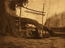

  
[Intangible Textual Heritage](../../../index.md)  [Native
American](../../index)  [Navajo](../index)  [Index](index.md) 
[Previous](sws35)  [Next](sws37.md) 

------------------------------------------------------------------------

[Buy this Book at
Amazon.com](https://www.amazon.com/exec/obidos/ASIN/B002EQAH5Q/internetsacredte.md)

------------------------------------------------------------------------

  
*Spider Woman*, by Gladys A. Reichard, \[1934\], at Intangible Textual
Heritage

------------------------------------------------------------------------

p. 255

### XXXIII

#### DEATH

The War Dance has kept me longer than I
had planned to stay. On Thursday I leave Maria Antonia with grave
misgivings. I am gone something over three weeks, during which she is
continually on my mind. I meet someone from Ganado at Gallup, but he
does not know how she is, was too busy to ask, never thought of it. At
length toward the end of my absence I receive relief to my anxiety from
my friend Little-Woman. "Marie says Maria Antonia is better." Consoled I
say to myself, "She is a tough one all right."

In a few days I return to Ganado, and Little-Woman tells me, "Maria
Antonia died at the hospital last night."

"I do not know what to do. Do you?" I ask my white friend, Big-Woman.
"Do you know what Navajo do at a death? The only thing I can think of is
to go up and see them."

"Yes, they will want to see you," she answers. "I will go with you. We
shall have to cry with them."

Before dark we go. We meet Curley's-Son on his horse. Solemnly he shakes
hands with both of us. We do not say much, but we can see his sorrow;
and it is evident that he understands ours. We find all but Tom in
Red-Point's shade, just sitting in a grief-stricken assemblage. The old
woman

p. 256

who was a patient with Maria Antonia at the War Dance is here, and I
wonder if there is a ceremonial reason. I go to the back of the fire
where Red-Point is sitting, thrust out my hand to grasp his. He gently
pulls me down, so I am kneeling, lays his head on my shoulder, and
breaks into sobs. All I can say in those long minutes, is, "My
grandfather, my grandfather!"

They are all crying quietly by this time, and at last I move over to
Marie as my friend weeps with Red-Point. Putting her head on my breast,
Marie sobs: "Oh, my sister, I am so glad to see you! Where have you
been?"

"I'm back now," I assure her as she continues to weep bitterly for
perhaps five minutes.

In turn I "cry with" Atlnaba and Ninaba, less long with Ben Wilson's
wife, whom I do not know so well, and I finally take a place right next
to my grandfather. Tom now comes in, quietly shakes hands with us, and
we all sit silent. I have cigarettes, but I hesitate to break into the
quiet. For twenty—perhaps it is only ten—minutes we sit there, the tears
gradually lessening, sniffles eventually subsiding. It is Djiba who
breaks the charged silence. In her serious businesslike manner which has
more than once reminded me of her grandmother, she gets up, bustles to
the woodpile, and places a huge piece of wood on the coals.

Red-Point breaks into a laugh, and we all smile at one another. He gets
out his smokes, I have mine ready. "It is very hard for us," he begins
in the exact vein I have heard from white people. "We did everything we
could, but nothing seemed to help."

My friend and I agree that he did everything he possibly could. He goes
on. "We want you to tell the white people

p. 257

that we are thankful for everything they did for us. Old-Mexican's-Son
and the people at the hospital, they did all they could, and we
appreciate it. The people at the hospital buried her for us. And they
did it quick too, and we are glad for that. Be sure and tell them how
thankful we feel for all they did."

Marie explains: "We were down at the hospital with my mother up to the
time she died. She died just before midnight. You know after a death
nobody in the family eats until after the body is buried."

"What time was she buried?" I ask.

"We could eat at eight," says Marie with the same satisfaction a white
might take in a carload of flowers or a silver casket. They have
friends; their friends have done for them the service they most dread,
and they have done it speedily. The Navajo, if he can manage it in any
way, leaves the last rites to someone else, anyone who will perform
them.

"I was terribly shocked when I got here. Just a few days ago
Little-Woman had written me that she was better. And I was so glad to
hear. Ever since I left I was worried. Nobody I asked in Gallup knew. I
didn't see Old-Mexican's-Son. Then I was much relieved at the good
news."

"She was well, you know," Marie continues. "She was so she could walk
around. That Knife Chanter sang for four days and nights, and he cured
her. Then they had that Male Shooting Chant over at Sage-Woman's, and my
father thought it would be good if they sang over my mother, too. And
she was all right. But then she came home, and it rained; and she got
wet. Then she got sick again the same way. My father wanted to have
another sing, but she said, "No!" After that she was hopeless, she
didn't think she'd get well any more."

p. 258

"Was she willing to go to the hospital?"

"Yes, but she did not believe they could help her."

"What did the doctor say she had?"

"Pneumonia."

"I thought so."

"But," expostulates Marie, "she got over that sickness she had when you
were here. I think she would have been all right, if she hadn't got wet
that time after the sing."

Red-Point takes the floor again. "I was waiting around the store this
morning. Everybody who came in, Indians and whites alike, told me what a
good woman she was, quiet, industrious, had good sense."

"She certainly was," chime Big-Woman and I in chorus. "Everybody had
great respect for her."

"I don't know what those children are going to do," he speculates. "You
know she was raising the three, Ninaba, Dan, and Djiba." This in the
presence of their parents! "They miss her an awful lot. But we all do."

"We are so glad you came," says Marie. "We didn't know where you were.
My mother was conscious up to the last. She would open her eyes and know
us. The morning before she died she asked for you. Have you seen Angela?
Does she know? She asked for her, too."

"No, I just heard it myself when I got here after four o'clock."

We leave finally, I promising to move back in a few days. As we drive
back I grumble to my friend: "I was sure she had pneumonia. It seems she
has had it before. I thought she was very ill, but I remembered how
hardy she was and hoped she could get over this. There's a limit to what
anyone can

p. 259

stand. Even if the doctor had been home on the Fourth of July he
couldn't have kept them from having these sings."

"And getting wet in that rain! There they are without a house," she
adds.

"Yes, and they have four perfectly good hogans over at White-Sands, yet
they live in these shades, with no real protection. I don't understand
it. I always used to think the Navajo left a place of death because they
were afraid of it; but that cannot be the case. They go back nearly
every day to get something; sometimes they stay a long time. There are
four chickens there, and they feed them regularly. Tom said they were
going to move the hogans over here, but they haven't even started yet."

"Of course, they have been much upset all summer, first by the little
girl's death and now by Maria Antonia's illness. It is a lot of trouble
for one family. It seems often to happen like that," concludes this
sympathetic lady, whose own family has suffered blow after blow of the
same kind.

I continue with my intolerance of death. "Another thing is, they never
think of such a thing as rest or convalescence. They think if a person
can walk around, she's well. The same way they never see that somebody's
sick, until she's dead. I suppose as soon as Maria Antonia wanted to
walk around and cook, they let her. I wouldn't even be surprised if she
gathered wood. Not that she'd have to, but you know how she was."

------------------------------------------------------------------------

[Next: Chapter XXXIV: Collecting Plants](sws37.md)
