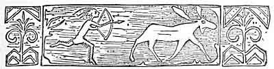

  
[Intangible Textual Heritage](../../../index.md)  [Native
American](../../index)  [Northeast](../index)  [Index](index.md) 
[Previous](al04)  [Next](al06.md) 

------------------------------------------------------------------------

[Buy this Book at
Amazon.com](https://www.amazon.com/exec/obidos/ASIN/B002DPU8XY/internetsacredte.md)

------------------------------------------------------------------------

  
*The Algonquin Legends of New England*, by Charles G. Leland, \[1884\],
at Intangible Textual Heritage

------------------------------------------------------------------------

p. 1

 

# INTRODUCTION.

AMONG the six chief divisions of the red Indians Of North America the
most widely extended is the Algonquin. This people ranged from Labrador
to the far South, from Newfoundland to the Rocky Mountains, speaking
forty dialects, as the Hon. J. H. Trumbull has shown in his valuable
work on the subject. Belonging to this division are the Micmacs of Nora
Scotia and the Passamaquoddy and Penobscot tribes of Maine, who with the
St. Francis Indians of Canada and some smaller clans call themselves the
Wabanaki, a word derived from a root signifying white or light,
intimating that they live nearest to the rising sun or the east. In
fact, the French-speaking St. Francis family, who are known *par
éminence* as "the Abenaki," translate the term by *point du jour*.

The Wabanaki have in common the traditions of a grand mythology, the
central figure of which is a demigod or hero, who, while he is always
great, consistent, and benevolent, and never devoid of dignity, presents
traits which are very much more like those of Odin and Thor, with not a
little of Pantagruel, than anything in the characters of the Chippewa
Manobozho, or the Iroquois Hiawatha. The name of this

p. 2

divinity is Glooskap, meaning, strangely enough, the Liar, because it is
said that when he left earth, like King Arthur, for Fairyland, he
promised to return, and has never done so. It is characteristic of the
Norse gods that while they are grand they are manly, and combine with
this a peculiarly domestic humanity. Glooskap is the Norse god
intensified. He is, however, more of a giant; he grows to a more
appalling greatness than Thor or Odin in his battles; when a *Kiawaqu'*,
or Jötun, rises to the clouds to oppose him, Glooskap's head touches the
stars, and scorning to slay so mean a foe like an equal, he kills him
contemptuously with a light tap of his bow. But in the family circle he
is the most benevolent of gentle heroes, and has his oft-repeated little
standard jokes. Yet he never, like the Manobozho-Hiawatha of the
Chippewas, becomes silly, cruel, or fantastic. He has his roaring revel
with a brother giant, even as Thor went fishing in fierce fun with the
frost god, but he is never low or feeble.

Around Glooskap, who is by far the grandest and most Aryan-like
character ever evolved from a savage mind, and who is more congenial to
a reader of Shakespeare and Rabelais than any deity ever imagined out of
Europe, there are found strange giants: some literal Jötuns of stone and
ice, sorcerers who become giants like Glooskap, at will; the terrible
Chenoo, a human being with an icy-stone heart, who has sunk to a
cannibal and ghoul; all the weird monsters and horrors of the Eskimo
mythology, witches

p. 3

and demons, inherited from the terribly black sorcery which preceded
Shamanism, and compared to which the latter was like an advanced
religion, and all the minor mythology of dwarfs and fairies. The Indian
*m'téoulin*, or magician, distinctly taught that every created thing,
animate or inanimate, had its indwelling spirit. Whatever had an *idea*
had a soul. Therefore the Wabanaki mythology is strangely like that of
the Rosicrucians. But it created spirits for the terrible Arctic winters
of the north, for the icebergs and frozen wastes, for the Northern
Lights and polar bears. It made, in short, a mythology such as would be
perfectly congenial to any one who has read and understood the Edda,
Beowulf, and the Kalevala, with the wildest and oldest Norse sagas. But
it is, as regards spirit and meaning, utterly and entirely unlike
anything else that is American. It is not like the Mexican pantheon; it
has not the same sounds, colors, or feelings; and though many of its
incidents or tales are the same as those of the Chippewas, or other
tribes, we still feel that there is an incredible difference in the
spirit. Its ways are not as their ways. This Wabanaki mythology, which
was that which gave a fairy, an elf, a naiad, or a hero to every rock
and river and ancient hill in New England, is just the one of all others
which is least known to the New Englanders. When the last Indian shall
be in his grave, those who come after us will ask in wonder why we had
no curiosity as to the romance of our country, and so much as to that of
every other land on earth.

p. 4

Much is allowed to poets and painters, and no fault was found with Mr.
Longfellow for attributing to the Iroquois Hiawatha the choice exploits
of the Chippewa demi-devil Manobozho. It was "all Indian" to the
multitude, and one name answered as well in poetry as another, at a time
when there was very little attention paid to ethnology. So that a good
poem resulted, it was of little consequence that the plot was a
*mélange* of very different characters, and characteristics. And when,
in connection with this, Mr. Long fellow spoke of the Chippewa tales as
forming an Indian Edda, the term was doubtless in a poetic and very
general sense permissible. But its want of literal truth seems to have
deeply impressed the not generally over particular or accurate
Schoolcraft, since his first remarks in the Introduction to the Hiawatha
Legends are as follows:—

"Where analogies are so general, there is a constant liability to
mistakes. Of these foreign analogies of myth-lore, the least tangible,
it is believed, is that which has been suggested with the Scandinavian
mythology. That mythology is of so marked and peculiar a character that
it has not been distinctly traced out of the great circle of tribes of
the Indo-Germanic family. Odin and his terrible pantheon of war gods and
social deities could only exist in the dreary latitudes of storms and
fire which produce a Hecla and a Maelstrom. These latitudes have
invariably produced nations whose influence has been felt in an
elevating power over the world. From such a source the Indian

p. 5

could have derived none of his vague symbolisms and mental
idiosyncrasies which have left him as he is found to-day, without a
government and without a god."

This is all perfectly true of the myths of Hiawat'ha-Manobozho. Nothing
on earth could be more unlike the Norse legends than the "Indian Edda"
of the Chippewas and Ottawas. But it was not known to this writer that
there already existed in Northeastern America a stupendous mythology,
derived from a land of storms and fire more terrible and wonderful than
Iceland; nay, so terrible that Icelanders themselves were appalled by
it. "This country," says the Abbé Morillot, "is the one most suggestive
of superstition. Everything there, sea, earth, or heaven, is strange."
The wild cries which rise from the depths of the caverned ice-hills, and
are reëchoed by the rocks, icebergs, or waves, were dreadful to Egbert
Olafson in the seventeenth century. The interior is a desert without
parallel for desolation. A frozen Sahara seen by Northern lightning and
midnight suns is but a suggestion of this land. The sober Moravian
missionary Crantz once only in his life rose to poetry, when more than a
century ago he spoke of its scenery. Here then was the latitude of storm
and fire required by Schoolcraft to produce something wilder and grander
than he had ever found among Indians. And here indeed there existed all
the time a cycle of mythological legends or poems such as be declared
Indians incapable of producing. But strangest of all, this American
mythology of the North, which has been the

p. 6

very last to become known to American readers, is literally so nearly
like the Edda itself that, as this work fully proves, there is hardly a
song in the Norse collection which does not contain an incident found in
the Indian poem-legends, while in several there are many such
coincidences. Thus, in the Edda we are told that the first birth on
earth was that of a giant girl and boy, begotten by the feet of a giant
and born from his armpit. In the Wabanaki legends, the first birth was
of Glooskap, the Good principle, and Ma\_lsum the Wolf, or Evil
principle. The Wolf was born from his mother's armpit. He is sometimes
male and sometimes female. His feet are male and female, and converse.
We pass on only twelve lines in the Edda (Vafthrudnismal, 36) to be told
that the wind is caused by a giant in eagle's plumage, who sits on a
rock far in the north "at the end of heaven." This is simply and
literally the *Wochowsen* or Windblower of the Wabanaki word for
word,--not the "Thunderbird" of the Western Indians. The second birth on
earth, according to the Edda, was that of man. Odin found Ash and Elm
"nearly powerless," and gave them sense. This was the first man and
woman. According to the Indians of Maine, Glooskap made the first men
from the *ash*-tree. They lived or were in it, "devoid of sense" till he
gave it to them. It is to be observed that primevally among the Norse
the *ash* alone stood for man. So it goes on through the whole Edda, of
which all the main incidents are to be found among the sagas of the
Wabanaki. The most

p. 7

striking of these are the coincidences between *Lox* (lynx, wolf,
wolverine, badger, or raccoon, and sometimes man) and Loki. It is very
remarkable indeed that the only two religions in the world which possess
a devil in whom *mischief* predominates should also give to each the
same adventures, if both did not come from the same source. In the
Hymiskvida of the Edda, two giants go to fish for whales, and then have
a contest which is actually one of heat against cold. This is so like a
Micmac legend in every detail that about twenty lines are word for word
the same in the Norse and Indian. The Micmac giants end their whale
fishing by trying to freeze one another to death.

It is to the Rev. Silas T. Rand that the credit belongs of having
discovered Glooskap, and of having first published in the Dominion
Monthly several of these Northern legends. After I had collected nearly
a hundred among the Passamaquoddy and Penobscot Indians, this gentleman,
with unexampled kindness, lent me a manuscript of eighty-four Micmac
tales, making in all nine hundred folio pages. Many were similar to
others in my collection, but I have never yet received a duplicate which
did not contain something, essential to the whole. Though the old
Indians all declare that most of their lore has perished, especially the
more recondite mythic poems, I am confident that much more remains to be
gathered than I have given in this work. As it is, I have omitted many
tales simply because they were evidently Canadian French stories. Yet
all of these, without exception, are half

p. 8

\[paragraph continues\] Indian, and it may
be old Norse modified; for a French story is sometimes the same with one
in the Eddas. Again, for want of room I have not given any Indian tales
or chronicles of the wars with the Mohawks. Of these I have enough to
make a very curious volume.

These legends belong to all New England. Many of them exist as yet among
the scattered fragments of Indian tribes here and there. The Penobscots
of Oldtown, Maine, still possess many. In fact, there is not an old
Indian, male or female, in New England or Canada who does not retain
stories and songs of the greatest interest. I sincerely trust that this
work may have the effect of stimulating collection. Let every reader
remember that everything thus taken down, and deposited in a local
historical society, or sent to the Ethnological Bureau at Washington,
will forever transmit the name of its recorder to posterity. Archæology
is as yet in its very beginning; when the Indians shall have departed it
will grow to giant-like proportions, and every scrap of information
relative to them will be eagerly investigated. And the man does not live
who knows what may be made of it all. I need not say that I should be
grateful for such Indian lore of any kind whatever which may be
transmitted to me.

It may very naturally be asked by many how it came to pass that the
Indians of Maine and of the farther north have so much of the Edda in
their sagas; or, if it was derived through the Eskimo tribes,

p. 9

how these got it from Norsemen, who were professedly Christians. I do
not think that the time has come for fully answering the first question.
There is some great mystery of mythology as yet unsolved, regarding the
origin of the Edda and its relations with the faiths and folk-lore of
the older Shamanic beliefs, such as Lapp, Finn, Samoyed, Eskimo, and
Tartar. This was the world's first religion; it is found in the
so-called Accadian Turanian beginning of Babylon, whence it possibly
came from the West. But what we have here to consider is whether the
Norsemen did directly influence the Eskimo and Indians. Let us first
consider that these latter were passionately fond of stories, and that
they had attained to a very high standard of culture as regards both
appreciation and invention. They were as fond of recitations as any
white man is of reading. Their memories were in this respect very
remarkable indeed. They have taken into their repertory during the past
two hundred years many French fairy tales, through the Canadians. Is it
not likely that they listened to the Northmen?

It is not generally noted among our learned men how long the Icelanders
remained in Greenland, how many stories are still told of them by the
Eskimo, or to what extent the Indians continue to mingle with the
latter. During the eleventh, twelfth, and thirteenth centuries, says the
Abbé Morillot, "there were in Greenland, after Archbishop Adalbert, more
than twenty bishops, and in the colony were many churches and
monasteries. In the Oestrbugd, one of the two

p. 10

inhabited portions of the vast island, were one hundred and ninety
villages, with twelve churches. In Julianshaab, one may to-day see the
ruins of eight churches and of many monasteries." In the fifteenth
century all these buildings were in ruins, and the colony was
exterminated by the pestilence or the natives. But among the latter
there remained many traditions of the Scandinavians associated with the
ruins. Such is the story of Oren'gortok, given by the Abbé Morillot, and
several are to be found in Rink's Legends. When we learn that the
Norsemen, during their three centuries of occupation of Greenland,
brought away many of the marvelous tales of the Eskimo, it is not
credible that they left none of their own. Thus we are told in the
Floamanna Saga how a hero, abandoned on the icy coast of Greenland, met
with two giant witches (Troldkoner), and cut the hand from one of them.
An old Icelandic work, called the Konúngs Skuggsjò (Danish,
Kongespeilet), has much to say of the marvels of Greenland and its
monsters of the sea. On the other band, Morillot declares that the
belief in ghosts was brought to Greenland by the Icelanders and
Scandinavians. The sagas have not been as yet much studied with a view
to establishing how much social intercourse there was between the
natives and the colonists, but common experience would teach that during
three centuries it must have been something.

There has always been intercourse between Greenland and Labrador, and in
this latter country we find

p. 11

the first Algonquin Indians. Even at the present day there are men among
the Micmacs and Passamaquoddies who have gone on their hunting
excursions even to the Eskimo. I myself know one of the latter who has
done so, and the Rev. S. T. Rand, in answer to a question on the
subject, writes to me as follows:—

"Nancy Jeddore, a Micmac woman, assures me that her father, now dead,
used to go as far as the wild (heathen) Eskimo, and remained once for
three years among the more civilized. She has so correctly described
their habits that I am satisfied that her statements are correct." [1](#fn_0.md)

These Eskimo brought from the Old World that primeval gloomy Shaman
religion, or sorcery, such as is practiced yet by Laplanders and
Tartars, such as formed the basis of the old Accadian Babylonian cultus,
and such as is now in vogue among all our own red Indians. I believe
that it was from the Eskimo that this American Shamanism all came. In
Greenland this faith assumed its strangest form; it made for itself a
new mythology. The Indians, their neighbors, borrowed from this, but
also added new elements of an only *semi*-Arctic character. Thus there
is a series of steps, but every one different, from the

p. 12

Eskimo to the Wabanaki, of Labrador, New Brunswick, and Maine, from the
Wabanaki to the Iroquois, and from the Iroquois to the more western
Indians. And while they all have incidents in common, the character of
each is radically different.

It may be specially noted that while there is hardly an important point
in the Edda which may not be found, as I have just shown, in Wabanaki
legends, there is very little else in the latter which is in common with
such Old World mythology as might have come to the Indians since the
discovery by Columbus. Excluding French Canadian fairy tales, what we
have left is chiefly Eskimo and Eddaic, and the proportion of the latter
is simply surprising. There are actually more incidents taken from the
Edda than there are from lower sources. I can only account for this by
the fact that, as the Indians tell me, all these tales were once
*poems*, handed down from generation to generation, and always sung.
Once they were religious. Now they are in a condition analogous to that
of the German Heldenbuch. They have been cast into a new form, but they
are not as yet quite degraded to the nursery tale.

It may be objected that if the Norsemen in Greenland were Christians it
is most unlikely that they would have taught the legends of the Edda to
the heathen; to which I reply that some scholar a few centuries hence
may declare it was a most improbable thing that Christian Roman Catholic
Indians should have taught me the tales of Glooskap and Lox. But

p. 13

the truth is, we really know very little as to how soon wandering
Vikings went to America, or how many were here.

I would say in conclusion that, while these legends of the Wabanaki are
fragmentary and incomplete, they still read like the fragments of a book
whose subject was once broadly and coherently treated by a man of
genius. They are handled in the same bold and artistic manner as the
Norse. There is nothing like them in any other North American Indian
records. They are, especially those which are from the Passamaquoddy and
Penobscot, inspired with a genial cosmopolite humor. While Glooskap is
always a gentleman, Lox ranges from Punch to Satan, passing through the
stages of an Indian Mephistopheles and the Norse Loki, who appears to
have been his true progenitor. But neither is quite like anything to be
found among really savage races. When it is borne in mind that the most
ancient and mythic of these legends have been taken down from the
trembling memories of old squaws who never understood their inner
meaning, or from ordinary *senaps* who had not thought of them since
boyhood, it will be seen that the preservation of a mass of prose poems,
equal in bulk to the Kalevala or Heldenbuch, is indeed almost
miraculous.

------------------------------------------------------------------------

### Footnotes

[11:1](al05.htm#fr_0.md) The word *Eskimo* is
Algonquin, meaning to eat raw fish, *Eskumoga* in Micmac, and people who
eat raw flesh, or *Eskimook*, that is, *eski*, raw, and *moo-uk*,
people. This word recalls *in-noo-uk*, people, and spirits, in Eskimo,
*Innue*, which has the same double meaning. This was all suggested to me
by an Indian.

------------------------------------------------------------------------

[Next: Of Glooskap's Birth, and of his Brother Malsum the Wolf](al06.md)
