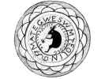

  
[Intangible Textual Heritage](../../../index)  [Native
American](../../index)  [Northeast](../index)  [Index](index) 
[Previous](al25)  [Next](al27) 

------------------------------------------------------------------------

[Buy this Book at
Amazon.com](https://www.amazon.com/exec/obidos/ASIN/B002DPU8XY/internetsacredte)

------------------------------------------------------------------------

  
*The Algonquin Legends of New England*, by Charles G. Leland, \[1884\],
at Intangible Textual Heritage

------------------------------------------------------------------------

### How Glooskap bound Wuchowsen, the Great Wind-Bird, and made all the Waters in all the World Stagnant.

(Passamaquoddy.)

The Indians believe in a great bird called by them *Wochowsen* or
*Wuchowsen*, meaning Wind-Blow or the Wind-Blower, who lives far to the
North, and sits upon a great rock at the end of the sky. And it is
because whenever he moves his wings the wind blows they of old times
called him that.

When Glooskap was among men he often went out in his canoe with bow and
arrows to kill sea-fowl.

p. 112

\[paragraph continues\] At one time it was
every day very windy; it grew worse; at last it blew a tempest, and he
could not go out at all. Then he said, "Wuchowsen, the Great Bird, has
done this!"

He went to find him; it was long ere he reached his abode. He found
sitting on a high rock a large white Bird.

"Grandfather," said Glooskap, "you take no compassion on your
*Koosesek*, your grandchildren. You have caused this wind and storm; it
is too much. Be easier with your wings!"

The Giant Bird replied, "I have been here since ancient times; in the
earliest days, ere aught else spoke, I first moved my wings; mine was
the first voice,--and I will ever move my wings as I will."

Then Glooskap rose in his might; he rose to the clouds; he took the
Great Bird-giant Wuchowsen as though He were a duck, and tied both his
wings, and threw him down into a chasm between deep rocks, and left him
lying there.

The Indians could now go out in their canoes all day long, for there was
a dead calm for many weeks and months. And with that all the waters
became stagnant. They were so thick that Glooskap could not paddle his
canoe. Then he thought of the Great Bird, and went to see him.

As he had left him he found him, for Wuchowsen is immortal. So, raising
him, he put him on his rock again, and untied one of his wings. Since
then the winds have never been so terrible as in the old time.

p. 113

The reader will find the main incident of this story repeated in
"Tumilkoontaoo, the Broken Wing," from the Micmac, in which there is no
mention of Glooskap. This of *Wuchowsen* is from the Passamaquoddy
manuscript collection by Louis Mitchell. It is unquestionably the
original. Glooskap, as the greatest magician, most appropriately subdues
the giant eagle of the North, the terrible god of the storm.

No one who knows the Edda will deny that Wuchowsen, or the Wind-blower,
as he appears in the Passamaquoddy tale, is far more like the same bird
of the Norsemen than the grotesque Thunder Bird of the Western tribes.
He is distinctly spoken of by the Indians of Maine as a giant and a bird
in one, sitting on a high cliff at the end of the sky, the wind--not
thunder--coming from his pinions:—

"Tell me ninthly,  
Since thou art called wise,  
Whence the wind comes,  
That over ocean passes,  
Itself invisible to man.

"Hraesvelg he is called  
Who at the end of heaven sits,  
A Jötun (giant) in eagle's plumage:  
From his wings comes,  
It is said, the wind  
That over all men passes."

(The Lay of Vafthrudnir. The Edda, trans. by B. Thorpe.)

------------------------------------------------------------------------

[Next: How Glooskap conquered the Great Bull-Frog, and in what Manner
all the Pollywogs, Crabs, Leeches, and other Water Creatures were
created](al27)
