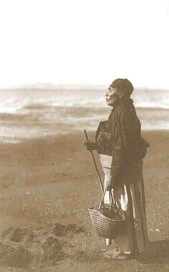

[Intangible Textual Heritage](../../../index)  [Native
American](../../index)  [Northwest](../index) 

------------------------------------------------------------------------

<table width="75%">
<colgroup>
<col style="width: 50%" />
<col style="width: 50%" />
</colgroup>
<tbody>
<tr class="odd">
<td data-valign="CENTER" width="50%"></td>
<td data-valign="CENTER" width="50%"><h1 id="chinook-texts" data-align="CENTER">CHINOOK TEXTS</h1>
<h2 id="by-franz-boas" data-align="CENTER">by Franz Boas</h2>
<h4 id="u.s.-bureau-of-american-ethnology-bulletin-no.-20" data-align="CENTER">U.S. Bureau of American Ethnology, Bulletin no. 20</h4>
<h4 id="section" data-align="CENTER">[1894]</h4></td>
</tr>
</tbody>
</table>

------------------------------------------------------------------------

[Contents](#contents)    [Start Reading](cht00)

------------------------------------------------------------------------

The Chinook tribes inhabited the salmon-rich lower Columbia river area
in the Northwest culture region, in what is now upper Oregon and lower
Washington state. As is evident from these texts, fishing was at the
center of their culture, and they were also avid traders and gamblers. A
creole based on their language and several European languages, the
'Chinook Jargon', was widely used as a trade language in the Northwest.
The Chinook practised the 'Potlatch'--the charateristic Northwestern
ceremony in which wealth was ritually redistributed.

These unfiltered stories, translated with great care by Franz Boas, one
of the founders of modern Anthropology, reflect a rich storytelling
tradition which shows a deep understanding of the range of human
emotions. The central character in many of these is 'Blue-Jay', a rather
dim but heroic figure who, in one memorable tale visits the land of the
dead, in a story worthy of the Twilight Zone.

--J. B. Hare

------------------------------------------------------------------------

[Title Page](cht00)  
[Contents](cht01)  
[Introduction](cht02)  
[Alphabet](cht03)  

### Myths

[1. CikLa](cht04)  
[2. Okulâ'm](cht05)  
[3. AnêktcXô'lEmiX](cht06)  
[4. The Salmon](cht07)  
[5. Raven and Gull](cht08)  
[6. Coyote](cht09)  
[7. The Crane](cht10)  
[8. Ênts!X](cht11)  
[9. The Crow](cht12)  
[10. Câ'xaL](cht13)  
[11. Stikua'](cht14)  
[12. The Skunk](cht15)  
[13. Robin and Blue-Jay](cht16)  
[18. Blue-Jay and Iô'i](cht17)  
[15. Blue-Jay and Iô'i](cht18)  
[16. Blue-Jay and Iô'i](cht19)  
[17. Ckulkulô'L](cht20)  
[18. The Panther](cht21)  

### Beliefs, Customs, and Tales

[The Soul and the Shamans](cht22)  
[How Cultee's Grandfather Acquired a Guardian Spirit](cht23)  
[The Four Cousins](cht24)  
[The GiLâ'unaLX](cht25)  
[The Elk Hunter](cht26)  
[Pregnancy and Birth](cht27)  
[Puberty](cht28)  
[Marriage](cht29)  
[Death](cht30)  
[Whaling](cht31)  
[Elk Hunting](cht32)  
[The Potlatch](cht33)  
[War](cht34)  

### Historical Tales

[War Between Quileute and Clatsop](cht35)  
[The First Ship Seen by the Clatsop](cht36)  
