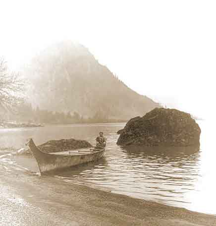

[Intangible Textual Heritage](../../../index)  [Native
American](../../index)  [Northwest](../index) 

------------------------------------------------------------------------

<table width="75%">
<colgroup>
<col style="width: 50%" />
<col style="width: 50%" />
</colgroup>
<tbody>
<tr class="odd">
<td data-valign="CENTER" width="50%"></td>
<td data-valign="CENTER" width="50%"><h1 id="coos-texts" data-align="CENTER">Coos Texts</h1>
<h2 id="by-leo-j.-frachtenberg" data-align="CENTER">by Leo J. Frachtenberg</h2>
<h4 id="section" data-align="CENTER">[1913]</h4></td>
</tr>
</tbody>
</table>

------------------------------------------------------------------------

This is a short collection of texts from the Coos people of Oregon,
collected by anthropologists a century ago. This includes origin myths
and lore about what lies beyond the sky and death, tales of people who
marry anthropomorphic animals, and legends about natural disasters such
as floods and fires. Like other unedited, unfiltered native American
texts, they possess earthy humor and a dreamlike, cyclic narrative
stucture.

For more information on the culture and history of the Coos, refer to
[Confederated Tribes of The Coos, Lower Umpqua, and Siuslaw
Indians](https://www.ctclusi.org/) \[External Site\].

------------------------------------------------------------------------

[Title Page](ct00)  
[Contents](ct01)  
[Introduction](ct02)  
[Alphabet](ct03)  

### Creation Myths

[I. Arrow Young Men (The Creation of the World)](ct04)  
[2. The Crow (and the Thunder-Bird)](ct05)  
[3. The Ascent to Heaven](ct06)  
[4. The Stealing Of Fire And Water](ct07)  
[5. The Origin of Death](ct08)  
[6. The Flood](ct09)  
[7. Origin of the Coos People](ct10)  
[8. The Girls and the Stars](ct11)  
[9. The Fire-Wind](ct12)  

### Miscellaneous Tales

[10. The Woman Who Married the Seal](ct13)  
[11. Spider-Old-Woman](ct14)  
[12. The Giant Woman. (First Version.)](ct15)  
[13. The Giant Woman. (Second Version.)](ct16)  
[14. The Giant Women. (Third Version.)](ct17)  
[15. The Girl and Her Pet](ct18)  
[16. The Five Grizzly-Bears](ct19)  
[17. The Five Shadows](ct20)  
[18. Night-Rainbow and Grizzly Bear](ct21)  
[19. The Pelican People](ct22)  

### Tales Collected by Harry Hull St. Clair, 2d

[20. The Battle in the Air](ct23)  
[21. The Long Night](ct24)  
[22. The Underground People](ct25)  
[23. The Country of the Souls](ct26)  
[24. The Revenge of the Sky People](ct27)  
[25. The Woman Who Married the Merman](ct28)  
[26. The Woman Who Married the Wolf](ct29)  
[27. The Woman Who Married the Dog](ct30)  
[28. The Woman Who Married the Bear](ct31)  
[29. The Women Who Married the Beaver](ct32)  
[30. The Woman Who Became a Bear](ct33)  
[31. Eagle-Woman](ct34)  
[32. The Man Who Married the Bird](ct35)  
