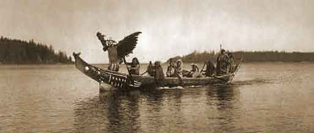

[Intangible Textual Heritage](../../../index)  [Native
American](../../index)  [Northwest](../index) 

------------------------------------------------------------------------

<table width="75%">
<colgroup>
<col style="width: 100%" />
</colgroup>
<tbody>
<tr class="odd">
<td data-valign="CENTER"></td>
</tr>
<tr class="even">
<td data-valign="CENTER"><h1 id="kwakiutl-tales" data-align="CENTER">KWAKIUTL TALES</h1>
<h2 id="by-franz-boas" data-align="CENTER">by Franz Boas</h2>
<h4 id="section" data-align="CENTER">[1910]</h4></td>
</tr>
</tbody>
</table>

------------------------------------------------------------------------

This is a collection of myths and folklore from the Kwakiutl Native
Americans of British Columbia, Canada. They originally resided on the
northern end of Vancouver Island and the adjacent coast. The texts were
collected and translated by Franz Boas, who was one of the founders of
modern anthropology and linguistics. These stories are much more
satisfying for the Western reader than many unfiltered Native American
texts, with rich characterizations, earthy humor, spooky supernatural
settings, and, for once, actual beginnings, middles and ends. It is
obvious that the Kwakuitl were accomplished story tellers.

------------------------------------------------------------------------

[Title Page](kt00)  
[Preface](kt01)  
[1. Q!â'nêqê?laku and Xatê'tsEn](kt02)  
[2. SE'n~~l~~ê?](kt03)  
[Hamâ'lak\*aua?ê](kt04)  
[4. Scab](kt05)  
[5. L!â'lamîn](kt06)  
[6. Kunô'sila](kt07)  
[7. Mâ'dEm](kt08)  
[8. The Singing Skull](kt09)  
[9. Mountain-Goat Hunter](kt10)  
[10. Wî'wag\*êsawê?](kt11)  
[11. The Dzô'noq!wa](kt12)  
[12. The Mink Legend](kt13)  
[Mink marries Kelp](kt14)  
[Mink Marries Frog-Woman](kt15)  
[Mink marries Diorite-Woman](kt16)  
[Mink wants to marry Sawbill-Duck-Woman](kt17)  
[Mink is deserted by his Wife](kt18)  
[Mink pretends to die](kt19)  
[Mink pretends to die (Another Version)](kt20)  
[Mink and the salmon](kt21)  
[Mink roasts the Salmon](kt22)  
[Mink plays with Seal](kt23)  
[Mink imitates his Hosts](kt24)  
[Mink goes to make War with his Friend Land-Otter](kt25)  
[13. The Deer and his Son.](kt26)  
[14. Great-Inventor](kt27)  
[X\*â'nElku](kt28)  

### 16. The Q!â'nêqi?laxu Legend

[Q!â'nêqi?la<u>x</u>u and his Brother Only-One](kt29)  
[Q!â'nêqi?la<u>x</u>u, and Ts!â'ts!ô](kt30)  
[Q!â'nêqi?la<u>x</u>u kills the Whales](kt31)  
[Q!â'nêqi?la<u>x</u>u makes a House for Only-One](kt32)  
[Q!â'nêqi?la<u>x</u>u begins his wanderings](kt33)  
[Q!â'nêqi?la<u>x</u>u marries the Daughter of
Gwâ'?nâlâlis](kt34)  
[Q!â'nêqi?la<u>x</u>u meets Shaman](kt35)  
[Q!â'nêqi?la<u>x</u>u revives the Ancestors of the
Koskimo](kt36)  
[Origin of the Deer](kt37)  
[Origin of the Mink](kt38)  
[Origin of the Raccoon](kt39)  
[Origin of the Mallard Ducks](kt40)  
[Q!â'nêqi?la<u>x</u>u gives Man and Woman their Present
Form](kt41)  
[Transformation of the Man with many Mouths](kt42)  
[Q!â'nêqi?la<u>x</u>u meets Oldest-One-in-the-World](kt43)  
[Q!â'nêqi?la<u>x</u>u meets Ô'?mâ~~l~~](kt44)  
[Origin of the Perch](kt45)  

### 17. MEskwa' (Greedy-One)

[The Birth of Greedy-One](kt46)  
[Greedy-One steals Crabapples](kt47)  
[Greedy-One catches the Salmon](kt48)  
[Greedy-One kills Bear, Cormorant, and Gum](kt49)  

### 18. Ô'?mâl.

[18. Ô'?mâl](kt50)  
[Ô'?mâ~~l~~ marries the Daughter of the Killer-Whale](kt51)  
[Ô'?mâ~~l~~ gets the Soil](kt52)  
[Ô'?mâ~~l~~ obtains the Water](kt53)  
[Ô'?mâ~~l~~ makes War on Southeast Wind](kt54)  
[Ô'?mâ~~l~~ obtains the Tides](kt55)  
[Ô'?mâ~~l~~ Paints the Birds](kt56)  
[Ô'?mâ~~l~~ obtains Daylight](kt57)  
[Ô'?mâ~~l~~ gambles with Gull](kt58)  
[Ô'?mâ~~l~~ imitates his Hosts](kt59)  
[Ô'?mâ~~l~~ kills the Thunder-Birds](kt60)  

 

[19. Hâ'da<u>g</u>a (Raven-Sound-in-House).](kt61)  
[20. NômasE'nxêlis (Oldest-One-in-the-World)](kt62)  
[Ô'?meä~~l~~ (Chief-of-the-Ancients)](kt63)  
[22. Dâ'p!abê (Leader)](kt64)  
[23. Q!â'g\*i?wa (Centre, the Chief of the Ghosts)](kt65)  
[24. Q!ômg\*ust<u>â</u>Els (Wealth-coming-up)](kt66)  
[25. A?mâ'<u>x</u>wax\*sag\*îla (Potlatch-Giver)](kt67)  
[26. Hâ'dahô](kt68)  
[27. Lâ'<u>g</u>elêqEla (Surpassing)](kt69)  
[28. The Descendants of Surpassing](kt70)  
[29. Nô'aqaua (Wisest-One)](kt71)  
[30. The Brothers](kt72)  
[31. Yax\*st!a~~l~~](kt73)  
[32. Q!ô'mg\*ila](kt74)  
[33. The Blind Man who recovered his Eyesight](kt75)  
[34. Song-Dance](kt76)  
[35. Dzâ'wadalalîs](kt77)  
[36. G\*â'yusdä?sElas](kt78)  
[37. ?nâ'lak!ulEm](kt79)  
[38. <u>X</u>wâ'xwas](kt80)  
[39. ?nEmô'gwis](kt81)  
[40. Gray-Face (Ô'xsEm) and Twin (Y<u>î</u>kwî'~~l~~)](kt82)  
[41. The Boy who disappeared Underground](kt83)  
[42. K\*ê'~~l~~ôs](kt84)  
[43. L!â'lamîn](kt85)  
[44. Mâ'lêleqala](kt86)  
[45. Nô'mas](kt87)  
[46. <u>G</u>â'sag\*ila](kt88)  
[47. Q!ê'x\*Lala](kt89)  
[48. Wâ'walê](kt90)  
[49. Additions to the Myth of Kwêkwaxâ'wê?](kt91)  
[50. Additions to the Myth of the Mink](kt92)  
[51. Addition to the Myth of Q!â'nêqê?laku](kt93)  
[52. Note regarding the Origin of the Sun](kt94)  
