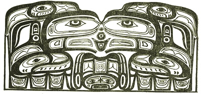

  
[Intangible Textual Heritage](../../../index)  [Native
American](../../index)  [Northwest](../index) 

------------------------------------------------------------------------

<table width="75%">
<colgroup>
<col style="width: 50%" />
<col style="width: 50%" />
</colgroup>
<tbody>
<tr class="odd">
<td width="50%" data-valign="TOP"></td>
<td width="50%" data-valign="CENTER"><h1 id="the-thunder-bird-tootooch-legends" data-align="CENTER">The Thunder Bird Tootooch Legends</h1>
<h2 id="by-w.l.-webber" data-align="CENTER">by W.L. Webber</h2>
<h4 id="section" data-align="CENTER">[1936]</h4></td>
</tr>
</tbody>
</table>

------------------------------------------------------------------------

[Contents](#contents)    [Start Reading](ttb00)    [Page
Index](pageidx)    [Text \[Zipped\]](ttb.txt.gz)

------------------------------------------------------------------------

This is a transcription of a pamphlet which was originally sold to the
tourist trade in British Columbia. It describes a vocabulary of symbols
which are incorporated into totem poles, including a representative myth
for each animal. While not an academic work, it still makes interesting
reading, particularly in historical context, and the illustrations are
charming.

------------------------------------------------------------------------

 [Title Page](ttb00)  
[Preface](ttb01)  
[Foreword](ttb02)  
[Table of Contents](ttb03)  
[The Transition of Totemism](ttb04)  
[Indian Baskets](ttb05)  
[The Aristocratic Aborigines](ttb06)  
[Stick Game](ttb07)  
[Tootooch, The Thunder Bird](ttb08)  
[Eena, The Beaver](ttb09)  
[Ol-Hiyo, The Seal](ttb10)  
[Kutze-ce-te-ut, The Wood Worm](ttb11)  
[Kee-War-Kow, The Sun](ttb12)  
[Sisuith or Se-Sook, The Two Headed Snake](ttb13)  
[The Ill-Jow](ttb14)  
[Ho-Xhok, The Crane](ttb15)  
[Shwah Kuk, The Frog](ttb16)  
[Chee-Che-Ka, The Mink](ttb17)  
[Le-Loo, The Wolf](ttb18)  
[Wolalee, The Salmon](ttb19)  
[Chet-Woot, The Bear](ttb20)  
[Men-a-Mooks, The Otter Spirit](ttb21)  
[Pi-Chikamin, The Gift Copper](ttb22)  
[Property Woman, or Great Grandmother](ttb23)  
[Slag’ame, the Butterfly](ttb24)  
[Shaman, the Medicine Man](ttb25)  
[Chak-Chak, the Eagle](ttb26)  
[Kwel-Kwel, The Owl](ttb27)  
[Skam-m, The Halibut](ttb28)  
[Welala, The Mountain Spirit](ttb29)  
[Quil-Tum-Tum](ttb30)  
[Kwaie’tek, The Sea Gull](ttb31)  
[Mateeh, The Goat](ttb32)  
[Skana, The Black Fish](ttb33)  
[He’-e-tlik, The Lightning Snake](ttb34)  
[Eh-Kolie, The Whale](ttb35)  
[The Young Raven](ttb36)  
[Kuuma, The Bull Head](ttb37)  
[Gal-Quith, The Cod Fish](ttb38)  
[Maht-Maht, The Duck](ttb39)  
[Qa-Yel, The Great Raven](ttb40)  
[The Thunder Bird Totem Pole](ttb41)  
[The Shadow People and the Raven](ttb42)  
[Chief Sisa-Kaula's Totem Pole](ttb43)  
[Story of the Mink](ttb44)  
[Siwash Rock](ttb45)  
[The Thunder Bird Totem Pole](ttb46)  
