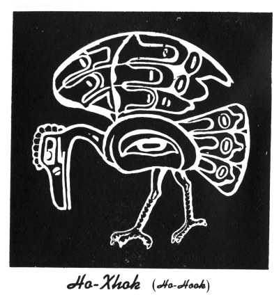

  
[Intangible Textual Heritage](../../../index.md)  [Native
American](../../index)  [Northwest](../index)  [Index](index.md) 
[Previous](ttb01)  [Next](ttb03.md) 

------------------------------------------------------------------------

  
*The Thunder Bird Tootooch Legends*, by W.L. Webber, \[1936\], at
Intangible Textual Heritage

------------------------------------------------------------------------

p. 6

 

p. 7

### FOREWORD

The Thunder Bird "TOOTOOCH" Legends have been written to explain the
more important of the single objects carved on totem poles and other
articles connected with totemism and the secret societies of the
Northwestern Indian tribes. The legends tell how individuals as well as
the tribes earned their crests as tokens of achievement and distinction.
These stories have been passed down by word of mouth from time
immemorial.

For years the writer has received inquiries regarding the totemic
designs of poles and basketry, and, in and effort to satisfy them, he
traced the Thunder Bird Legend. First published in a stamp-size booklet
that has had a circulation of 275,000 copies, it so excited the
imagination of the tourists invading the Northwest that the Indians
could not keep up with the demand for totemic objects.

The designs in his book are from original drawings and carvings on totem
poles at present in the possession of the author. They are the work of
primitive-minded Indians of artistic ability, the most notable being
Charlie James (Yakuglas of the Kwakiutls of Alert Bay). Other carvers
have unknowingly contributed their truly excellent craftsmanship to this
work, Jacob Louie and Herbert Francis of Nootka, and Titus Campbell of
Port Essington being among them.

The stories have been collected during the past ten years from various
Indian tillicums, and some have been taken from the works of Boas and
Staunton, published by the American Museum of Natural History, New York
City. These works were obtained through the courtesy of Mr. T. P. O.
Menzies of the Vancouver City Museum, to whom the author wishes to
express deep gratitude, as well as to other members of the Museum staff.

Charlie James and those like him are endeavoring to preserve the arts of
their people. In all too much of Indian craftsmanship the influence of
the white man has corrupted the primitive conception of art:
[gaudy](errata.htm#2.md) painting cannot cover poor workmanship. The
Department of Indian Affairs could do much to re-educate the Indian
along these lines by freely exhibiting collections of
[authentically](errata.htm#3.md) old craftsmanship to the rising
generation. The work of Charlie James, besides being on view in Stanley
Park, Vancouver, and Lincoln Park, Chicago, has won an honored place in
the collections of many noted collectors, including the Emperors of
Japan and Siam. Under his guidance some famous mortuary posts have been
reconstructed, and his present position of Instructor in the Art of
Carving to the pupils of the Government Indian School, is one to which
he is eminently suited.

The author is indebted to Anna Wilson, a Haida Indian. for one of the
folk tales of her people, and also to Oscar Peers of the King-come Inlet
Band for the Legend of the Cod Fish. The description of the Thunder Bird
Totem Pole of Stanley Park was contributed by Elline Newman of Alert
Bay.

It was originally intended that this work should be profusely
illustrated in color by the excellent drawings of Mr. B. Slaughter, but
it has been again found necessary to bring out this edition in a cheap
and popular form, with black and white illustrations.

p. 8

THE LEGENDS

EXPLAINS THE TOTEM SYMBOLS

These Legends are the key to the most important single objects carved on
Totem Poles and used in decorative arts of the Indian Tribes of the
Pacific Northwest.

To the Indians who have adorned me with Knowledge Beyond Dreams

------------------------------------------------------------------------

[Next: Table of Contents](ttb03.md)
