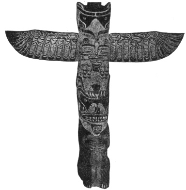
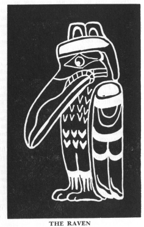

  
[Intangible Textual Heritage](../../../index)  [Native
American](../../index)  [Northwest](../index)  [Index](index) 
[Previous](ttb07)  [Next](ttb09) 

------------------------------------------------------------------------

  
*The Thunder Bird Tootooch Legends*, by W.L. Webber, \[1936\], at
Intangible Textual Heritage

------------------------------------------------------------------------

p. 20

 

### THE THUNDER BIRD

The Thunder Bird is the crest of the Raven Clan. It is not a mere idol,
but a powerful, mystic emblem having its origin among the native tribes
of British Columbia. The Medicine men and other members of these tribes
believe that the Thunder Bird is a powerful god, under whose protection
come brotherhood, peace plenty and goodwill. He is the **Sagalie Tyee**
(Creator God), and when he flaps his wings and blinks his eyes it rains
and the storm rages; thus the evil spirits are driven to the
[lonely](errata.htm#13), high, mountain ranges.

Keep this emblem always and you will be under the protection of the
Thunder Bird wherever you may be. It will bring you the best that life
has to offer; your business dealings will prosper, the course of your
love will run smooth, and goodwill toward your fellow creatures will
fill your heart and will be returned a hundredfold.

This symbol is protected by numerous members of the clan scattered
throughout this land and the possession of it, or the presence of a
likeness of it in your house, will enable your fellow members to know
you at sight wherever you may meet them. They are people whose sense of
humor is strong, their hospitality is unlimited, they are jealous of the
glory of this brotherhood and all the emblem stands for and will go far
and do much for a **Tillicum**. **Hyiu-Tillicum** (Much Friend) is the
password.

As a member of the Thunder Bird Fellowship you must resolve to live an
upright and honorable life, distinguishing your name and yourself by
**Mamook** (Good Works). **Siam** (The Bear) will come to your aid and
give you strength and wisdom to paddle your own **Camin** (Canoe).

Seek out the silent places, ramble among the works of nature and gaze
upon the sky and the green earth and so you will talk with **Sagalie
Tyee** (The Great Spirit) who lives everywhere, in the trees, in the
flowers, in the sun and wind, in the blades of grass, in the **Skookum
Chuck** (Rivers) and in the **Salt Chuck** (Sea).

Live a simple life and waste not, for what cannot be used today can be
held for tomorrow. Be clean in mind and body for if you are

p. 21

not, **Tootooch** (Thunder Bird) will be vexed with you, shaking his
wings in thunder and flashing his eyes in lightning to show his anger.

Strive always for reputation for generosity of word and deed.
**Potlatch** (give), that you may receive. Be kind and just,
affectionate to children and to the aged and infirm. Make your word your
bond. Call upon **Siam** (The Bear) for aid in helping you deal rightly
by your tillicums and fellowmen.

Let the words "Put yourself in his place" be your guiding principle of
conduct at all times.

Follow the rules and spread glory and reputation of the Raven Clan.

 

------------------------------------------------------------------------

[Next: Eena, The Beaver](ttb09)
