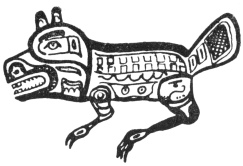

  
[Intangible Textual Heritage](../../../index)  [Native
American](../../index)  [Northwest](../index)  [Index](index) 
[Previous](ttb08)  [Next](ttb10) 

------------------------------------------------------------------------

  
*The Thunder Bird Tootooch Legends*, by W.L. Webber, \[1936\], at
Intangible Textual Heritage

------------------------------------------------------------------------

p. 22

 

### Eena, THE BEAVER

The Beaver, the supernatural giant of extraordinary intelligence was
captured and adopted by Kilisnu of the Kicksetti People. The Beaver was
greatly respected for he could live longer under water than any other
animal. He dwelt in a house in Salmon Lake which was so cunningly
constructed that no one was ever able to enter. It was Beaver who showed
the Indians how to make Salmon Weir. He also cut two spears with
beautiful handles with his sharp teeth. When he was not using these to
spear salmon he hid them in a hollow log. One day the spears were found
by three members of the tribe, who used them with such results that they
were able to give a bountiful supply of salmon to all inhabitants of
their village.

They showed the spears to the village Chief, Kilisnu, claiming to have
made them and to have given them great magic. But Beaver said: "I made
them." This caused great confusion to the other claimants who became
very jealous of Beaver as well as of each other. Then they mocked the
Beaver and ridiculed him and made him the butt of their jokes, all the
time keeping out of the way of his sharp teeth. At last Beaver got so
angry that he took up one of the magic spears and threw it at the Chief,
killing him and many others. Then he went to his floating house in the
middle of Salmon Lake and in four days dug a tunnel under the Indian
village, undermining the houses so that they sank into a pool. Those of
the tribesmen who survived were forever after allowed to use the Beaver
on their crest and so his crest has been used down the ages by many
tribes through inter-marriage.

Beaver is nearly always shown gnawing his magic spear with his sharp
teeth. Because of his industry he is almost always associated with Raven
(Thunder Bird) on Totem Poles. He is also carved on the popular
Kicksetti Totem Pole at Juneau.

There are other legends of the Beaver that tell of how the Indians
acquired their crests by more honorable means than this story indicates.

------------------------------------------------------------------------

[Next: Ol-Hiyo, The Seal](ttb10)
