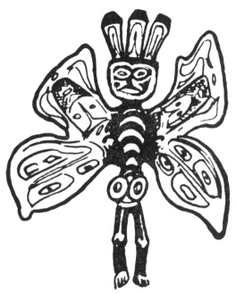

  
[Intangible Textual Heritage](../../../index)  [Native
American](../../index)  [Northwest](../index)  [Index](index) 
[Previous](ttb23)  [Next](ttb25) 

------------------------------------------------------------------------

  
*The Thunder Bird Tootooch Legends*, by W.L. Webber, \[1936\], at
Intangible Textual Heritage

------------------------------------------------------------------------

p. 37

 

### Slag’ame, THE BUTTERFLY

Among the many adventures and travels of Thunder Bird, while he was
putting the finishing touches on creation, he met with Butterfly, who
was also travelling around. They became quite chummy. Being
supernatural, they were in their human form. They came to a **Siwash
Tyee's** (Indian Chief's house on the Queen Charlotte Islands. The chief
invited the tired travellers to stay for **Muckamuck** (dinner). Thunder
Bird, wishing to uphold his dignity, did not wish to talk to ordinary
mortals, so Butterfly did the interpreting.

The host asked Thunder Bird if he would like some boiled salmon with
**oolichan grease**. Butterfly said that Thunder Bird did not eat salmon
and ate both portions himself. Thunder Bird was then asked if he would
like some tender seal meat, his favorite dish. Again Butterfly said that
Thunder Bird did not care for seal. Thunder Bird was then handed some
dried **o’lil-lie** (berry) cakes. Butterfly took them from him, saying
that such things made him sick. The host was very angry, not knowing how
to please Thunder Bird. He did not have anything more to offer him
except some stale and smelly salmon so this was presented to the
important guest. Butterfly said that Thunder Bird was very fond of
tainted fish, but he could not eat, although he tried. By this time he
too was getting very angry so he got up and left with Butterfly, who was
so full of food that he could hardly walk, tagging along.

The trail took them to a creek spanned by a shaky cedar log. Thunder
Bird crossed over the log first but Butterfly was afraid to cross
because he was tired and drowsy. Thunder Bird said he would steady the
log for him but when he mounted it Thunder Bird rolled the log on top of
Butterfly. This removed all the food from his stomach. After Thunder
Bird had eaten the food he sewed Butterfly up. That is why Butterfly is
always flat.

Butterfly is carved on the totem poles of the Haidas. It is also woven
into baskets and other fibre articles of the Indian tribes of Vancouver
Island.

------------------------------------------------------------------------

[Next: Shaman, the Medicine Man](ttb25)
