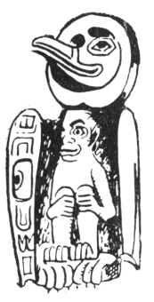

  
[Intangible Textual Heritage](../../../index)  [Native
American](../../index)  [Northwest](../index)  [Index](index) 
[Previous](ttb35)  [Next](ttb37) 

------------------------------------------------------------------------

  
*The Thunder Bird Tootooch Legends*, by W.L. Webber, \[1936\], at
Intangible Textual Heritage

------------------------------------------------------------------------

p. 49

 

### THE YOUNG RAVEN

Young Raven is a very important Mythical Character to the Indians
inhabiting the Queen Charlotte Islands and those living amid the inland
chain of channels of Alaska. His exploits were similar to those of
Thunder Bird. The Supernatural Indian of the tribes living in the
regions south of Prince Rupert.

Long ago, when the world was in darkness, the Powerful Raven, **Saghalie
Tyee** (Creator of the Universe), lived at the headwaters of the Nass
River. In his lodge he had beautifully carved cedar chests. In them the
Sun, Moon and Stars were kept hidden from the mortal eye.

Our Character, **Tenas Kaka** (Young Raven), was an earthly being who
desired light for himself and his fellow creatures. He changed himself
into a Raven and flew through a bright opening in the sky where the
Powerful Creator lived, guarding his virgin daughter.

Young Raven again changed himself, this time into a pine needle. Then he
cast himself into a crystal spring where the Princess came for
**Muchamuck Chuck** (Drinking Water). So it came that she swallowed the
pine needle. Young Raven was then reborn as a child and, as he grew up,
became the idol of the household. Like

all children he wanted everything he saw. He wanted to play with the
lights that bestow their radiance on the heavens. First his Grandfather
gave him the stars and, with childish glee, he threw them in the sky,
but they did not give light. Then he cried for the Moon, but this only
gave a glow. Then he coaxed so persistently for the Sun that it was
given to him and, while his Grandfather slept, he pushed it through the
smokehole, thus bringing sudden daylight into the world.

When the Young Raven realized what he had done and thought of his
Grandfather's anger, he became alarmed and left his ancestral home,
flying to the earth.

------------------------------------------------------------------------

[Next: Kuuma, The Bull Head](ttb37)
