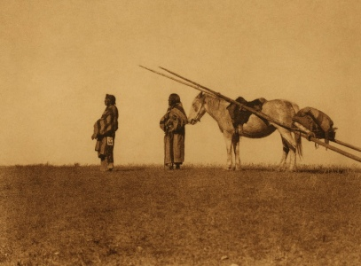

  
[Intangible Textual Heritage](../../../index.md)  [Native
America](../../index)  [Plains](../index.md) 

------------------------------------------------------------------------

[Buy this Book at
Amazon.com](https://www.amazon.com/exec/obidos/ASIN/0803271093/internetsacredte.md)

------------------------------------------------------------------------

<table width="75%">
<colgroup>
<col style="width: 50%" />
<col style="width: 50%" />
</colgroup>
<tbody>
<tr class="odd">
<td width="50%" data-valign="TOP"></td>
<td width="50%" data-valign="CENTER"><h1 id="blackfoot-lodge-tales" data-align="CENTER">Blackfoot Lodge Tales</h1>
<h2 id="by-george-bird-grinnell" data-align="CENTER">by George Bird Grinnell</h2>
<h4 id="section" data-align="CENTER">[1892]</h4></td>
</tr>
</tbody>
</table>

------------------------------------------------------------------------

[Contents](#contents)    [Start Reading](blt00.md)

------------------------------------------------------------------------

|                                                                                                                           |
|---------------------------------------------------------------------------------------------------------------------------|
|  |

------------------------------------------------------------------------

 [Title Page](blt00.md)  
[Contents](blt01.md)  
[Note](blt02.md)  
[Indians And Their Stories](blt03.md)  

### Stories Of Adventure

[The Peace With The Snakes](blt04.md)  
[The Lost Woman](blt05.md)  
[Adventures Of Bull Turns Round](blt06.md)  
[Kŭt-o´-yis](blt07.md)  
[The Bad Wife](blt08.md)  
[The Lost Children](blt09.md)  
[Mik-a´pi—Red Old Man](blt10.md)  
[Heavy Collar And The Ghost Woman](blt11.md)  
[The Wolf-Man](blt12.md)  
[The Fast Runners](blt13.md)  
[Two War Trails](blt14.md)  

### Stories Of Ancient Times

[Scarface](blt15.md)  
[Origin of the I-kun-uh´-kah-tsi](blt16.md)  
[Origin Of The Medicine Pipe](blt17.md)  
[The Beaver Medicine](blt18.md)  
[The Buffalo Rock](blt19.md)  
[Origin Of The Worm Pipe](blt20.md)  
[The Ghosts’ Buffalo](blt21.md)  

### Stories Of Old Man

[The Blackfoot Genesis](blt22.md)  
[The Dog And The Stick](blt23.md)  
[The Bears](blt24.md)  
[The Wonderful Bird](blt25.md)  
[The Race](blt26.md)  
[The Bad Weapons](blt27.md)  
[The Elk](blt28.md)  
[Old Man Doctors](blt29.md)  
[The Rock](blt30.md)  
[The Theft From The Sun](blt31.md)  
[The Fox](blt32.md)  
[Old Man And The Lynx](blt33.md)  

### The Story Of The Three Tribes

[The Past And The Present](blt34.md)  
[Daily Life And Customs](blt35.md)  
[How The Blackfoot Lived](blt36.md)  
[Social Organization](blt37.md)  
[Hunting](blt38.md)  
[The Blackfoot In War](blt39.md)  
[Religion](blt40.md)  
[Medicine Pipes And Healing](blt41.md)  
[The Blackfoot Of To-day](blt42.md)  
[Index](blt43.md)  
