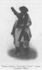

  
[Intangible Textual Heritage](../../../index)  [Native
American](../../index)  [Plains](../index)  [Index](index) 
[Previous](ont24)  [Next](ont26) 

------------------------------------------------------------------------

[Buy this Book at
Amazon.com](https://www.amazon.com/exec/obidos/ASIN/B002E9HLW0/internetsacredte)

------------------------------------------------------------------------

  
*The Old North Trail*, by Walter McClintock, \[1910\], at Intangible
Textual Heritage

------------------------------------------------------------------------

p. 302

### CHAPTER XXII

#### RAISING THE CENTRE POLE

Ceremonial of painting Mad Wolf and clothing the
sacred woman.—The priests and sacred women appear before the tribe.—The
Feast of Tongues.—Making vows in behalf of the sick.—Awasaki's prayer
for her grandchildren.—Ceremonial of "Cutting the hide."—Warriors
assemble according to clans.—They march holding long poles aloft.—The
tribe sing the Hymn to the Pole in unison.—An impressive scene.—The
priests and sacred women bless the Centre Pole.—The warriors raise the
pole and complete the Sun-lodge.—Points of resemblance in the Feast of
Tongues to feasts of the Jewish and Christian Churches.

ON the morning of the fourth day many assembled to witness the
ceremonial of decorating Mad Wolf with the black paint and clothing the
sacred woman. As Gives-to-the-Sun put on the ceremonial dress, made from
the skins of antelope and black-tail deer, the women assistants sang and
made signs in imitation of deer and antelope. While putting on her
medicine bonnet they sang:

"I want the weasel tails."

\[paragraph continues\] When the elk-skin
medicine robe was thrown about her they sang the Elk song, making signs
with their hands, imitating the movements of elk, swaying their bodies
like trotting elk and giving the elk call.

Food was carried to the side of the Sun lodge, where the entire tribe
assembled for a feast, seating themselves in long rows upon the ground.
When the waiting people heard the Elk song, they knew the ceremonial in

p. 303

\[paragraph continues\] Mad Wolf's tipi
was nearly finished, and some eagerly exclaimed, "It is now time for the
sacred woman to come forth." Gives-to-the-Sun, her face completely
hidden by the medicine bonnet, was lifted to her feet by Natokema. She
waited, leaning upon her cane for support. A line was formed, led by
O-mis-tai-po-kah. Then came White Grass, Natosin, and Mad Wolf,

  [  
Click to enlarge](img/30300.jpg)  
PROCESSION OF PRIESTS AND SACRED WOMEN.  

carrying the wild rhubarb stalk with eagle feathers attached. He was
followed by Natokema, Gives-to-the-Sun and their assistants. The
procession moved slowly to a temporary shelter, or "lean-to" of canvas,
near the site selected for the Sun-lodge, where they seated themselves.
The parfleches of sacred tongues were opened. At this time, if there
were any sick among the people their female relatives or friends came
forward to pray to the Sun for their recovery. They

p. 304

took pieces of the consecrated meat and came before the tribe, the
priests, and the givers of the Sun-dance. On all sides women were
standing and facing the setting sun, each with right hand upraised,
holding aloft portions of the sacred food, making vows,

  [  
Click to enlarge](img/30400.jpg)  
PRIESTS AND SACRED WOMEN BENEATH THE SUN SHELTER.  

confessing aloud and praying for their relatives standing beside them.

Awasaki, an old woman, the wife of Painted Wing, came forward with the
children of Wakes-up-last, [1](#fn_27) her son.
When the small line was properly formed, Awasaki, raising her voice,
called upon all to hear. The silence and respectful attention of the
spectators, the grandmother, and the children by her side, standing
before the venerable chiefs and medicine women, made

p. 305

an impressive scene. Awasaki said, "I now give Spotted Eagle a good
horse, and ask him to pray for my sick grandchild." Spotted Eagle arose
and prayed,

"O, Sun! I am praying for this woman because she is
pure. She will take some of the holy food and will eat with you and with
the Underground Spirits that her sick one may recover. Listen, Sun, and
hear us! Grant us all life and health!"

\[paragraph continues\] Awasaki having
taken a piece of tongue, broke off and

  [  
Click to enlarge](img/30500.jpg)  
AWASAKI PRAYING FOR HER GRANDCHILDREN.  

ate a morsel of it, facing the sun. Holding up another piece, she
prayed,

"Great Sun Power! I give you my life to-day, because
I have always been a pure and honest woman. I promise now to eat with
you and with the Underground Spirits, that my grandchild may recover. I
am praying also for these children standing before you, that they may
grow and be strong, that they may have long life and may never suffer
from hunger. Hear us and pity us!"

\[paragraph continues\] She planted
another piece of tongue in the ground, and divided the remainder among
her friends, to help them lead good lives.

p. 306

A green hide was stretched and pegged upon the ground, to be cut into
strips for binding the framing poles together. For this ceremony, Three
Bears, a noted warrior, was chosen, because he had once killed an enemy
with his knife. He was selected by Eagle Head, the cutter of the hide of
the year before. It

  [  
Click to enlarge](img/30600.jpg)  
WOMEN MAKING VOWS HOLDING UP PIECES OF SACRED TONGUE.  

sometimes happened that men cut the hide because of a vow. Three Bears
sat beside a fire, in which sweet grass burned as incense, and was
painted by Eagle Head—red over his body, and a black circle around his
face. Eagle Head also prayed to the Sun that he might cut the hide
properly. Three Bears stood before the assembled people with a painted
knife, half red for the Sun and half black for the Moon. He first prayed

p. 307

to the Sun for power, and then, holding the knife high in the air, he
called out, "Hear! men and women, for what I speak is true. Once I made
an expedition against our enemy, the Snakes; I captured a band of horses
and killed two men." He then cut several strips from the hide. Again he
said, "I 

<table data-align="RIGHT">
<colgroup>
<col style="width: 100%" />
</colgroup>
<tbody>
<tr class="odd">
<td data-valign="CENTER"><a href="img/30700.jpg"> 
Click to enlarge</a> 
THREE BEARS 
“COUNTING COUPS” 
WHILE CUTTING HIDE. 
</td>
</tr>
</tbody>
</table>

was on the warpath in the north, and fought with a chief of the Crees. I
killed him and brought his scalp back with me." In this manner Three
Bears cut as many strips as were needed, "counting a coup" [1](#fn_28) before each cutting. Each time his wife
was heard singing, and after he had finished, his relatives arose and
danced, because their brother had gone through many dangers and had
returned safely to his people. For. conferring upon him the honour of
cutting the hide, Three Bears gave to Eagle Head the customary gift of
several horses. Many presents of moccasins, blankets, and old clothing
were fastened to the Centre Pole, as sacrifices to the Sun and Moon. It
was explained that articles, which

p. 308

had been worn, were used as gifts, because the Sun and Moon expected
offerings, but never made use of them.

When the Sun was setting, O-mis-tai-po-kah, the head chief, arose and in
a loud voice directed the people to prepare for the ceremony of "Raising
the Centre Pole." The men dispersed to their lodges, but soon
reappeared, dressed in paint and war clothes. They

  [  
Click to enlarge](img/30800.jpg)  
WARRIORS WITH POLES SINGING TRIBAL HYMN.  

formed in four lines towards the north, south, east and west according
to the clan, or camp to which they belonged. They held aloft long poles
lashed together near the top, for lifting into place the heavy timbers
of the Sun-lodge. The camp of Chiefs-all-over was first in line. They
led off in singing the grand old hymn, "Raising the Pole," [1](#fn_29) I given to the Blackfeet by the Sun
through Scarface, and sung by them, in order that

p. 309

the Centre Pole might rest firmly in the ground. The singing was taken
up by the different camps as they formed in line, the Bloods, Big Top
Knots, Buffalo Chips, Don't Laughs, Skunks, Lone Eaters, Grease Melters
and Small Robes. The lines moved forward from the four points of the
compass towards the centre. Mad Wolf, with the priests and medicine
women, passed slowly and in single file into the Sun-lodge.
Gives-to-the-Sun

  [  
Click to enlarge](img/30900.jpg)  
THRONG OF WOMEN AND CHILDREN SURROUNDING WARRIORS WHILE RAISING “CENTRE
POLE.”  

took her position with Natokema beside the forks of the Centre Pole.
Four times the lines of warriors advanced and stopped. On the fourth
advance, they stood in a large circle around the unfinished Sun-lodge,
singing in unison. The solemn and inspiring notes of their great "Hymn
to the Pole" floating out over the quiet plain, the light of the evening
sun, now sinking behind the Rocky Mountains, falling upon the strong and
earnest faces of the chiefs and medicine women and

p. 310

the religious dignity of the occasion, combined to make the scene most
impressive, one never to be forgotten. When all was ready,
O-mis-tai-po-kah called in a loud voice, "Hurry! raise the Centre Pole
quickly, that the sacred woman may eat and drink, for she is famished."

A bundle of willow branches was tied in the forks of the Centre Pole,
representing the nest of an eagle. Mad Wolf stood upon the branches
waving his robe in imitation of an eagle about to fly. When the priests
shook the branches as if driving the eagle from its nest, Mad Wolf blew
shrilly upon his medicine whistle, in imitation of an eagle screaming,
and jumped from the Pole. The eager throng of women surrounding the
lines of warriors closed in, shouting, "Hurry!" and praying,

"Great Sun Power! May our part of the sacred lodge
go up safely, for we do not want to lose any of our relatives."

The lines broke and the warriors rushed towards the Sun-lodge, with
shrill war-whoops. The Centre Pole was quickly raised by means of
lariats. The young men with poles lifted the girders into place and
branches with foliage were placed against the sides.

A small opening towards the west was left free from branches. These were
secured and put in place by Mad Wolf and Gives-to-the-Sun, at dawn on
the following day, that they might do their share in the labour of
building the sacred lodge. The Sun-lodge was thus completed and ready
for occupancy. In it the entire tribe assembled, during the remaining
days of the festival, to witness the ceremonies and dances under the
leadership of Spotted Eagle, Bull Child, and other medicine men.

Gives-to-the-Sun's fast was now ended. She returned

p. 311

to her tipi and was given a small quantity of nourishing soup, while Mad
Wolf again entered the sweat-lodge to remove the black paint, and to
pray for his people.

The preparatory services, the consecration and setting apart of the food
before its distribution, the religious assembling of the people, the
symbolic act of eating a small portion of the consecrated food by each,
the giving of thanks and prayer before partaking and the purification
beforehand of those conducting the ceremonies,—all these impressed me by
their religious significance, and the many respects in which this
Blackfoot Feast of Tongues resembled the Jewish feast of the Passover
and the Lord's Supper of the Christian Church.

  [  
Click to enlarge](img/31100.jpg)  
TRIBAL HYMN, “RAISING THE POLE”  

------------------------------------------------------------------------

### Footnotes

[304:1](ont25.htm#fr_31) See
[Appendix](ont44.htm#an_504).

[307:1](ont25.htm#fr_32) See
[Appendix](ont44.htm#an_307).

[308:1](ont25.htm#fr_33) Song 8. See [p.
311](#page_311).

------------------------------------------------------------------------

[Next: Chapter XXIII. Inside the Sun-Lodge](ont26)
