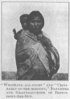
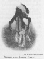

  
[Intangible Textual Heritage](../../../index.md)  [Native
American](../../index)  [Plains](../index)  [Index](index.md) 
[Previous](ont30)  [Next](ont32.md) 

------------------------------------------------------------------------

[Buy this Book at
Amazon.com](https://www.amazon.com/exec/obidos/ASIN/B002E9HLW0/internetsacredte.md)

------------------------------------------------------------------------

  
*The Old North Trail*, by Walter McClintock, \[1910\], at Intangible
Textual Heritage

------------------------------------------------------------------------

p. 383

### CHAPTER XXVIII

#### CAMP OF BRINGS-DOWN-THE-SUN

We dine with Brings-down-the-Sun. –Onesta introduces
me to the old chief.—He declines to impart his knowledge.—Recites the
wrongs which caused his mistrust of the white race.—Allows me to remain
in his camp.—I meet his wife and youngest daughter.—He offers us free
use of their wild berry supply.—His statesmanlike reasons for preserving
their natural resources of trees and berry bushes.—First thunder of the
summer is heard marking time for opening Medicine Pipes.—I meet my
friend Bull Plume conducting a Pipe ceremonial.—Hospitality of
Brings-down-the-Sun.—Indian children's fear of white men.—Interesting
scenes along a stream.—A contented family of beavers.—A miniature camp
with complete doll outfit.—Games of boys and girls.—"Wheel and arrow," a
gambling game of men.—An extended sunset view from Lookout Butte.

WE found Brings-down-the-Sun reclining against his lodge-back, waiting
our arrival. He directed Onesta, his nephew, to a place on his right,
while Kionama and I took seats on a comfortable blanket-bed on his left.
A small fire burned in the centre, and, from a hot coal, arose the
fragrant smoke of dried sweet grass. Everything inside the lodge was
scrupulously neat and clean. The shining cooking utensils were stored in
boxes by the door. The provisions and clothing were hidden away behind
the beds in bags and painted parfleches, while articles decorated with
beads and coloured porcupine quills hung from the lodge poles. After a
preliminary smoke and a simple meal of bread, dried meat and tea, Onesta
addressed Brings-down-the-Sun:

"We have brought this white man, A-pe-ech-eken, the
adopted son of Mad Wolf, a long journey under a hot sun to see you.
On

p. 384

our way we met Spotted Eagle and Big Smoke. We also
visited the lodge of One Spot in the Kainau Camp. I have told them all
that we were taking A-pe-ech-eken to the North Piegans, to learn from
you about our legends and customs and that you might instruct him
concerning the worship of the Sun. You are my uncle, A-pe-ech-eken is my
friend, and I ask that you do this."

Brings-down-the-Sun gazed keenly into my face and then replied very
earnestly: "The white race have always cheated and deceived us. They
have deprived

<table data-align="LEFT">
<colgroup>
<col style="width: 100%" />
</colgroup>
<tbody>
<tr class="odd">
<td data-valign="CENTER"><a href="img/38400.jpg"> 
Click to enlarge</a> 
BRINGS-DOWN-THE-SUN. 
</td>
</tr>
</tbody>
</table>

us of our country. Now they are trying to take away our religion, by
putting a stop to the ceremonial sacred to the Sun. Our religion was
given to us by the Sun and Moon, and we will never give it up, while the
Sun and Moon last. The white people have given us no good reason why
they wish to take away our religion. We do not fight, nor drink whisky
at our ceremonials, and there is nothing harmful that can come from
them. We have been struggling to keep up our religion, in order that our
people may be happy, and that they may lead better lives. When I began
preparations for a Sun ceremonial this spring, in accordance with the
vow, made by one of our women for the healing of her sick son, the agent
shut off our rations. He would not allow my family to receive the food,
upon which we are dependent. Because of these things my heart has

p. 385

become bitter, and I have made a vow, that I will have nothing more to
do with the white race. It does not now seem to me advisable to talk
further about these things, and to explain our religion to a white man.
However, Onesta is my kinsman and has brought this white man a long
distance. He can remain in my camp for a few days to rest, and, during
that time, it is possible that we may grow to know each other better."
At this moment Bird, the 

<table data-align="RIGHT">
<colgroup>
<col style="width: 100%" />
</colgroup>
<tbody>
<tr class="odd">
<td data-valign="CENTER"><a href="img/38500.jpg"> 
Click to enlarge</a> 
“WHISTLING-ALL-NIGHT” AND 
“CRIES-EARLY-IN-THE-MORNING,” 
DAUGHTER AND GRANDDAUGHTER 
OF BRINGS-DOWN-THE-SUN. 
</td>
</tr>
</tbody>
</table>

chief's wife, entered the lodge with her daughter, a very pretty young
woman. The mother was small and slender. In her youth she must have been
remarkably good looking. She gave me a smile of welcome, and the old
chief explained, that the girl was his youngest daughter, and that she
was called as "Whistling-all-night," because she was born in January,
the moon when the jack rabbit whistles at night, in calling his mate,
just as the bull elk is accustomed to do. Brings-down-the-Sun said to
Kionama, "I am glad in my heart that you have come to stay in my camp.
We pitch our tipis in this grove of cottonwoods every summer, to gather
sarvis berries for our use, when the snows are deep. You will find many
kinds of berries on all sides. You can eat them now, or gather and dry
them for your winter supply, just as we do. I ask, however, that you
will be careful not to injure the trees, or break

p. 386

the branches of the berry bushes. I make this request, because I am
looking ahead for my tribe. I am anxious to preserve these big trees and
the berry bushes for our children. I am accustomed to admonish my
people, in this manlier, warning them not to be short-sighted like the
Bloods. They once had many large trees along their river, but they cut
them down for firewood. Now their country is bare and they have few
berries. I am continually advising my people not to cut down the trees
along the river, but to haul their wood from the forests on the
mountains. They have followed my advice and we still have our big leaf
trees (cottonwoods). The long leaved trees are the spear-leaf trees
(Balsam-Poplar). We also have round-leaf trees (Quaking-Asps) and
brush-sticks (Willows). We always speak of large trees as 'The Old Time
Trees' and the small ones as 'Young People's Trees.'" When leaving, I
presented the chief with a large silk handkerchief, his wife with a
blanket, while the daughter, Whistling-all-night, showed great delight,
when I gave her a set of pearl buttons.

The first night of our arrival in Brings-down-the-Sun's camp, I spread
my blankets beneath a large cottonwood tree. Although I was very tired
after our long ride in the hot sun, and from assisting in the laborious
work of making a permanent camp, caring for the horses, unloading the
wagons, cutting the lodge poles and firewood, pitching the tipis and
starting the fires, I was too restless to sleep. The night was unusually
warm and sultry. Heavy clouds had gathered over the Rockies and extended
over the plains, bursting upon us, during the night, with wind,
lightning and crashing peals of thunder.

Next morning, Onesta said that it was the first

p. 387

thunder heard by the Piegans. In Montana it had thundered earlier and
the South Piegans had already brought out their Medicine Pipes, but the
North Piegans had been waiting, and now they must give the ceremonial of
unrolling their Pipes and renewing the tobacco in their sacred bundles.
A messenger came into camp, announcing that Running Antelope would

  [  
Click to enlarge](img/38700.jpg.md)  
BULL PLUME LEADING THE CEREMONIAL.  

open his Medicine Pipe and invited us all to the ceremonial. Onesta,
Nitana, Bird and Long Hair were going, so I accompanied them several
miles up the river to Running Antelope's camp. When we entered the
lodge, the ceremonial had already begun. To my surprise, I saw that the
leader was Bull Plume, the chief, whom I had met when visiting Mad Wolf.
He was so astonished at my unexpected appearance, that the rattles fell
from his hands, and he stopped in the

p. 388

middle of a chant. When he had recovered himself, he shook my hand,
telling the assembled people my Indian name, and explaining that I was
the adopted son of Mad Wolf. Bull Plume then turned to me and said: "I
can tell you how many moons have passed, since I last met you in Mad
Wolf s lodge, for I have kept count and have marked the moons in my
records." He handed me a pair of rattles, requesting me to join in the
chant and take part in the ceremonial. After a number of dances,
followed by a feast, the Medicine Pipe was opened and held up. Fresh
tobacco was also inserted in the Bundle, in place of the old, which was
distributed among the people. When the Medicine Pipe ceremonial was
finished, Running Antelope's wife availed herself of the opportunity to
open a Medicine Bonnet, in fulfilment of a vow made by her son. During
the winter, when he was very sick, he made a vow to the Sun, that, if he
recovered, his mother who had given the Sun-dance and owned a Medicine
Bonnet, would give a ceremonial. The boy recovered, and the mother was
now fulfilling his promise.

On this same day, Brings-down-the-Sun drove thirty miles across the
plains, under a burning sun, that he might secure, from the nearest
trading store, provisions for his visitors. He took with him Mysterious
Woman, his young daughter-in-law, and Sinopa, the daughter of Menake.
When they returned, Brings-down-the-Sun carried all of his purchases
(five loaves of bread and some fresh meat) to our camp, at the same time
offering apologies that he had so little to offer. He said: "Some people
may think me foolish for taking two young women with me, but I thought
they would be pleased at seeing the strange sights of the town." Sinopa
afterwards told her mother that, when they reached town

p. 389

\[paragraph continues\] (Macleod, Canada)
the old chief took them to a restaurant and ordered a fine turkey dinner
for them. While they were eating, he visited the bakers to buy bread,
and hunted for a good store to secure the best meat. Before they started
home he gave Mysterious Woman five cents with which to buy candy,
remarking that "it was not well to spend more for sweet stuff."

When I walked through the wood to explore the trails, I noticed groups
of children slyly peeping through the trees to get a look at the
"strange white man." They had been taught from infancy that white men
are dangerous monsters, for whenever I came near, they quickly
disappeared like frightened deer, but I gradually overcame their
instinctive dread; at first by seeming to ignore their presence, and
finally gaining their confidence, by small presents and bribes of candy.
I investigated the spring pointed out by Brings-down-the-Sun for our
water supply. It proved to be the still-water of a very beautiful
stream. Along its shady banks, I found delicious wild strawberries,
choke cherries and sarvis berry bushes, growing high above my head and
laden down with ripe fruit. In the wood, were great numbers of beautiful
song birds. I recognised the yellowthroat, cat bird, whitethroat,
goldfinch, white crowned sparrow and many varieties of warblers. In a
grove of cottonwoods, beside the river, I discovered the fresh tracks of
a family of beavers. There were tiny footprints of the children in the
soft mud and the large tracks of old beavers. I saw their recent
cuttings and also weather-beaten stumps of trees felled by them, many
years ago. When I spoke to Onesta of my find, he said; "Some beavers,
like many people, never seem to be satisfied and are continually
travelling, but this family, you speak of, have lived here undisturbed
for

p. 390

many years. They have a sandy beach and a mud bottom, with plenty of
food, and are contented with their home."

Following a trail, leading past Brings-down-the-Sun's tipi, and crossing
the stream near the deep pool, where every day the old chief and his
entire family took their early morning plunge, I met Long Hair coming
from the stream with a bucket of water. Nitana sat nearby upon a grassy
bank washing Yellow Mink. It was a beautiful spot. In the mirror-like
stillwater were perfect reflections of the arching trees, the tipis
close to the shore, and the blue smoke floating from their tops. The
children and young people had congregated along the banks, to wade and
swim and play their primitive games. I saw a young girl poling a raft.
She looked very picturesque in her squaw dress, with hair hanging in
long braids over her shoulders. She wore white shell earrings, a braided
health-charm fastened in her front hair, and a long necklace of dried
sarvis berries. When the craft finally grounded upon a large rock in
midstream, I felt like going to her assistance but, realising that it
would only subject her to the gossip of the camp, I remained at a
distance, and contented myself with taking her picture.

In an open glade was a miniature encampment, where a group of little
girls were playing. They had men and women-dolls dressed in buck-skin,
and cloth costumes, with real human hair and leggings and beaded belts
and moccasins. There were gopher skins for robes, little knife-sheaths,
tanning-tools and baby-cases. In the centre of the camp circle of
miniature tipis, they had the largest tipi with long poles, for the head
chief, also small lodge backs, painted parfleches and a diminutive
medicine case, hanging from a tripod.

p. 391

A boisterous game was being played by lively boys and girls. The game
was similar to our 'catcher,' in which all endeavoured to avoid the
touch of one of their number, at whom they sang derisively,
"Ape-koi-ya-soma-tia-kake-kina" (You are a mangey old skunk with no hair
along your backbone). [1](#fn_34.md)

The young girls played a game called, "Throwing

  [  
Click to enlarge](img/39100.jpg.md)  
CHILD'S PLAY TIPI.  

willow arrows." They used a large arrow with a string of plaited
horse-hair attached to one end. The first in turn threw it into a bush.
If the second thrower could hit the larger arrow with a smaller one, or
even touch the horse hair, she won an arrow from the first player. But,
if she missed, and the first player in turn threw a

p. 392

small arrow touching the second arrow, the latter became the winner. The
girls also had a game of "hiding bones," made of antelope bones,
beautifully carved and decorated. The boys had another curious and
amusing game. They sat in two long rows. One of the players, with his
eyes closed, walked back and forth between them, each side trying to
confuse him, by calling to him to go this way, or that. If he came too
close and touched one of the players with his foot, that boy jumped up,
and taking him upon his back, held him by the legs with his head hanging
down. All then rose and, taking hold, swung him round and round. If he
called out the name of a girl, saying: "She is my sweetheart," they
stopped, but, if he was ashamed to do so, they kept swinging him until
they were tired out. If the boy lacked nerve to endure the swinging, he
acknowledged it by spitting and they dropped him at once.

The boys had a bow-and-arrow game. A stake arrow was driven into the
ground and they shot in turn, each trying to hit the stake, or come as
near as possible. If the first player shot so close, that the second in
turn thought he would have difficulty in beating it, he walked up to the
stake arrow and danced beside it, to secure "power" for shooting,
beating time with an arrow upon his bow while singing, "I am going to
hit it first." If the second player shot well also, the third danced,
seeking for even greater skill, singing, "No, I am the one, who will hit
the stake arrow first."

There was also the "wheel and arrow," a gambling game played by men with
arrows and a small wheel with beaded spokes. The wheel was rolled over a
smooth and level course, each player throwing an arrow at it. The points
were counted according to the position of the arrows when the wheel
stopped. Its origin is very

p. 393

ancient and it is often mentioned in old stories and legends. Its use as
a gambling game was very general among the plains-tribes.

Passing from these interesting scenes of camp life, I climbed the steep
ascent of "Lookout Butte," which Onesta told me had been used for many
generations by Brings-down-the-Sun and his ancestors, as a place of
meditation and prayer. A wonderful prospect was spread out in every

<table data-align="RIGHT">
<colgroup>
<col style="width: 100%" />
</colgroup>
<tbody>
<tr class="odd">
<td data-valign="CENTER"><a href="img/39300.jpg"> 
Click to enlarge</a> 
WHEEL AND ARROW GAME. 
</td>
</tr>
</tbody>
</table>

direction. By the winding course of green cottonwood trees, I could
trace the beautiful valley of the Crow Lodge River westward to its very
source among the snow-crowned summits of the Rocky Mountains, and then
follow it eastward like a shining silver band, far out upon the
prairies. A rainbow from a straggling storm appeared in mid air, hanging
over the river. As the sun was sinking behind the mountains, the clouds
became suffused with red up to the zenith. At the foot of the butte, and
among the trees below, lay the picturesque Indian camp, with its white
lodges and brightly blazing outside fires. The continuous beating of
drums came from our South Piegan camp, where Onesta was making
preparations for his Crow Beaver ceremonial, to be held on the following
day.

Seated in this ancestral place of meditation, and under the spell of my
peaceful and beautiful surroundings,

p. 394

a strong doubt entered my mind as to whether the white races, in the
pride of their civilisation, fit their natural environments much better
than this patriarchal settlement of Blackfeet.

While we have mastered and harnessed the forces of nature to do our
bidding, and have achieved wonderful things in science and industrial
combination, have we, with all of our striving and complex life,
attained a much higher average of character, contentment and loyalty to
the community interests, than was attained under the simple life and few
wants of the average Blackfoot family, before the invasion of the white
race? We could look in vain in such camps as that of the North Piegans,
nestled among the cottonwoods, to find the depravity, misery and
consuming vice, which involve multitudes in the industrial centres of
all the large cities of Christendom.

------------------------------------------------------------------------

### Footnotes

[391:1](ont31.htm#fr_38.md) Song 9. See [p.
515](ont43.htm#page_515.md).

------------------------------------------------------------------------

[Next: Chapter XXIX. Proper Names](ont32.md)
