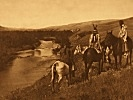

  
[Intangible Textual Heritage](../../../index.md)  [Native
American](../../index)  [Plains](../index)  [Index](index.md) 
[Previous](ont45)  [Next](ont47.md) 

------------------------------------------------------------------------

[Buy this Book at
Amazon.com](https://www.amazon.com/exec/obidos/ASIN/B002E9HLW0/internetsacredte.md)

------------------------------------------------------------------------

  
*The Old North Trail*, by Walter McClintock, \[1910\], at Intangible
Textual Heritage

------------------------------------------------------------------------

p. 532

### *Page* [431](ont35.htm#page_431.md). Genealogical Table of Brings-down-the-Sun's Family

 
[  
Click to enlarge](img/53200.jpg.md)  
*Page* 431.—GENEALOGICAL TABLE OF BRINGS-DOWN-THE-SUN'S FAMILY.  

------------------------------------------------------------------------

[Next: Index](ont47.md)
