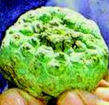

  
[Intangible Textual Heritage](../../../index)  [Native
American](../../index)  [Plains](../index) 

------------------------------------------------------------------------

[Buy this Book at
Amazon.com](https://www.amazon.com/exec/obidos/ASIN/0803257104/internetsacredte)

------------------------------------------------------------------------

<table width="75%">
<colgroup>
<col style="width: 50%" />
<col style="width: 50%" />
</colgroup>
<tbody>
<tr class="odd">
<td width="50%" data-valign="TOP"></td>
<td width="50%" data-valign="CENTER"><h1 id="the-peyote-cult" data-align="CENTER">The Peyote Cult</h1>
<h2 id="by-paul-radin" data-align="CENTER">by Paul Radin</h2>
<h5 id="from-the-winnebago-tribe-pp.-340-78-arbae-37" data-align="CENTER">from <em>The Winnebago Tribe</em>, pp. 340-78, ARBAE 37</h5>
<h4 id="section" data-align="CENTER">[1925]</h4></td>
</tr>
</tbody>
</table>

------------------------------------------------------------------------

[Contents](#contents)    [Start Reading](pey00)    [Text](peyote.txt)

------------------------------------------------------------------------

|                                                                                                                           |
|---------------------------------------------------------------------------------------------------------------------------|
|  |

Peyote has never been a drug for thrill seekers. The small, hard cactus
is difficult to obtain. It tastes vile, ingestion normally leads to
painful vomiting, and the effects are more subtle than other
psychedelics.

The Native American Peyote ceremony emerged at the turn of the 20th
century, like the Ghost Dance, at a time when Native American culture
was under much stress. It blended Christian and traditional beliefs, and
used Peyote as a sacrament. The Peyote ceremony spread from the
Southwest into the Plains and other culture regions. Participants
reported a spiritual cleansing, and experienced healing effects, which
may be the result of powerful natural antibiotics in Peyote.

This is one of the first ethnographic accounts of the Peyote ceremony.
Paul Radin wrote this monograph, mostly consisting of first-hand
accounts, as part of his 1925 ethnography of the Winnebago tribe, who
live in Wisconsin. The Peyote 'Cult' did not die out as Radin thought it
might, but grew into the Native American Church, which is still going
strong today. This group fought the US legal system to get an exemption
to use the cactus, which is a controlled substance, in their ceremonies.

------------------------------------------------------------------------

 [Title Page](pey00)  
[General Description](pey01)  
[John Rave's Account of the Peyote Cult and of His Conversion](pey02)  
[O.L.'s Description of the Peyote Cult](pey03)  
[J.B.'s Account of the Leader of the Peyote](pey04)  
[Albert Hensley's Account of the Peyote](pey05)  
[J.B.'s Peyote Experiences](pey06)  
[J.B.'s Account of His Conversion](pey07)  
[Jesse Clay's Account of the Arapaho Manner of Giving the Peyote,
Ceremony Which He Introduced Among the Winnebago in 1912](pey08)  
[Development of the Ritualistic Complex](pey09)  
[Dissemination of the Doctrine](pey10)  
[What the Converts Introduced](pey11)  
[The Attitude of the Conservatives](pey12)  
