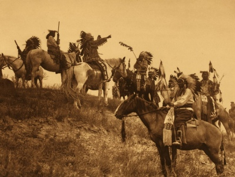

  
[Intangible Textual Heritage](../../../index)  [Native
American](../../index)  [Plains](../index) 

------------------------------------------------------------------------

[Buy this Book at
Amazon.com](https://www.amazon.com/exec/obidos/ASIN/0803270089/internetsacredte)

------------------------------------------------------------------------

<table width="75%">
<colgroup>
<col style="width: 50%" />
<col style="width: 50%" />
</colgroup>
<tbody>
<tr class="odd">
<td width="50%" data-valign="TOP"></td>
<td width="50%" data-valign="CENTER"><h1 id="the-punishment-of-the-stingy-and-other-indian-stories" data-align="CENTER">The Punishment of the Stingy and Other Indian Stories</h1>
<h2 id="by-george-bird-grinnell" data-align="CENTER">by George Bird Grinnell</h2>
<h4 id="section" data-align="CENTER">[1901]</h4></td>
</tr>
</tbody>
</table>

------------------------------------------------------------------------

[Contents](#contents)    [Start Reading](pots00)    [Text](pots.txt)

------------------------------------------------------------------------

|                                                                                                                           |
|---------------------------------------------------------------------------------------------------------------------------|
|  |

------------------------------------------------------------------------

 [Title Page](pots00)  
[Contents](pots01)  
[Illustrations](pots02)  
[The Stories and the Story-Tellers](pots03)  
[The Bluejay Stories](pots04)  
[The Punishment of the Stingy](pots05)  
[Bluejay, the Imitator](pots06)  
[Bluejay Visits the Ghosts](pots07)  
[The Girl Who Was the Ring](pots08)  
[The First Corn](pots09)  
[The Star Boy](pots10)  
[The Grizzly Bear's Medicine](pots11)  
[The First Medicine Lodge](pots12)  
[Thunder Maker and Cold Maker](pots13)  
[The Blindness of Pi-wap´-ōk](pots14)  
[Ragged Head](pots15)  
[Nothing Child](pots16)  
[Shield Quiver's Wife](pots17)  
[The Beaver Stick](pots18)  
[Little Friend Coyote](pots19)  
