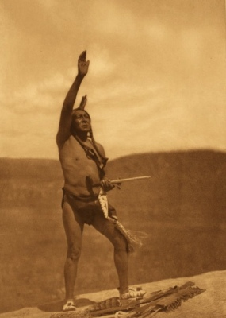

  
[Intangible Textual Heritage](../../index)  [Native American](../index.md) 

------------------------------------------------------------------------

[Buy this Book at
Amazon.com](https://www.amazon.com/exec/obidos/ASIN/B002BNKRAM/internetsacredte.md)

------------------------------------------------------------------------

<table width="75%">
<colgroup>
<col style="width: 50%" />
<col style="width: 50%" />
</colgroup>
<tbody>
<tr class="odd">
<td width="50%" data-valign="TOP"></td>
<td width="50%" data-valign="CENTER"><h1 id="the-path-on-the-rainbow" data-align="CENTER">The Path on the Rainbow:</h1>
<h4 id="an-anthology-of-songs-and-chants-from-the-indians-of-north-america" data-align="CENTER">An Anthology of Songs and Chants from the Indians of North America</h4>
<h2 id="edited-by-george-w.-cronyn" data-align="CENTER">Edited by George W. Cronyn</h2>
<h4 id="section" data-align="CENTER">[1918]</h4></td>
</tr>
</tbody>
</table>

------------------------------------------------------------------------

[Contents](#contents)    [Start Reading](por00.md)    [Page
Index](pageidx)    [Text \[Zipped\]](por.txt.gz.md)

------------------------------------------------------------------------

|                                                                                                                           |
|---------------------------------------------------------------------------------------------------------------------------|
|  |

This anthology of Native American poetry, song and ritual, presents
texts from a wide range of culture areas. The translations are largely
based on work by anthropologists, and all reflect genuine Native
American lore. These poems come from a place in which magic, art and
ritual are indistinguishable. They reflect an archaic consciousness
which comes close to the Homeric or Indian epics in which gods walk the
earth, magic is alive, and animals are just as human as you or me. To
read these texts is to be absorbed back into that consciousness.--J.B.
Hare

------------------------------------------------------------------------

 [Title Page](por00.md)  
[Contents](por01.md)  
[Early Moon](por02.md)  
[Introduction](por03.md)  
[Songs From The Eastern Woodlands: Abanaki Songs](por04.md)  
[Vengeance Song (Micmac)](por05.md)  
[Iroquois Ritual](por06.md)  
[Fire-Fly Song (Ojibwa)](por07.md)  
[Calling-One's-Own (Ojibwa)](por08.md)  
[Ojibwa War Songs](por09.md)  
[Two Winnebago Songs](por10.md)  
[Sacred Midé Songs (Ojibwa)](por11.md)  
[Songs of the Chippewa](por12.md)  
[Memorial Ode (Iroquois)](por13.md)  
[The Wallum Olum (Delaware)](por14.md)  
[Sacred Formulas of the Cherokees](por15.md)  
[Hunting Songs (Dakota)](por16.md)  
[The Fashioning of the Children (Osage)](por17.md)  
[Ritual Chants of the Omaha](por18.md)  
[Songs of the Ghost Dance Religion](por19.md)  
[Viracocha (Ancient Inca)](por20.md)  
[War Songs (Zuni)](por21.md)  
[Invocations for Rain (Sia)](por22.md)  
[Magpie Song (Navajo)](por23.md)  
[Songs in the Garden of the House God (Navajo)](por24.md)  
[The Mountain Chant of the Navaho](por25.md)  
[The Town Crier Calls at Dawn (Pueblo)](por26.md)  
[Song of the Horse (Navajo)](por27.md)  
[Song of the Blue-Corn Dance (Zuni)](por28.md)  
[Songs of the Pima](por29.md)  
[Song of the Earth (Navajo)](por30.md)  
[Hunting Song (Navajo)](por31.md)  
[Song of the Rain Chant (Navajo)](por32.md)  
[Song From the Mountain Chant (Navaho)](por33.md)  
[Corn-Grinding Song](por34.md)  
[Korosta Katzina Song (Hopi)](por35.md)  
[He-Hea Katzina Song (Hopi)](por36.md)  
[Songs of Spirits (Wintu)](por37.md)  
[Songs of Kumastamxo (Yuma)](por38.md)  
[Prayers of the Tsimshian](por39.md)  
[Three Songs from the Haida](por40.md)  
[Bear Song (Haida)](por41.md)  
[Haida Cradle Songs](por42.md)  
[Bilqula Death Song](por43.md)  
[Songs of the Tlingit](por44.md)  
[Spell Song](por45.md)  
[Chinook Songs](por46.md)  
[Songs for the Great Feast to the Dead](por47.md)  
[Eskimo Songs](por48.md)  
[Sednor and the Fulmar (Eskimo Ballad)](por49.md)  
[Summer Dawn](por50.md)  
[Song of the Search](por51.md)  
[Song of Whip-Plaiting](por52.md)  
[Song of the young Mother](por53.md)  
[Song of Basket-Weaving](por54.md)  
[The Change Song](por55.md)  
[Song of the Full Catch](por56.md)  
[Spring to the Earth-Witch](por57.md)  
[Chief Capilano Greets his Namesake at Dawn](por58.md)  
[The Wild Woman's Lullaby](por59.md)  
[Indian's Lover's Hymn](por60.md)  
[The Song of the Hills (Yokut)](por61.md)  
[Neither Spirit nor Bird (Shoshone)](por62.md)  
[Prayer to the Mountain Spirit (Navaho)](por63.md)  
[Song for the Passing of Beautiful Women (Paiute)](por64.md)  
[Song of a Passionate Lover (Yokut)](por65.md)  
[The Heart's Friend (Shoshone)](por66.md)  
[A Song in Time of Depression (Paiute)](por67.md)  
[Along the South Star Trail](por68.md)  
[Sa-a Narai](por69.md)  
[Earth-Mother](por70.md)  
[Feast of Wolves](por71.md)  
[Lone-Dog Unto the Delawares](por72.md)  
[Listening](por73.md)  
[Buffalo Dance](por74.md)  
[Where the Fight Was](por75.md)  
[The Wind](por76.md)  
[Courtship](por77.md)  
[Parting](por78.md)  
[The Lost Lagoon (Tekashionweke)](por79.md)  
[The Song my Paddle Sings (Tekashionweke)](por80.md)  
[Plem-Sali-Kwi (Autumn Dawn)](por81.md)  
[(A Pawnee Ceremony)](por82.md)  
