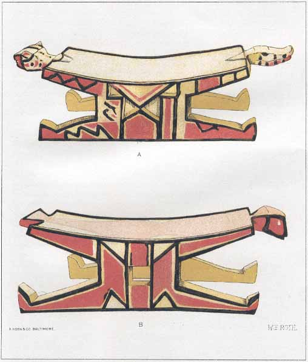

[Sacred-Texts](../../../index) [Native American](../../index.md) [South
American](../index.md)

------------------------------------------------------------------------

  
ARAWAK DOCTORS' BENCHES  
FROM UPPER MORUCA RIVER  
A.—WITH ALLIGATOR AND TIGER (JAGUAR) HEADS  
B.—WITH HEAD AND TAIL OF MACAW; REMAINDER OF BODY PAINTED ON SEAT  

# An Inquiry into the Animism and Folk-Lore of the Guiana Indians

### By Walter E. Roth

#### from the *Thirtieth Annual Report of the Bureau of American Ethnology, 1908-1909*, pp. 103-386

##### \[Washington D.C., 1915\]

###### {Reduced to HTML by Christopher M. Weimer}

------------------------------------------------------------------------

|         |                                                                                               |
|---------|-----------------------------------------------------------------------------------------------|
|         | [note to the hypertext transcription](note.md)                        |
|         | [Title Page](aflg000.md)                                                                         |
|         | [Dedication](aflg001.md)                                                                         |
|         | [PREFACE](aflg002.md)                                                                            |
|         | [CONTENTS](aflg003.md)                                                                           |
|         | [MYTHS AND FOLK-TALES](aflg004.md)                                                               |
|         | [ILLUSTRATIONS](aflg005.md)                                                                      |
|         | [WORKS OF REFERENCE](aflg006.md)                                                                 |
| I.      | [NO EVIDENCE OF BELIEF IN A SUPREME BEING](aflg01.md)                                            |
| II\.    | [TRIBAL HEROES](aflg02.md)                                                                       |
| III\.   | [TRACES OF SPIRIT, IDOL, AND FETISH CULT](aflg03.md)                                             |
| IV\.    | [CREATION OF MAN, PLANTS, AND ANIMALS](aflg04.md)                                                |
| V.      | [THE BODY AND ITS ASSOCIATED SPIRITS](aflg05.md)                                                 |
| VI\.    | [DREAMS; IDIOCY](aflg06.md)                                                                      |
| VII\.   | [FAMILIAR SPIRITS](aflg07.md)                                                                    |
| VIII\.  | [THE SPIRITS OF THE BUSH: NATURAL HISTORY](aflg08.md)                                            |
| IX\.    | [THE SPIRITS OF THE BUSH: ANIMALS AS SENTIENT HUMAN BEINGS](aflg09.md)                           |
| X.      | [THE SPIRITS OF THE BUSH: ASSOCIATED WITH PARTICULAR PLANTS](aflg10.md)                          |
| XI\.    | [THE SPIRITS OF THE MOUNTAIN](aflg11.md)                                                         |
| XII\.   | [THE SPIRITS OF THE WATER](aflg12.md)                                                            |
| XIII\.  | [THE SPIRITS OF THE SKY](aflg13.md)                                                              |
| XIV\.   | [OMENS, CHARMS, TALISMANS](aflg14.md)                                                            |
| XV\.    | [RESTRICTIONS ON GAME AND FOOD, VISION, ARTS AND CRAFTS, NOMENCLATURE (TABOOS)](aflg15.md)       |
| XVI\.   | [SEXUAL LIFE](aflg16.md)                                                                         |
| XVII\.  | [THE MEDIClNE-MAN](aflg17.md)                                                                    |
| XVIII\. | [KANAIMA; THE INVISIBLE OR BROKEN ARROW](aflg18.md)                                              |
| XIX\.   | [MISCELLANEOUS INDIAN BELIEFS CONCERNING MAN AND ANIMALS](aflg19.md)                             |
| XX\.    | [ANIMISM AND FOLK-TALES OF RECENT INTRODUCTION; MIXED FOREIGN AND INDIGENOUS BELIEFS](aflg20.md) |
| XXI\.   | [MISCELLANEOUS FOLK-LORE, INDEPENDENT OF ANIMISM](aflg21.md)                                     |
|         | [GLOSSARY](aflg22.md)                                                                            |
