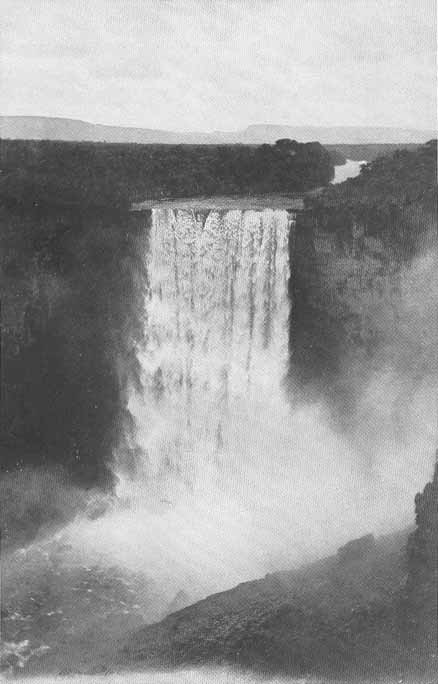

[Sacred-Texts](../../../index) [Native American](../../index) [South
American](../index) [Index](index) [Return to Text](aflg11.htm#pl4)

------------------------------------------------------------------------

|                              |                                   |
|------------------------------|----------------------------------:|
| BUREAU OF AMERICAN ETHNOLOGY | THIRTIETH ANNUAL REPORT   PLATE 4 |

THE KAIETUR FALL  
(From a photograph by W. H. McTurk)

------------------------------------------------------------------------

[Return to Text](aflg11.htm#pl4)
