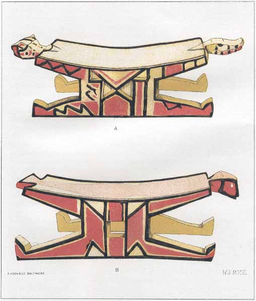

[Sacred-Texts](../../../index) [Native American](../../index) [South
American](../index) [Index](index) [Return to Text](aflg17.htm#pl5)

------------------------------------------------------------------------

|                              |                                   |
|------------------------------|----------------------------------:|
| BUREAU OF AMERICAN ETHNOLOGY | THIRTIETH ANNUAL REPORT   PLATE 5 |

|                                                                   |
|:-----------------------------------------------------------------:|
|                      ARAWAK DOCTORS' BENCHES                      |
|                      FROM UPPER MORUCA RIVER                      |
|            A.—WITH ALLIGATOR AND TIGER (JAGUAR) HEADS             |
| B.—WITH HEAD AND TAIL OF MACAW; REMAINDER OF BODY PAINTED ON SEAT |

------------------------------------------------------------------------

[Return to Text](aflg17.htm#pl5)
