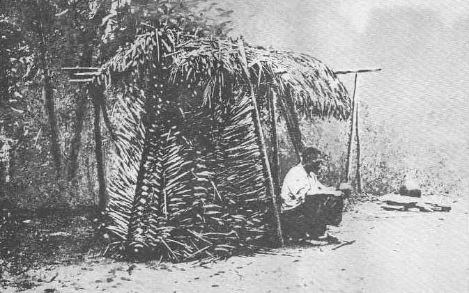

[Sacred-Texts](../../../index) [Native American](../../index.md) [South
American](../index) [Index](index) [Return to Text](aflg17.htm#pl6.md)

------------------------------------------------------------------------

|                              |                                   |
|------------------------------|----------------------------------:|
| BUREAU OF AMERICAN ETHNOLOGY | THIRTIETH ANNUAL REPORT   PLATE 6 |

A CARIB PIAI'S "CONSULTING ROOM," MORUCA RIVER, CONSTRUCTED OF KOKERITE
LEAVES SET UP ON END. THE MEDICINE-MAN IS HOLDING THE RATTLE WITH WHICH
THE INVOCATIONS ARE MADE

------------------------------------------------------------------------

[Return to Text](aflg17.htm#pl6.md)
